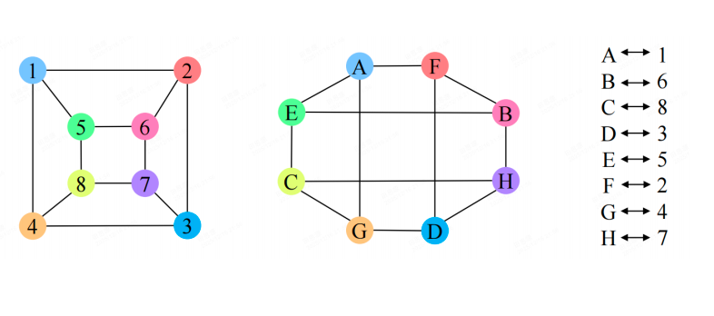
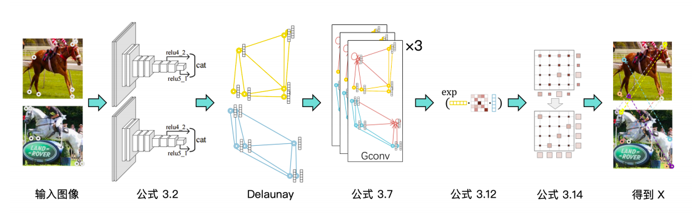
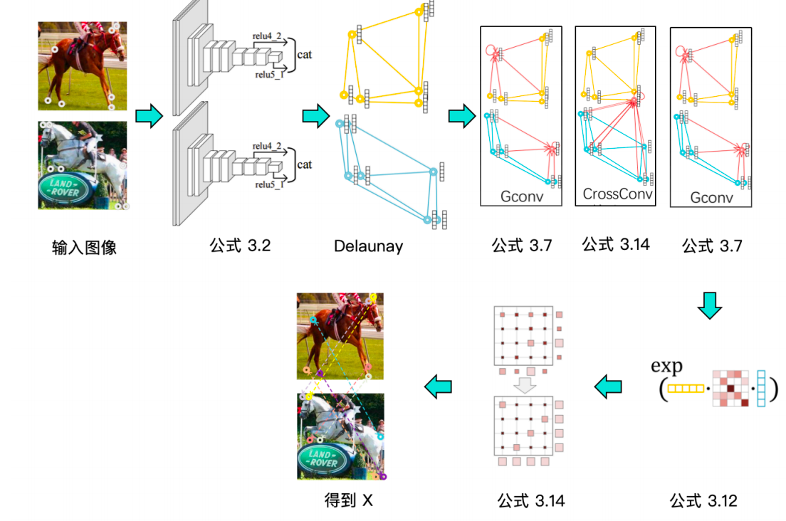
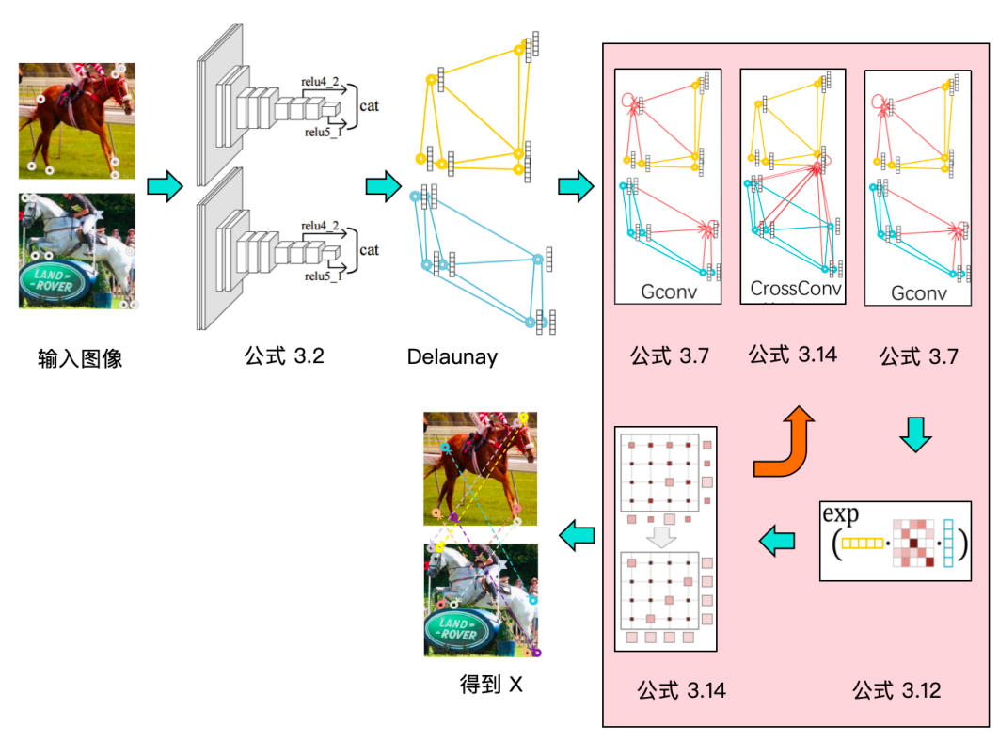
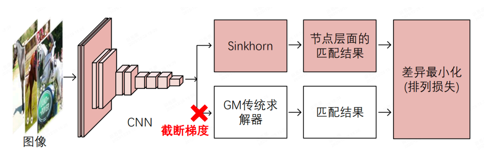
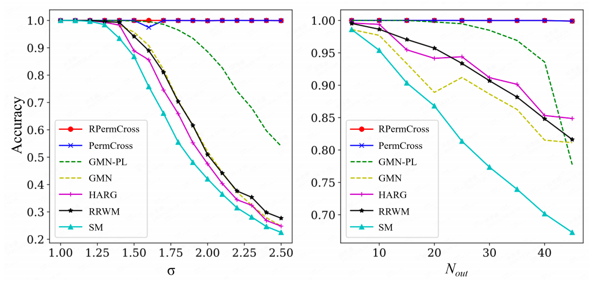
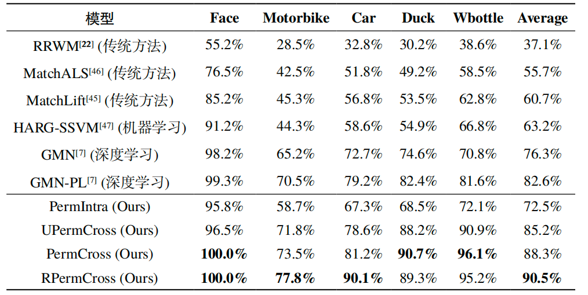
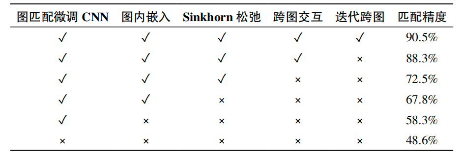
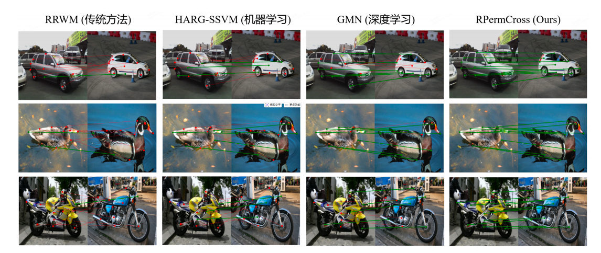

<!-- _class: cover_c -->
<!-- _header: -->
<!-- _paginate: "" -->
<!-- _footer: 组合数学大作业汇报  -->

# <!-- fit -->组合数学图匹配问题的神经网络解法探究

###### 基于图嵌入与 Sinkhorn 算法的图匹配实现
Reporter 张哲源 田思源 钱林强
Date ：Dec. 31  /  2025  

## 目录

<!-- _class: cols2_ol_ci fglass toc_c  -->
<!-- _footer: "" -->
<!-- _header: "CONTENTS" -->
<!-- _paginate: "" -->

- [引言](#3)
- [背景](#6)
- [设计](#10)
- [实验](#12)
- [总结](#13)

## 1. 引言 - 图匹配问题描述

<!-- _header: \ ****** **引言** *背景* *设计* *实验* *总结* -->
<!-- _class: navbar cols-2 -->

- 图匹配是什么？
  给定两个图 $G_1 = (V_1, E_1)$ 和 $G_2 = (V_2, E_2)$，寻找节点间的最优一一对应关系（即排列矩阵 $X \in \{0, 1\}^{n \times n}$）。

- 典型应用场景
  - 计算机视觉：图像关键点匹配（如车轮 ↔ 车轮）
  - 生物信息学：蛋白质结构比对
  - 任务分配：工人-任务最优指派（二部图匹配）

- 问题 NP-Hard
  属于二次指派问题（QAP），解空间阶乘级增长，精确求解不可扩展。

 

 非精确图匹配示例 

 >现实挑战：非精确匹配
  真实数据存在噪声、遮挡、离群点、结构差异，传统方法鲁棒性差。

## 2. 背景 — 国内外研究现状

<!-- _header: \ ****** *引言* **背景** *设计* *实验* *总结* -->
<!-- _class: navbar cols-2-64 bq-purple-->

 

- **传统方法（基于优化）**
  → RRWM（重加权随机游走）、MatchLift（半正定规划）、匈牙利算法等
  → 优点：有理论保证；缺点：**对噪声敏感、不可微、难以端到端优化**
- **早期学习型方法**
  → HARG-SSVM（结构 SVM）、GMN（图匹配网络）
  → 可学习特征，但**未显式建模跨图结构交互**，匹配精度受限

| 类型     | 代表方法        | 局限                 |
| -------- | --------------- | -------------------- |
| 传统优化 | RRWM, MatchLift | 噪声敏感、不可微     |
| 学习型   | GMN, HARG-SSVM  | 无跨图交互、精度有限 |

 

- **核心瓶颈**

  → 特征提取与匹配求解**相互割裂**
  → 缺乏**可微分、鲁棒、端到端**的统一框架

 

> **我们的定位**
> 
>  → **首个**融合**几何嵌入 + 跨图卷积 + 迭代优化**的端到端可微图匹配器
>  → 实现从“规则驱动”到“数据驱动”的范式转变

## 3. 模型一 PermIntra  图内嵌入基础模型（基线）

<!-- _header: \ ****** *引言* *背景* **设计** *实验* *总结* -->
<!-- _class: navbar pin-3 -->

 
 

- **目标**：构建图匹配的**基础可微求解器**，验证几何嵌入有效性

- **局限**：两图特征**独立提取** 无法解决结构歧义

 
 

- **关键技术**：
  - Delaunay 三角剖分 → 构建几何拓扑
  - 图卷积网络（GCN）→ 融合局部结构上下文
  - 双线性亲和力 + Sinkhorn 松弛 → 可微匹配

## 3. 模型二：PermCross（显式跨图特征对齐）

<!-- _header: \ ****** *引言* *背景* **设计** *实验* *总结* -->
<!-- _class: navbar pin-3 -->

 
 
 

- **训练目标**：端到端排列损失
- **优势**： 
  1. 特征与匹配联合优化 
  2. 显式建模图间结构一致性

 

#### 验证跨图交互是性能跃升的关键

- **关键创新**：**跨图卷积算子**
  - 利用软匹配矩阵 S*S* 作为桥梁
  - $H_1^{\mathrm{cross}}=S\cdot H_2$,实现特征“检索-聚合”
  - 类似注意力机制，解决对称/模糊节点歧义

## 3. 模型三：RPermCross（循环迭代，动态优化）

<!-- _header: \ ****** *引言* *背景* **设计** *实验* *总结* -->
<!-- _class: navbar pin-3 -->

 

 
 
 

- **数学本质**：**不动点迭代**（Fixed-Point Iteration）
  - 动态逼近图匹配问题的稳定解

 
 
 

- **核心机制**：**RNN式循环迭代**（K=3轮）
  - 每轮：特征 → 亲和力 → Sinkhorn → 软匹配 → 跨图卷积 → 更新特征
  - **权重共享**：所有轮次共享 GCN 与跨图卷积参数

## 3. 模型四：UPermCross（无监督，无需标注）

<!-- _header: \ ****** *引言* *背景* **设计** *实验* *总结* -->
<!-- _class: navbar pin-3 -->

 

- **动机**：缓解标注成本高问题，探索无监督图匹配
- **架构**：**双分支孪生网络**
  - 分支1：可微 Sinkhorn 求解器
  - 分支2：传统不可微 渐进指派算法（Graduated Assignment，GA）

 

- **损失函数**：最小化两分支输出的 **匹配差异**
   $$ \mathrm{~}\mathcal{L}_{\mathrm{unsup}}=\|X_{\mathrm{Sinkhorn}}-X_{\mathrm{GA}}\|_{F}^{2}$$
- **关键设计**：
  - 共享 CNN 特征提取器
  - 梯度截断：传统求解器 → CNN 梯度不回传

## 4. 仿真实验：高斯噪声与离群点下的鲁棒性

<!-- _header: \ ****** *引言* *背景* *设计* **实验** *总结* -->
<!-- _class: navbar cols-2-46 -->

#### 实验设置：

  - 随机生成 2D 点集（N=20）
  - 引入：① 高斯位置噪声（σ = 1.0 → 2.5）② 随机离群点（0 → 10 个）
  - 仅使用几何坐标 + 随机特征（**剥离 CNN 影响**，聚焦求解器本身）
- **关键结果**：

  - **RPermCross / PermCross** 在 σ=2.5 时仍保持 **>90% 准确率**
  - 传统方法（如 RRWM）随噪声迅速崩溃（<40%）

> 借助 参数化亲和力 + Sinkhorn全局归一化，模型对几何扰动具备强鲁棒性。

 

 不同程度高斯位置噪声与随机离群点数目的仿真实验结果 

## 4. 真实图像匹配：Willow Object Class

<!-- _header: \ ****** *引言* *背景* *设计* **实验** *总结* -->
<!-- _class: navbar cols-2-46 -->

- **对比方法**：
  - 传统：RRWM, MatchLift
  - 学习型：GMN, HARG-SSVM
  - Ours：PermIntra, PermCross, RPermCross, UPermCross

- **关键指标（平均准确率）**：
  - **RPermCross：90.5%**
  - 比 RRWM **↑53.4%**，比 MatchLift **↑29.8%**
  - **Face 类：100%**，Car 类：90.1%

- **测试集**：5 类物体（Face, Car, Motorbike, Duck, Wbottle），每类 400 张图像

 不同模型在 Willow 数据集中的 Duck、Car、 Motorbike 等类别上的性能对比

## 4. 消融实验：各组件对性能的贡献

<!-- _header: \ ****** *引言* *背景* *设计* **实验** *总结* -->
<!-- _class: navbar pin-3 -->

**关键结论**：

- **跨图交互** 是最大性能来源（**+15.8%**）
- **图匹配微调 CNN** 是基础（+9.7%）
- **迭代机制** 带来精细提升（+2.2%）

## 4. 定性结果与在线 Demo

<!-- _header: \ ****** *引言* *背景* *设计* **实验** *总结* -->
<!-- _class: navbar -->

  - **RRWM / HARG-SSVM**：连线交叉、错误匹配（如车轮连到车灯）
  - **RPermCross**：连线平行、语义正确（车轮 ↔ 车轮，车灯 ↔ 车灯）

- **Demo 视频** : 🎥 [RPermCross 实时匹配演示](./demo.mp4)
> “我们的方法**数值优异**，而且**视觉合理**。”

## 5. 总结与未来工作

<!-- _header: \ ****** *引言* *背景* *设计* *实验* **总结** -->
<!-- _class: navbar cols-2-->

#### 【核心贡献】

- ✅ **提出 PermCross 家族框架**
  首个融合**几何嵌入 + 跨图卷积 + 循环迭代**的端到端可微图匹配器
- ✅ **显著超越 SOTA**
  RPermCross 在 Willow 数据集达 **90.5% 准确率**，比 RRWM **↑53.4%**
- ✅ **验证无监督可行性**
  UPermCross **无需标签**，实现 **85.2%** 匹配准确率

#### 【技术价值与展望】

- 🌐 **范式意义**
  为 NP-Hard 组合优化问题提供 **“连续松弛 + 深度学习”** 新路径
- 🔜 **未来方向**
  - 扩展至**大规模图匹配**（稀疏化 / 分层策略）
  - 探索**少样本 / 零样本**图匹配
  - 推广至**TSP、背包、路径规划**等经典组合问题
- 💡 **应用潜力**
  可用于蛋白质对接、3D 场景对齐、工业视觉定位等实际场景

---
<!-- _class: lastpage  -->
<!-- _header: -->

###### Q & A

