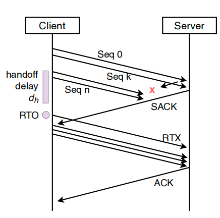
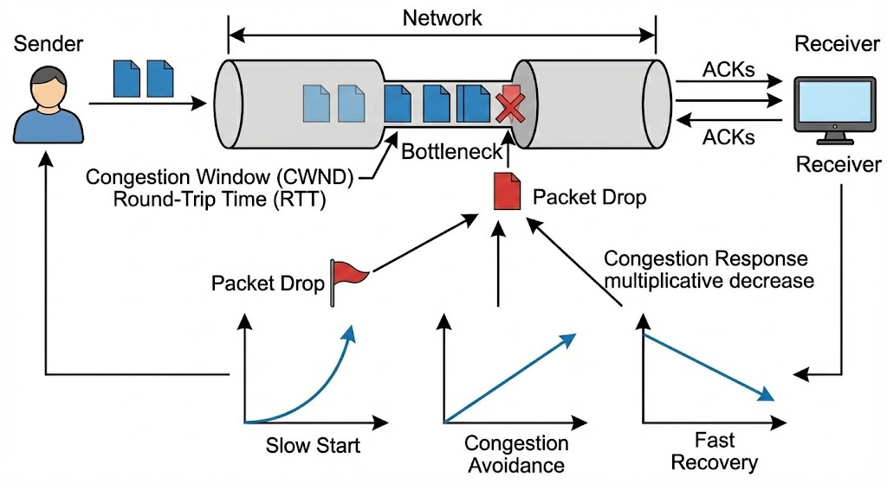

<!-- _class: cover_c -->
<!-- _header: -->
<!-- _paginate: "" -->
<!-- _footer: English course for masters  -->

# <!-- fit -->LUMIN: Proactive TCP Recovery for Seamless WiFi Roaming

###### Enabling Low-Latency Mobile Applications in Indoor Edge Environments
Reporter ：Zhang zheyuan 
Date ：Dec. 24  /  2025  

## 目录

<!-- _class: cols2_ol_ci fglass toc_c  -->
<!-- _footer: "" -->
<!-- _header: "CONTENTS" -->
<!-- _paginate: "" -->

- [Introduction](#3)
- [Background](#6)
- [Design](#10)
- [Experimental](#12)
- [Conclusion](#13)

## 1. Introduction: The Hidden Latency in “Seamless” Roaming

<!-- _header: \ ****** **introduction** *background* *design* *experimental* *conclusion* -->
<!-- _class: navbar cols-2 -->

#### Real-World Impact

- **Visual SLAM**: Accuracy drops from 
    **90% → 15%** if latency > 666 ms
- **Robots move at 0.5 m/s** 
  → Handoff every **24–50 sec**
- **MAC-layer handoff**: ~100 ms (acceptable)
- **TCP recovery time**: **896 ms** (unacceptable)

> “Seamless roaming preserves *connectivity*, not *performance*.”

During handoff, >90% of in-flight packets are lost

## 2. Background: Why TCP Fails During Handoff

<!-- _header: \ ****** *introduction* **background** *design* *experimental* *conclusion* -->
<!-- _class: navbar cols-2-64 -->

#### TCP’s Congestion Control Assumption
- Treats all packet loss as congestion
- Triggers RTO → slow start (cwnd = 1)
- Recovery takes hundreds of milliseconds

#### IEEE 802.11r Is Not Enough

- Reduces link-layer handoff to ~50 ms
- But transport-layer loss still occurs
- 76% of handoffs still trigger RTO

 
 

> “The problem is **not** when you switch,  **but** how TCP reacts.”
>
>  “802.11r solves *latency*, not *loss*.”

## 3. Design I: Map-Free Handoff Prediction via RSSI Evolution

<!-- _header: \ ****** *introduction* *background* **design** *experimental* *conclusion* -->
<!-- _class: navbar -->

#### Core Idea
Predict handoff **1 second ahead** using only RSSI history

#### Two Adaptive Models
- Near AP (large RSSI derivative):
Fit a “Check Function” → captures non-linear signal drop near AP
- Far from AP (small derivative):
Fit a Logarithmic Function → models slow decay with distance
> Accuracy: >99.7% for 1-sec-ahead 

## 4. Design II: Proactive Rate Control Before Handoff
<!-- _header: \ ****** *introduction* *background* **design** *experimental* *conclusion* -->
<!-- _class: navbar -->

##### Key Insight

Handoff-induced loss is **predictable** → treat it as **temporary loss rate = p**

#### Rate Control Rule

Scale sending rate by **(1 − p)** in the RTT before handoff
- *p* = probability of handoff within next RTT
- Estimated via **Manhattan distance** between predicted RSSI and handoff thresholds

> Reduces inflight packets → fewer losses → avoids RTO

## 5. Design III: RTO Decoupling and Immediate Fast Recovery
<!-- _header: \ ****** *introduction* *background* **design** *experimental* *conclusion* -->
<!-- _class: navbar -->

#### Core Problem

Standard TCP couples **loss detection** and **congestion response** via RTO → triggers slow start

#### LUMIN’s Fix

- **Freeze RTO** during disassociation
- **Reset RTO immediately** upon first ACK from new AP
- **Skip slow start** → jump to **fast recovery**

> “Recovery ≠ Congestion. Treat them separately.”

#### Safety Guarantee

- If prediction fails (false negative): fallback to standard TCP
- If too conservative (false positive): mild under-utilization

## 6. Evaluation: 40% Faster Recovery, Zero Regressions

<!-- _header: \ ****** *introduction* *background* *design* **experimental** *conclusion* -->
<!-- _class: navbar -->

#### Testbed Setup

- **APs**: 2× MI AX3000T in **Mesh mode**, 10 m apart
- **Client**: Ubuntu 22.04 + Intel AX201 WiFi 6
- **Traffic**: iperf3 + Linux `ss`/`tc` for TCP state monitoring
- **Baseline**: Standard TCP (Cubic) ± IEEE 802.11r

#### Key Results

- **RTO trigger rate**: ↓ from **80% → 20%**
- **Avg. recovery time**: ↓ from **896 ms → 509 ms** (**>40% improvement**)
- **Safety**:
  - False positive → mild under-utilization
  - False negative → fallback to standard TCP

## 7. Conclusion: Rethinking Handoff as Deterministic Loss

<!-- _header: \ ****** *introduction* *background* *design* *experimental* **conclusion** -->
<!-- _class: navbar pin-3-->

#### Key Contributions

- **Reframes handoff** as *predictable, deterministic loss* — not congestion
- **Client-only, map-free, no infrastructure change**
- **40%+ faster TCP recovery** with **zero performance regression**

#### Impact

- Enables **low-latency mobile applications**:
  – Visual/LiDAR SLAM
  – Real-time robotics
  – Immersive AR/VR

#### Future Work

- Extend to **QUIC/HTTP/3** (PTO handling)
- Support **dense multi-AP** environments

---
<!-- _class: lastpage  -->
<!-- _header: -->

###### Thank you for your attention!

