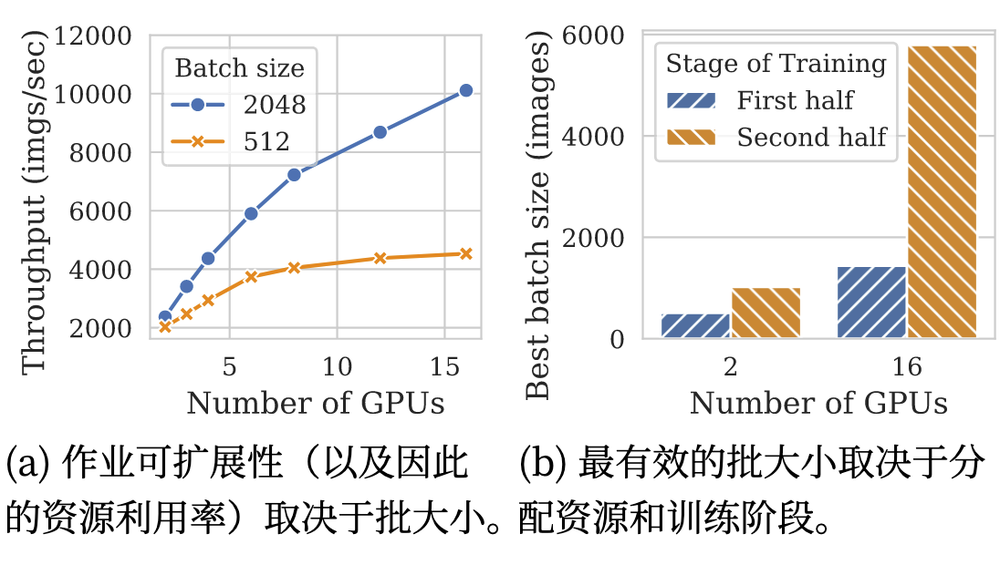
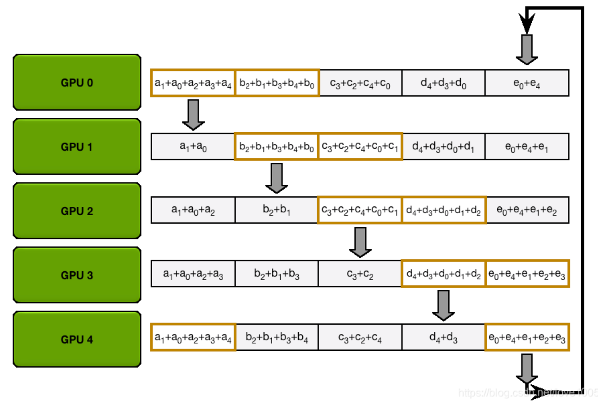
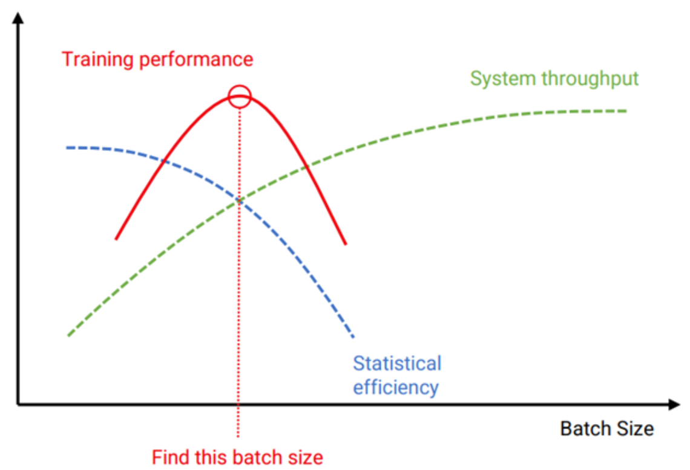
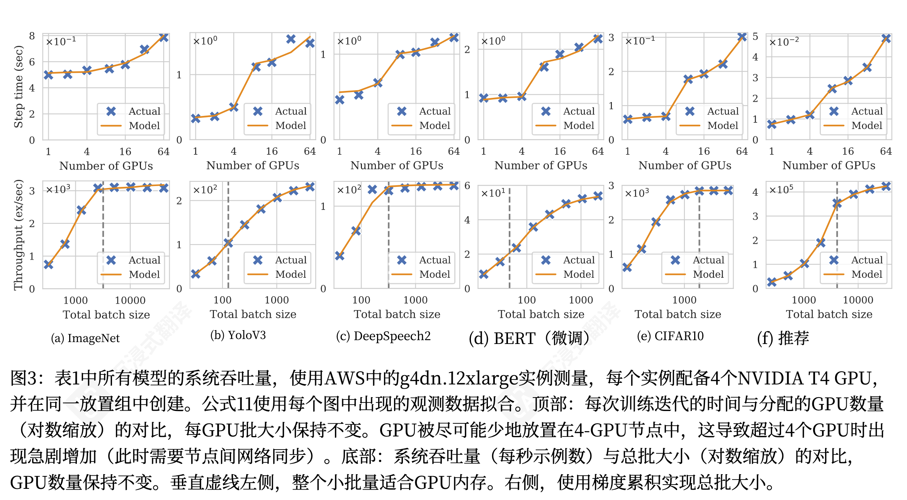
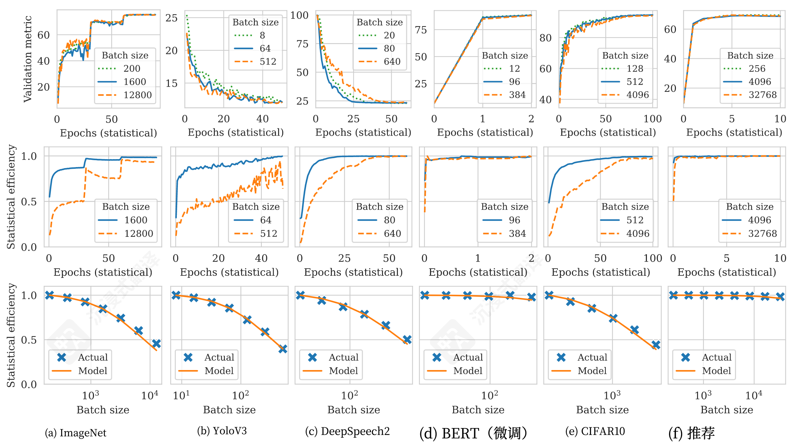
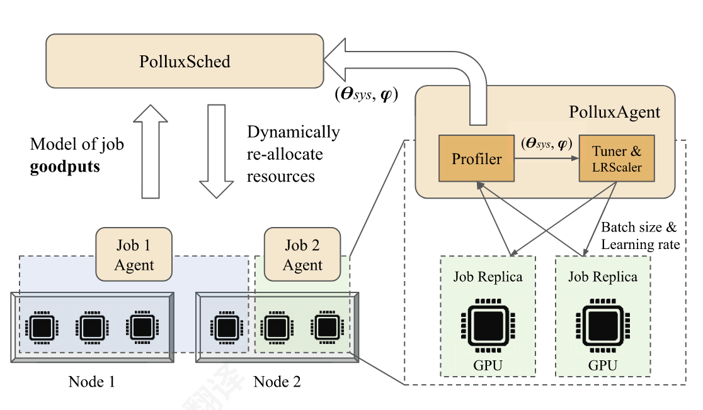
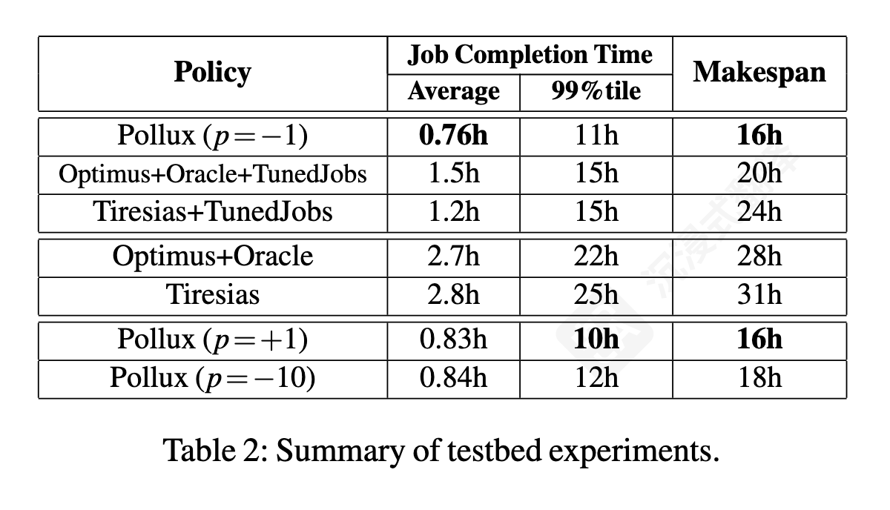
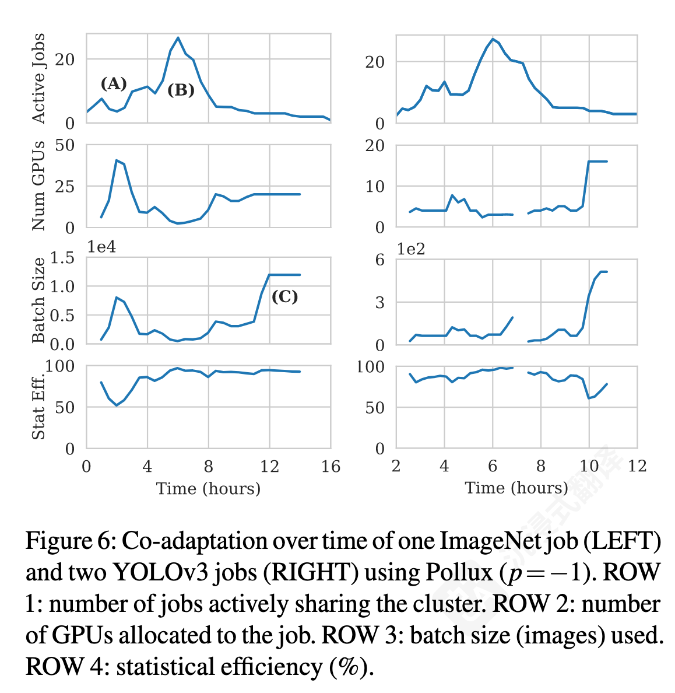

<!-- _class: cover_c -->
<!-- _paginate: "" -->
<!-- _footer: 流媒体传输组 -->

# <!-- fit -->Pollux: 面向Goodput优化的深度学习协同自适应集群调度

###### [OSDI 21'] Pollux: Co-adaptive Cluster Scheduling for Goodput-Optimized Deep Learning

Reporter ：张哲源
Date ：2025 年 11 月 18 日

## 目录

<!-- _class: cols2_ol_ci fglass toc_a  -->
<!-- _footer: "" -->
<!-- _header: "CONTENTS" -->
<!-- _paginate: "" -->

- [引言](main.md#3)
- [背景](main.md#6)
- [建模](main.md#10)
- [设计](main.md#12)
- [结论](main.md#13)

## 1. 引言
<!-- _header: \ ****** **引言** *背景* *建模* *设计* *结论* -->
<!-- _class: navbar -->

#### 深度学习训练的现状与挑战

- **要点 1: DL训练是核心负载**
  - 深度学习 (DL) 训练是当今计算集群（特别是GPU集群）中资源最密集、运行时间最长的主要负载。
  
- **要点 2: 性能高度敏感**
  - 训练性能（即达到目标模型准确度所需的时间）对两个因素极其敏感：
    1. **资源分配：** 例如分配了多少个 GPU。
    2. **训练超参数：** 尤其是 **批量大小 (Batch Size)**。
   
- **要点 3: 复杂的权衡**
  - 更多的GPU + 更大的批量，可以提高**系统吞吐量**（每秒处理的样本数）。
  - 但是，过大的批量，会降低**统计效率**（每个样本对模型收敛的贡献降低）。

## 1. 引言
<!-- _header: \ ****** **引言** *背景* *建模* *设计* *结论* -->
<!-- _class: navbar cols-2-46 -->

> 现有调度器的困境

- **类型一：静态调度器 (Static Schedulers, e.g., Tiresias)**
  - **机制：** 用户在提交作业时，必须**手动指定**固定的GPU数量和批量大小。
  - **缺陷：** 用户**极难**预测最佳配置。这常常导致：
    - **资源浪费** (Over-provisioning)：分配了过多GPU，但扩展性不佳。
    - **训练缓慢** (Under-provisioning)：分配资源过少，或批量大小配置不当。

- **类型二：弹性调度器 (Elastic Schedulers, e.g., Optimus)**
  - **机制：** 调度器可以动态调整作业的GPU数量。
  - **缺陷：** 它们**只调整了资源**，但**忽略**了训练参数（批量大小）与资源量之间的**紧密耦合关系**。它们无法“协同”自适应。

## 1. 引言
<!-- _header: \ ****** **引言** *背景* *建模* *设计* *结论* -->
<!-- _class: navbar -->

#### 核心洞察与 Pollux 的贡献

- **核心洞察 (Key Insight)：**
  - **最佳的批量大小 (Batch Size) 取决于可用的GPU数量！**
  - 并且，这个最佳值甚至会随着训练的进行而**动态变化**。
- **引出问题：**
  - 因此，调度器必须**同时 (co-adapt)** 优化资源分配（分配多少GPU）和训练参数（匹配多大的Batch Size）。
- **Pollux 的核心贡献：**
  1. **提出 "Goodput" (有效吞吐量)：** 一个新指标，同时衡量系统吞吐量和统计效率。
     - $Goodput = 系统吞吐量 × 统计效率$
  2. **设计协同自适应调度器：** Pollux 是第一个能够协同优化资源分配和训练参数的调度系统。
  3. **目标：** 最大化集群的**总 Goodput**，最终显著减少作业完成时间 (JCT)。

## 2. 背景
<!-- _header: \ ****** *引言* **背景** *建模* *设计* *结论* -->
<!-- _class: navbar cols-2-46 -->

#### 分布式训练基础：数据并行 (Data Parallelism)

- **标准模式：同步随机梯度下降 (Synchronous SGD)**
  1. **分发：** 将一个大的“有效批量 (Effective Batch)” $M$ 分给 $N$ 个 GPU。
  2. **计算：** 每个 GPU 处理自己的“微批量 (micro-batch)” $m$ (其中 $M = N * m$)，独立计算梯度。
  3. **同步：** 所有 GPU 通过 $AllReduce$ 操作聚合各自的梯度，得到总梯度。
  4. **更新：** 所有 GPU 使用这个总梯度来更新本地的模型副本，保持模型一致。
- **关键变量：**
  - $N$: 分配的 GPU 数量。
  - $m$: 每个 GPU 上的批量大小。
  - $M = N * m$: 整个训练步骤的有效批量大小

## 2. 背景 
<!-- _header: \ ****** *引言* **背景** *建模* *设计* *结论* -->
<!-- _class: navbar cols-2-37 -->

#### 权衡 (1): 系统吞吐量

> 系统每秒能处理多少训练样本？
- **计算时间 (T_compute):**
  - 与$m$成正比。
  - $m$ 越大，GPU 利用率越高，吞吐量越高。
- **通信时间 (T_comm):**
  - $AllReduce$ 的时间，与 $N$ (GPU数量) 相关。
  - $N$ 越大，跨节点通信开销越大，吞吐量可能下降。

**挑战 (图1所示)：**
- **扩展性瓶颈：** 当 $N$ 增加时，如果 $m$ 太小，通信开销会占主导，导致“扩展效率”很差
- **如何提升扩展性？** 增加 $m$。
- **倾向于使用更多的 GPU (N) 和更大的微批量 (m)。**

## 2. 背景 
<!-- _header: \ ****** *引言* **背景** *建模* *设计* *结论* -->
<!-- _class: navbar -->
#### 权衡 (2): 统计效率 (Statistical Efficiency)

- **定义：** *“平均每个训练样本能给模型收敛带来多大进展？”*
- **影响因素 (即“大批量训练问题”)：**
  - 主要受 $M$ (有效批量) 的影响。
  - **梯度噪声 (Gradient Noise):**
    - **小批量 (M 较小):** 梯度“噪声”大。这有助于模型“探索”并跳出局部最小值，对收敛有益。**统计效率高。**
    - **大批量 (M 较大):** 梯度“噪声”小。模型可能过早陷入“尖锐”的局部最小值 (sharp minima)，导致泛化能力差。**统计效率低。**
- **关键现象：**
  - 当 $M$ 超过某个阈值后，$M$ 翻倍，但模型收敛所需的总迭代次数并不会减半（即回报递减）。
- **结论：** **为了实现高统计效率，我们倾向于使用更小的有效批量 (M)。**

## 2. 背景 
<!-- _header: \ ****** *引言* **背景** *建模* *设计* *结论* -->
<!-- _class: navbar cols-2 -->

#### 核心的冲突
  1. **高系统吞吐量 (High Throughput)**
     - 需要 $N$ 增大 (更多 GPU)
     - 需要 $m$ 增大 (更高利用率)
     - 导致 $M = N * m$ 变得**非常大**。
  2. **高统计效率 (High Efficiency)**
     - 需要 $M = N * m$ 保持在**较小**的范围内。
  3. Pollux 的目标：**找到一组动态变化的 (N, m) 组合，最大化集群的总 Goodput，从而最小化作业完成时间 (JCT)。**
>这需要**协同自适应 (Co-adaptive)** 地调整资源分配和训练参数。

- **“Goodput” 的引入：**
  - 单独优化任何一个指标都是错误的。
  - **Throughput (吞吐量)** 衡量“速度”。
  - **Efficiency (效率)** 衡量“有用性”。
  - **Goodput (有效吞吐量) = Throughput × Efficiency**

  

## 3. 建模 
<!-- _header: \ ****** *引言* *背景* **建模** *设计* *结论* -->
<!-- _class: navbar -->

- **回顾定义：**
  - $Goodput (有效吞吐量) = System Throughput (系统吞吐量) × Statistical Efficiency (统计效率)$
- **Pollux 的目标：**
  - 调度器需要一个**预测模型**。
  - 对于一个作业 $j$，给定一组配置 $(a, m, s)$：
    - $a$: 分配的 GPU 数量 (Allocation)
    - $m$: 单个 GPU 的微批量大小 (Micro-batch size)
    - $s$: 梯度累积步数 (Gradient accumulation steps)
  - ... 调度器必须能预测出这个作业的 $Goodput_j(a, m, s)$ 是多少。
- **策略：** 分别对 $Throughput$ 和 $Efficiency$ 建模。

## 3. 建模 
<!-- _header: \ ****** *引言* *背景* **建模** *设计* *结论* -->
<!-- _class: navbar cols-2-37 -->

#### 建模 (1): 系统吞吐量 

- **定义：** 吞吐量 = (有效批量大小) / (迭代时间)
  - 有效批量大小 $M = a \cdot m \cdot s$
  - 关键是建模**迭代时间 $T_{iter}$**。
- **迭代时间的组成 $(T_{iter})$：**
  - 一次迭代包含 $s$ 次梯度累积和 1 次参数同步。
 

 - **1. 计算时间 $T_{grad}(m)$:**
    - 在单个 GPU 上执行一个微批量 $m$ 的前向和后向传播所需的时间。
    - Pollux 将其建模为线性函数： **$T_{grad}(m) = \alpha \cdot m + \beta$**
    > 其中 $\alpha$ 和 $\beta$ 是通过在不同 $m$ 下测量实际运行时间拟合得到的常数。
  - **2. 同步时间 $T_{sync}(a)$:**
    - $s$ 步累积后，在 $a$ 个 GPU 之间执行一次 $AllReduce$ 同步梯度的时间。
    - 这个时间**不**依赖 $m$ 或 $s$，但**高度依赖** $a$ 的大小和“拓扑结构”（例如，$a=8$ 在同一台机器内 vs $a=16$ 跨两台机器，$T_{sync}$ 会有阶跃）。
    - Pollux 会在作业启动时，对不同数量的 GPU ($a$) 测量其 $T_{sync}(a)$。

## 3. 建模 
<!-- _header: \ ****** *引言* *背景* **建模** *设计* *结论* -->
<!-- _class: navbar  -->
- **吞吐量公式：**
  - **$T_{iter}(a, m, s) = s \cdot T_{grad}(m) + T_{sync}(a)$**
  - 代入 $T_{grad}(m)$: **$T_{iter}(a, m, s) = s \cdot (\alpha m + \beta) + T_{sync}(a)$**
  - **$Throughput(a, m, s) = \frac{M}{T_{iter}} = \frac{a \cdot m \cdot s}{s \cdot (\alpha m + \beta) + T_{sync}(a)}$**

## 3. 建模 
<!-- _header: \ ****** *引言* *背景* **建模** *设计* *结论* -->
<!-- _class: navbar  -->
####  建模 (2): 统计效率 (Statistical Efficiency)

- **目标：** 建模有效批量大小 $M = a \cdot m \cdot s$ 如何影响收敛效率。
- **核心概念：梯度噪声比 (Gradient Noise Ratio, $\phi_t$)**
  - 这是论文的关键洞察。统计效率取决于**梯度“信噪比”**。
  - $\phi_t$ ：在训练时间 $t$，它衡量了“真实”梯度（信号）与“随机”梯度（噪声）之间的比率。
  - **关键特性：** $\phi_t$ 是**动态变化**的。
    - **训练初期：** $\phi_t$ 较大（信号强），此时模型对大批量 $M$ 容忍度较低。
    - **训练后期：** $\phi_t$ 减小（信号弱，噪声主导），此时模型**可以**（也应该）使用更大批量 $M$ 来平滑噪声。

## 3. 建模 
<!-- _header: \ ****** *引言* *背景* **建模** *设计* *结论* -->
<!-- _class: navbar  -->

- **如何获取 $\phi_t$？**
  - $PolluxAgent$ 会在训练过程中，通过分析不同微批量的梯度方差，**周期性地实时估计**当前的 $\phi_t$ 值。
- **效率公式 (Efficiency Model)：**
  - Pollux 使用一个基于 $\phi_t$ 和 $M$ 的模型来预测效率。**$E_t(M) = \frac{M}{M_0} \cdot \frac{\phi_t + M_0}{\phi_t + M}$**
  - $E_t(M)$: 在时间 $t$，使用批量 $M$ 相对于使用某个基准批量 $M_0$ (例如 $M_0=1$) 的效率。

> (见下一页 sildes)模型准确地捕捉到了“训练后期 (50% Epochs)”的曲线（$\phi_t$ 较小）比“训练早期 (10% Epochs)”的曲线（$\phi_t$ 较大）更“平坦”，意味着后期大批量的效率惩罚更小。

## 3. 建模 
<!-- _header: \ ****** *引言* *背景* **建模** *设计* *结论* -->
<!-- _class: navbar  -->

## 3. 建模 
<!-- _header: \ ****** *引言* *背景* **建模** *设计* *结论* -->
<!-- _class: navbar  -->

- 现在，Pollux (的 Agent) 拥有了在时间 $t$ 预测 Goodput 所需的所有武器：
  - $Throughput(a, m, s) = \frac{a \cdot m \cdot s}{s \cdot T_{grad}(m) + T_{sync}(a)}$
    - (其中 $T_grad$ 和 $T_sync$ 是预先 profile 好的)
  - $Efficiency_t(M) = \frac{M}{M_0} \cdot \frac{\phi_t + M_0}{\phi_t + M}$ (其中 $M = a \cdot m \cdot s$)
    - (其中 $\phi_t$ 是实时估计的)
- **完整的 Goodput 预测函数：**
  - **$Goodput_t(a, m, s) = Throughput(a, m, s) \times Efficiency_t(a \cdot m \cdot s)$**
- **核心能力：**
  - Pollux 的作业级代理 (Agent) 可以构建这个函数。
  - 它**不再**需要调度器告诉它“最佳”参数是什么。
  - 相反，它可以**告诉**调度器：“给我 $a$ 个 GPU，我（Agent）自己知道我能产生的最大 Goodput 是多少”，因为它可以在本地求解 $(m, s)$ 的最优值。

## 4. 设计
<!-- _header: \ ****** *引言* *背景* *建模* **设计** *结论* -->
<!-- _class: navbar cols-2 -->

##### pollux 整体架构

- **核心设计：** Pollux 将调度问题分解为两层。
- **1. $PolluxSched$ (集群级 - 全局):**
  - **职责:** 宏观资源分配。
  - **决策:** 决定给每个作业 $j$ 分配**多少GPU ($a_j$)**。
- **2. $PolluxAgent$ (作业级 - 本地):**
  - **职责：** 匹配本地训练参数。
  - **决策：** 拿到 $a_j$ 个 GPU 后，自己决定**最优的批量大小 ($m$) 和累积步数 ($s$)**。
  
  

## 4. 设计
<!-- _header: \ ****** *引言* *背景* *建模* **设计** *结论* -->
<!-- _class: navbar -->

#### $PolluxAgent$ (本地) 的工作
- **Agent 有两个核心任务：**
- **任务 1：建模与汇报 (Model & Report)**
  - $Agent$ 实时分析作业的 $T_grad$, $T_sync$ 和 $\phi_t$ (梯度噪声)。
  - 它构建一个 **Goodput 配置文件 $G_j(a)$**。
  - $G_j(a)$ 回答了这个问题：“*如果给我 $a$ 个 GPU，我能产生的最大 Goodput 是多少？*”
  - 它将这个 $G_j(a)$ 函数（或查找表）汇报给 $PolluxSched$。
  

- **任务 2：本地自适应 (Local Adaptation)**
  - 当 $PolluxSched$ 给它分配了新的 $a_j$ (GPU数量) 时...
  - ...$Agent$ **立即**在本地求解 $max_{m, s} Goodput(a_j, m, s)$，自动调整 $m$ 和 $s$ 以榨干新资源的潜力。

## 4. 设计
<!-- _header: \ ****** *引言* *背景* *建模* **设计** *结论* -->
<!-- _class: navbar -->

#### $PolluxSched$ (全局) 的工作

- **$Sched$ 只做一个核心决策：全局优化。**
- **输入：** 从所有 Agent 收集到的 $G_j(a)$ 配置文件。
- **目标：** 求解一个资源分配问题，找到一组 $\vec{a} = (a_1, a_2, ..., a_j)$，使得**集群整体的“效用”最大化**。
- **核心问题：** 如何定义“效用”？
  - 如果只最大化**总Goodput** ($\sum G_j(a_j)$)，会导致**不公平** (大作业会饿死小作业)。

## 4. 设计
<!-- _header: \ ****** *引言* *背景* *建模* **设计** *结论* -->
<!-- _class: navbar -->

####  $FITNESS$ 函数 (平衡效率与公平)

- **Pollux 的方案：** 使用一个可调的 $L_p$ 范数 $FITNESS$ 函数来平衡**效率 (Efficiency)** 和**公平性 (Fairness)**。
- **$\text{FITNESS}_p(\vec{a}) = \left( \sum_{j} (G_j(a_j))^p \right)^{1/p}$**
- **$p$ 是“公平性旋钮”:**
  - $p=1$ (算术平均): 追求**最高效率** (不公平)。
  - $p=0$ (几何平均): **比例公平** (Proportional Fair)。
  - $p \to -\infty$ (最大最小): **绝对公平** (Max-min Fair)。
- **Pollux 的选择: $p = -1$ (调和平均)**
  - 论文证明 $p=-1$ 是在**高效率**和**高公平性**之间的最佳平衡点。(在评估部分，使用“基尼系数 Gini Coefficient”作为*度量指标*，证明了 $p=-1$ 方案的公平性确实很高)。

## 4. 设计
<!-- _header: \ ****** *引言* *背景* *建模* **设计** *结论* -->
<!-- _class: navbar -->

- **1. Agent (本地):**
  - 实时分析 `\phi_t` (梯度噪声)。
  - 构建并**汇报 `G_j(a)`** (我的Goodput加速比曲线)。
- **2. Sched (全局):**
  - 收集所有 `G_j(a)`。
  - 求解 `FITNESS_{p=-1}` 全局优化问题。
  - **下发新 `a_j`** (你的新GPU配额)。
- **3. Agent (本地):**
  - 收到新的 `a_j` (例如，GPU 从 16 变到 8)。
  - **立即自适应：** 自动重新计算并设置最优的 `(m, s)` (例如，减小批量) 以匹配 8 个 GPU。
- **4. (循环往复...)**

## 5. 结论
<!-- _header: \ ****** *引言* *背景* *建模* *设计* **结论** -->
<!-- _class: navbar -->
#### 实验设置 (Evaluation Setup)
- **集群 (Cluster):**
  - 64x NVIDIA T4 GPUs (部署在 16 个 AWS 节点上)
- **负载 (Workload):**
  - 基于微软集群跟踪（Microsoft cluster trace）生成的 160 个作业。
  - 包含 ImageNet, BERT, YOLOv3, Transformer 等多种真实模型。
- **对比基线 (Baselines):**
  - **Tiresias:** 顶尖的**静态**调度器 (SOTA Static)。
  - **Optimus+Oracle:** 顶尖的**弹性**调度器 (SOTA Elastic)，并且给予了“先知”能力（完美知道作业长度）。

## 5. 结论
<!-- _header: \ ****** *引言* *背景* *建模* *设计* **结论** -->
<!-- _class: navbar cols-2 -->

#### 关键结果：平均作业完成时间 (JCT)

- **(建议：使用论文 Table 2 的 JCT 对比图表)**
- **核心发现：**
  - Pollux 将平均作业完成时间 (JCT) 降低了 **37% - 50%**。
- **关键对比 (平均 JCT):**
  - Tiresias (真实配置): 2.5 小时
  - Optimus+Oracle (已调优): 1.5 小时
  - Tiresias (已调优): 1.2 小时
  - **Pollux (p=-1): 0.76 小时 (显著胜出)**

- **结论：** 即使与**经过理想调优**的SOTA基线相比，Pollux 的协同自适应策略也具有压倒性优势。

## 5. 结论
<!-- _header: \ ****** *引言* *背景* *建模* *设计* **结论** -->
<!-- _class: navbar cols-2 -->

#### Pollux 胜出的原因：协同自适应

- **Pollux 的动态行为 (以一个作业为例):**
  - **[A] 集群低负载时:**
    - `Sched` 分配大量 GPU (约40个)。
    - `Agent` **自适应**：使用大批量，追求高**吞吐量 (Throughput)**。
  - **[B] 集群高负载时 (资源竞争):**
    - `Sched` 回收 GPU (减少到约10个)。
    - `Agent` **自适应**：自动切换到小批量，追求高**统计效率 (Efficiency)**。
  - **[C] 训练后期 (模型变化):**
    - `Agent` 检测到 `\phi_t` 变化 (可容忍更大批量)。
    - `Sched` 重新分配更多 GPU (约25个)，`Agent` 随之使用**超大批量**，快速完成训练。

## 5. 结论
<!-- _header: \ ****** *引言* *背景* *建模* *设计* **结论** -->
<!-- _class: navbar -->
#### 结论 (Conclusion)

- **问题 (Problem):**
  - DL 调度中，资源分配 (GPU数量) 和训练参数 (批量大小) 存在**高度相互依赖**，但被现有调度器忽略。
- **Pollux 的解决方案 (Solution):**
  1. **提出 "Goodput" 指标：**
     - `Goodput = System Throughput × Statistical Efficiency`
  2. **精确建模 (Modeling):**
     - 分别对 `Throughput` (基于 `\alpha, \beta, T_{sync}`) 和 `Efficiency` (基于 `\phi_t`) 建模。
  3. **两层协同自适应架构 (Co-adaptive Architecture):**
     - `PolluxSched` (全局)：优化资源分配 `a`，以最大化集群 `FITNESS_{p=-1}` (基于归一化)。
     - `PolluxAgent` (本地)：实时估计 `\phi_t`，并自适应匹配最优的 `(m, s)`。
- **贡献 (Contribution):** Pollux 是第一个实现**协同自适应**的 DL 集群调度器，显著提升了集群效率和公平性。

---

<!-- _class: lastpage -->

###### Q & A

