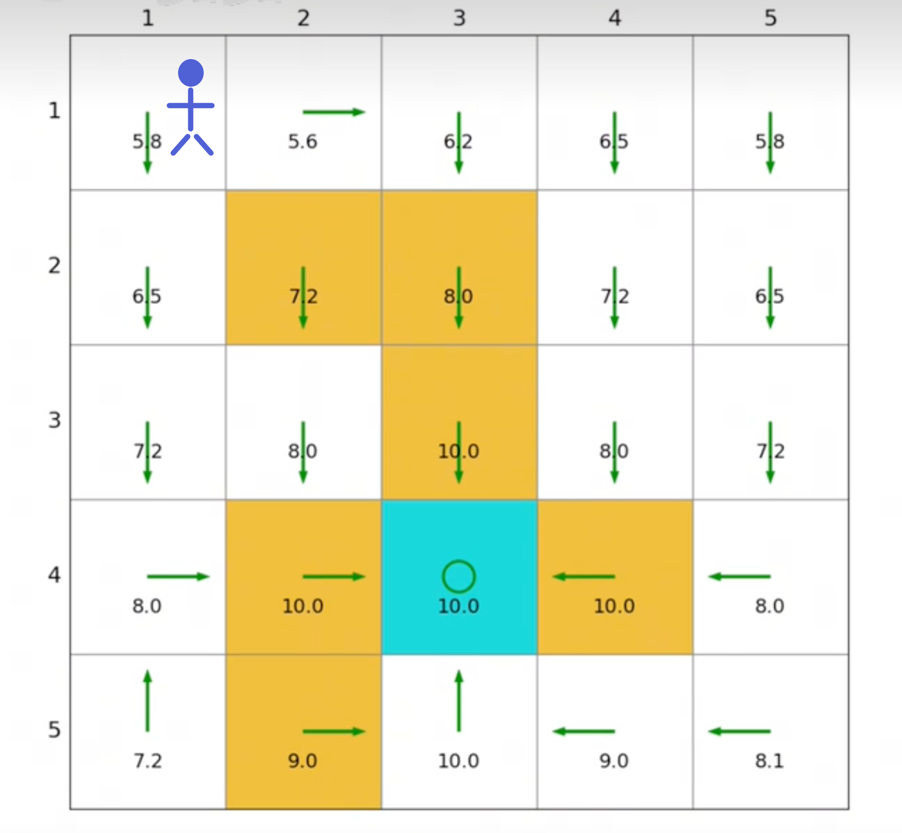
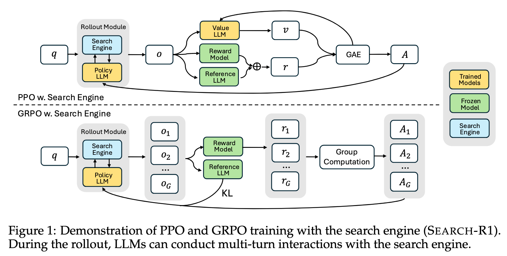
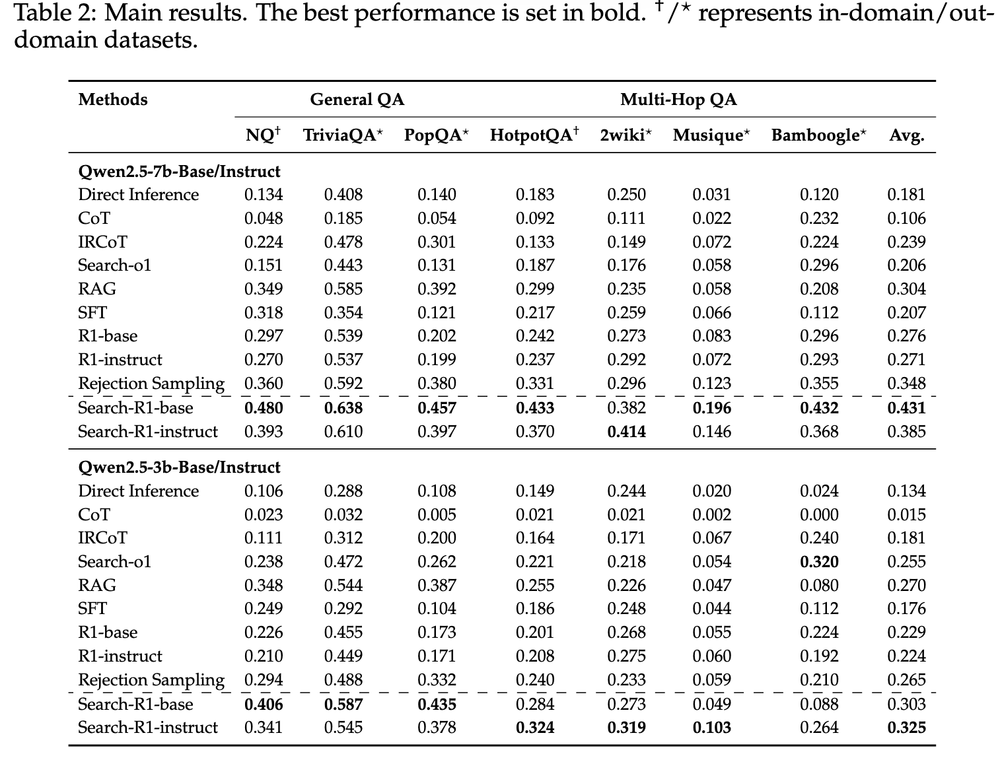
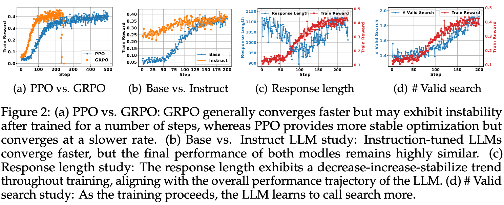

<!-- _class: cover_c -->
<!-- _header: -->
<!-- _paginate: "" -->
<!-- _footer:   -->
# Search-R1: Training LLMs to Reason and Leverage Search Engines with Reinforcement Learning

Published as a conference paper at COLM 2025
Bowen Jin1, Hansi Zeng2, Zhenrui Yue1, Jinsung Yoon3, Sercan O ̈ . Arık3, Dong Wang1, Hamed Zamani2, Jiawei Han1


Reporter ：Zhang zheyuan 
Date ：2026-05-26

## 目录

<!-- _class: cols2_ol_ci fglass toc_c  -->
<!-- _footer: "" -->
<!-- _header: "CONTENTS" -->
<!-- _paginate: "" -->

- [Introduction](#3)
- [Background](#5)
- [Design](#6)
- [Evaluation](#10)
- [Conclusion](#13)


## 1 Introduction & Search-R1 核心摘要<!-- page 3 -->

<!-- _header: \ ****** **Introduction** *Background*  *Design* *Evaluation* *Conclusion* --> 
<!-- _class: navbar -->

🎯 **问题**：大模型解决复杂问题时（如多跳问答、事实核查），必须动态获取外部知识

⚠️ **核心挑战**：
- 模型参数知识有截止/幻觉风险
- 单次检索无法支撑迭代推理
- "怎么查"比"查什么"更难教

💡 **关键洞察**：让LLM像人一样**自主决策检索时机与内容**，是通向可靠推理的关键一步

> 本次介绍：Search-R1 用强化学习教会模型"边想边查"的后训练的开山之作

## 1.Introduction & 现有方案及其局限<!-- page 4 -->

<!-- _header: \ ****** **Introduction** *Background* *Design* *Evaluation* *Conclusion* --> 
<!-- _class: navbar -->
| 方案 | 核心思路 | 关键缺陷 |
|------|----------|----------|
| **RAG** | 先检索→再生成 | 单次检索，无法迭代修正；检索与推理解耦 |
| **Prompt Tool-use** | 教模型调用搜索 | 泛化弱，依赖高质量标注轨迹 |
| **SFT端到端** | 监督微调交互策略 | 搜索操作不可微，难规模化 |


<br>

> 🔑 核心矛盾：**"怎么查"比"查什么"更难教**，现有方法无法让模型自主学会检索策略

## 1.Introduction & Search-R1 的核心突破 <!-- page 5 -->

<!-- _header: \ ****** **Introduction** *Background*  *Design* *Evaluation* *Conclusion* --> 
<!-- _class: navbar -->

✅ **范式创新**：将搜索引擎纳入RL环境，实现“思考-检索”多轮交替  
✅ **极简设计**：  
  - 仅用结果奖励（Exact Match），无需过程/格式奖励  
  - 检索Token Loss Masking，防止优化漂移  
  - 原生兼容PPO/GRPO算法  

💡 **本质**：不手工设计“怎么查”，让强化学习自主探索最优交互策略

## 1.Introduction & 效果速览：同设置下显著提升 <!-- page 6 -->

<!-- _header: \ ****** **Introduction** *Background*  *Design* *Evaluation* *Conclusion* --> 
<!-- _class: navbar -->


| 模型 | 平均提升 (vs RAG) | 多跳任务最佳提升 |
|------|------------------|------------------|
| Qwen2.5-7B | **+24%** | Musique +238% |
| Qwen2.5-3B | **+20%** | PopQA +12% |

<br>
<br>

✅ **公平对比**：同检索器 / 同语料 / 同Top-k=3 / 同预训练基座  
✅ **泛化性强**：分布内（NQ/HotpotQA）+ 分布外（5个多跳数据集）均有效  
✅ **模型无关**：Base/Instruct 最终性能趋同 → RL 可弥补预训练差异

## 1.Introduction & 核心问题与突破 <!-- page 7 -->

<!-- _header: \ ****** **Introduction** *Background*  *Design* *Evaluation* *Conclusion* --> 
<!-- _class: navbar -->


🎯 **核心问题**：如何让LLM自主学会"边思考边搜索"的交互策略？

💡 **Search-R1 的做法**：
- 把搜索变成环境的一部分，用RL端到端优化
- 极简奖励（Exact Match）+ Token Masking = 稳定训练
- 不教"怎么查"，让模型自己探索最优策略
 
## 2.Background & 强化学习 <!-- page 8 -->

<!-- _header: \ ****** *Introduction* **Background**  *Design* *Evaluation* *Conclusion* --> 
<!-- _class: navbar cols-2 -->
<div class="ldiv">

🎮 **场景**：4×4 网格，智能体从起点走向终点
- **State (状态)**：智能体当前所在位置
- **Action (动作)**：上/下/左/右/原地不动
- **Reward (奖励)**：每步 -1（取决具体场景），到达终点 +10
- **Episode (回合)**：从起点到终止状态的一次完整交互过程

> 💡 核心目标：在 Episode 中最大化**累计奖励**，而非单步奖励
> 
</div><div class="rdiv">


</div>

## 2.Background & 强化学习 <!-- page 9 -->

<!-- _header: \ ****** *Introduction* **Background**  *Design* *Evaluation* *Conclusion* --> 
<!-- _class: navbar cols-2-64 -->


<div class="ldiv">

- **Trajectory**: $\tau = (s_0, a_0, r_1, \dots, s_T)$ 一次完整交互序列
- **Return**: $G_t = \sum \gamma^k r_{t+k}$ 轨迹上所有奖励之和
- **State Value**: $V^\pi(s) = \mathbb{E}[G_t \mid s_t=s]$ 从状态$s$出发的期望Return
- **Action Value**: $Q^\pi(s,a) = \mathbb{E}[G_t \mid s_t=s, a_t=a]$ 选动作$a$后的期望Return
- **Policy $\pi(a|s)$**: 策略分布（如上下左右的具体概率）
- **Bellman方程**: $V(s) = \mathbb{E}[r + \gamma V(s')]$ 价值递归关系，Reward由环境期望决定

</div><div class="rdiv">


</div>

## 2.Background & 强化学习——值迭代 <!-- page 10 -->

<!-- _header: \ ****** *Introduction* **Background**  *Design* *Evaluation* *Conclusion* --> 
<!-- _class: navbar -->
值迭代算法：从随机初始值到最优策略

**算法流程**：
1. **初始化**：任意设定 $V_0(s)$（如全为0）
2. **迭代更新**（直到收敛）：
   - **Q值计算**：$Q_k(s,a) = \mathbb{E}[r|s,a] + \gamma \sum_{s'} P(s'|s,a) V_k(s')$
   - **策略改进**：$\pi_{k+1}(s) = \arg\max_a Q_k(s,a)$ （贪心选择最优动作）
   - **价值更新**：$V_{k+1}(s) = \max_a Q_k(s,a)$ （贝尔曼最优方程）

> 💡 **数学保证**：当迭代次数 $k \to \infty$，$V_k(s)$ 收敛到最优价值 $V^*(s)$，策略收敛到最优策略 $\pi^*$

## 2.Background & 强化学习——蒙特卡洛近似 <!-- page 11 -->

<!-- _header: \ ****** *Introduction* **Background**  *Design* *Evaluation* *Conclusion* --> 
<!-- _class: navbar -->
- **问题**：$V^\pi(s)=\mathbb{E}[G_t\|s]$ 的期望无法直接计算（状态空间太大）
- **蒙特卡洛思路**：用**多次rollout的样本平均**近似期望
  - 一次 Rollout：从状态$s$出发，按策略$\pi$采样一条完整轨迹$\tau$，计算$G_t$
  - 重复$N$次：$\hat{V}(s) \approx \frac{1}{N}\sum_{i=1}^N G_t^{(i)}$

⚠️ 局限：方差大、必须等到回合结束才能更新
> 数学上可以证明， 即使是小的采样， 最后算法也可以收敛到最优值
>  证明可以参考《强化学习的数学原理》 赵世钰
> 

## 2.Background & 强化学习——神经网络近似 <!-- page 12 -->

<!-- _header: \ ****** *Introduction* **Background**  *Design* *Evaluation* *Conclusion* --> 
<!-- _class: navbar bq-red-->

- **瓶颈**：现实问题状态/动作空间巨大（如围棋 $10^{170}$），表格法无法存储与更新
- **核心思想**：用神经网络作**万能函数**，替代查表
- **参数化表示**：
  • 价值网络 $V_\phi(s)$：输入状态 → 输出期望回报
  • 策略网络 $\pi_\theta(a\|s)$：输入状态 → 输出动作概率分布
- **优势**：具备**泛化能力**，能评估未见过的状态，支撑大规模RL训练

> 大模型推理过程也可以看作一个RL过程：
> 
> 💡 大模型的promt + token1, token2, ... token n 可以记作当前的 **State**
> 💡 大模型自回归生成一个token记作 **Action**
> 💡 大模型自回归生成每个token的概率为 **policy**
> 

## 2.Background & 强化学习——Actor-Critic <!-- page 13 -->

<!-- _header: \ ****** *Introduction* **Background**  *Design* *Evaluation* *Conclusion* --> 
<!-- _class: navbar -->

- **核心思想**：两个神经网络分工，兼顾“决策”与“评估”
  - **Actor (策略网络)**：输入状态 $s$，输出动作概率 $\pi_\theta(a\|s)$，负责“怎么选”
  - **Critic (价值网络)**：输入状态 $s$，输出价值估计 $V_\phi(s)$，负责“评好坏”
  - **TD误差**：$\delta = r + \gamma q_w(s',a') - q_w(s,a)$  
- **优势函数 (Advantage)**：$A_t = r_t + \gamma V(s_{t+1}) - V(s_t)$，衡量动作“比预期好多少”
- **更新机制**：Actor 沿 $A_t$ 梯度上升优化策略，Critic 用 TD 误差拟合价值

> 💡 双网络配合：Actor 探索方向，Critic 降低方差，实现高效在线学习

## 2.Background & 强化学习——Actor-Critic <!-- page 14 -->

<!-- _header: \ ****** *Introduction* **Background**  *Design* *Evaluation* *Conclusion* --> 
<!-- _class: navbar -->


**算法**：在每个episode的时间步$t$执行

1. **采样**：根据$\pi(a\|s_t,\theta_t)$生成$a_t$，观察$r_{t+1}, s_{t+1}$
2. **预采样**：根据$\pi(a\|s_{t+1},\theta_t)$生成$a_{t+1}$（用于bootstrap）

3. **Critic更新（Value Update）**：
   $$w_{t+1} = w_t + \alpha_w [r_{t+1} + \gamma q(s_{t+1},a_{t+1},w_t) - q(s_t,a_t,w_t)] \nabla_w q(s_t,a_t,w_t)$$

4. **Actor更新（Policy Update）**：
   $$\theta_{t+1} = \theta_t + \alpha_\theta \nabla_\theta \ln \pi(a_t\|s_t,\theta_t) q(s_t,a_t,w_{t+1})$$

> ✅ 双网络交替更新：Critic先学，Actor再学

## 2.Background & 强化学习——Critic 网络如何估计 Action Value <!-- page 15 -->

<!-- _header: \ ****** *Introduction* **Background**  *Design* *Evaluation* *Conclusion* --> 
<!-- _class: navbar -->

- **问题**：$Q^\pi(s,a)$ 无法直接计算，需用神经网络近似
- **参数化表示**：$q_w(s,a)$ —— 输入 $(s,a)$，输出标量价值估计
- **训练目标**：最小化 TD 误差的平方
  $$L(w) = \mathbb{E}[(r + \gamma q_w(s',a') - q_w(s,a))^2]$$
- **梯度更新**：
  $$w_{t+1} = w_t + \alpha_w [r + \gamma q_w(s',a') - q_w(s,a)] \nabla_w q_w(s,a)$$

> 💡 Critic 通过"预测→观察实际→修正预测"循环，逐步逼近真实 $Q$ 值


## 3.Design & 从 Actor-Critic 到 PPO：为什么要加"刹车"？ <!-- page 16 -->

<!-- _header: \ ****** *Introduction* *Background*  **Design** *Evaluation* *Conclusion* --> 
<!-- _class: navbar -->

- **Actor-Critic 的问题**：策略更新步长难以控制
  - 策略梯度更新：$\theta_{new} = \theta_{old} + \alpha \nabla J(\theta)$
  - 如果学习率 $\alpha$ 太大 → 策略突变，训练崩溃
  - 如果学习率 $\alpha$ 太小 → 收敛太慢，效率低

- **PPO 的核心洞察**：与其调学习率，不如直接限制"新策略偏离旧策略多远"
  - 重要性采样比：$\frac{\pi_\theta(a\|s)}{\pi_{old}(a\|s)}$ 衡量策略变化幅度
  - 理想情况：比值接近 1（策略小幅改进）
  - 危险情况：比值 >> 1 或 << 1（策略剧变）

> 💡 PPO = 在 Actor-Critic 基础上加"安全约束"，确保每次更新都在"信任区域"内


## 3.Design & PPO 算法：Clip 机制实现"信任区域"优化 <!-- page 17 -->

<!-- _header: \ ****** *Introduction* *Background*  **Design** *Evaluation* *Conclusion* --> 
<!-- _class: navbar -->

- **Clip 目标函数**（核心创新）：
  $$J^{PPO}(\theta) = \mathbb{E}\left[\min\left(\underbrace{\frac{\pi_\theta}{\pi_{old}}A_t}_{\text{原始更新}},\ \underbrace{\text{clip}\left(\frac{\pi_\theta}{\pi_{old}},1-\epsilon,1+\epsilon\right)A_t}_{\text{限制幅度}}\right)\right]$$
  
- **工作机制**：
  - 如果 $\frac{\pi_\theta}{\pi_{old}} > 1.2$ → 截断为 1.2，防止过度优化好动作
  - 如果 $\frac{\pi_\theta}{\pi_{old}} < 0.8$ → 截断为 0.8，防止过度惩罚差动作

- **Search-R1 适配**：
  - Advantage 用 GAE 计算：$A_t = r_{t+1} + \gamma V(s_{t+1}) - V(s_t)$
  - **检索 Token Loss Masking**：只对 LLM 生成的 token 算 loss，检索内容不参与优化

## 3.Design & Search-R1 奖励设计：极简但有效 <!-- page 18 -->

<!-- _header: \ ****** *Introduction* *Background*  **Design** *Evaluation* *Conclusion* --> 
<!-- _class: navbar -->

- **核心选择**：仅用**结果奖励（Outcome-based）**，不用过程/格式奖励
- **具体实现**：Exact Match（EM）
  $$r_\phi(x,y) = \mathbb{I}[\text{extract}(y) = \text{ground\_truth}]$$
  → 答案完全匹配得+1，否则得0
- **为什么不用复杂 Reward Model**？
  • 避免训练额外神经网络，降低计算成本
  • 减少奖励信号噪声，防止优化目标漂移
  • 论文验证：简单信号 + 正确框架 = 有效学习

> 💡 关键洞察：**"教模型怎么做"不如"告诉模型做对了没"**

## 3.Design & KL 散度：为什么需要"约束策略跑偏"？ <!-- page 19 -->

<!-- _header: \ ****** *Introduction* *Background*  **Design** *Evaluation* *Conclusion* --> 
<!-- _class: navbar -->

- **问题**：RL 训练中，策略可能为"刷高分"而偏离合理行为
- **KL 散度作用**：约束新策略 $\pi_\theta$ 不远离参考策略 $\pi_{ref}$
  $$\mathcal{L}_{KL} = D_{KL}[\pi_\theta(y\|x;R) \|\| \pi_{ref}(y\|x;R)]$$
- **在目标函数中的位置**：
  $$\max_\theta \mathbb{E}[r_\phi] - \beta \cdot \mathcal{L}_{KL}$$
  → $\beta$ 控制约束强度（Search-R1 中 $\beta=0.001$）
- **Search-R1 适配**：KL 计算时同样应用 Retrieved Token Masking

> 💡 KL 约束 = "防止模型为拿分而胡写"，保证训练稳定性和生成质量


## 3.Design & KL 散度：为什么需要"约束策略跑偏"？ <!-- page 20 -->

<!-- _header: \ ****** *Introduction* *Background*  **Design** *Evaluation* *Conclusion* --> 
<!-- _class: navbar -->



## 3.Design & GRPO 算法：免 Critic 的轻量替代 <!-- page 21 -->

<!-- _header: \ ****** *Introduction* *Background*  **Design** *Evaluation* *Conclusion* --> 
<!-- _class: navbar -->

- **PPO 的局限**：需额外训练 Value Network（Critic），增加计算开销
- **GRPO 核心思想**：用**组内平均奖励**替代 Critic 作为 baseline
  - 对每个问题 $x$，采样 $G$ 个响应 $\{y_1,...,y_G\}$
  - Advantage 近似：$\hat{A}_{i,t} = r_i - \frac{1}{G}\sum_{j=1}^G r_j$
- **目标函数**：
  $$J^{GRPO} = \mathbb{E}\left[\min\left(\frac{\pi_\theta}{\pi_{old}}\hat{A}, \text{clip}(\cdot)\hat{A}\right) - \beta D_{KL}\right]$$
- **Search-R1 适配**：组采样时支持多轮检索交互，Token Masking 同步应用

> 💡 GRPO = "用统计代替网络"，收敛更快，适合资源有限场景

 ## 3.Design & 采样与迭代：Search-R1 的训练流程 <!-- page 22 -->

<!-- _header: \ ****** *Introduction* *Background*  **Design** *Evaluation* *Conclusion* --> 
<!-- _class: navbar -->

- **Rollout 采样**：按当前策略 $\pi_\theta$ 生成带检索的完整轨迹
- ```<think>推理</think> → <search>查询</search> → <information>结果</information> → 循环 → <answer>答案</answer>```
- - **优势估计**：
• PPO：用 GAE 计算 $A_t = r_{t+1} + \gamma V(s_{t+1}) - V(s_t)$
• GRPO：用组内奖励差 $\hat{A} = r_i - \bar{r}$
- **迭代更新**：
1. 采样一批轨迹 → 2. 计算 Advantage → 3. 更新 Actor/Critic → 4. 重复
- **关键技巧**：检索 Token Loss Masking + KL 约束 + Clip 机制，三重稳定保障

> ✅ 搜索即环境：$\pi_\theta(\cdot\|x) \otimes R$，端到端学习"边想边查"

## 4.Evaluation & 数据集：覆盖单跳与多跳推理 <!-- page 23 -->

<!-- _header: \ ****** *Introduction* *Background* *Design*  **Evaluation** *Conclusion* --> 
<!-- _class: navbar -->

- **7个QA数据集**，分两类评估泛化性：
  • **单跳（分布内）**：NQ、TriviaQA、PopQA → 测试基础检索能力
  • **多跳（分布外）**：HotpotQA、2Wiki、Musique、Bamboogle → 测试迭代推理+检索
- **统一评估指标**：Exact Match（EM），答案完全匹配才得分
- **公平对比原则**：同检索器（E5）、同语料（Wikipedia 2018）、同Top-k=3、同预训练基座

> 💡 关键设计：**控制变量**，确保性能提升来自训练方法，而非数据/检索差异

## 4.Evaluation & 主结果：Search-R1 显著提升多跳推理能力 <!-- page 24 -->

<!-- _header: \ ****** *Introduction* *Background* *Design*  **Evaluation** *Conclusion* --> 
<!-- _class: navbar cols-2-64-->
<div class= "ldiv">

**Table 2 关键发现**（7个数据集，Qwen2.5-7B/3B）：

- **整体提升**：
  • Search-R1-base (7B): **0.431** vs RAG 0.304 → **+41%**
  • Search-R1-base (3B): **0.303** vs RAG 0.270 → **+12%**
  
- **多跳任务提升最显著**：
  • Musique: 0.196 vs RAG 0.058 → **+238%**
  • 2Wiki: 0.382 vs RAG 0.235 → **+63%**
  
- **模型规模效应**：7B模型提升幅度 >> 3B模型
  → 更大模型更擅长学习"如何搜索"
</div>
<div class="rdiv">


> 💡 关键洞察：**Search-R1在复杂推理任务上优势最大**，证明模型真的学会了"边想边查"
</div>

## 4.Evaluation & RL方法对比：PPO更稳，GRPO更快 <!-- page 25 -->

<!-- _header: \ ****** *Introduction* *Background* *Design*  **Evaluation** *Conclusion* --> 
<!-- _class: navbar cols-2-64-->


<div class="ldiv">




**Figure 2a 分析**：

- **收敛速度**：GRPO > PPO
  • GRPO无需Critic网络，跳过warm-up阶段
  • Figure 2a：GRPO前100步上升更快
  

</div>
<div class="rdiv">

- **训练稳定性**：PPO >> GRPO
  • Figure 2a：GRPO在300步后出现**Reward Collapse**
  • PPO全程稳定，无崩溃现象
  
- **最终性能**：PPO ≈ GRPO
  • Table 3：两者平均性能接近（0.431 vs 0.350）
  • PPO在多跳任务上略优

> ✅ **Search-R1推荐配置**：PPO（稳定性优先）

</div>

## 4.Evaluation & Base vs Instruct：RL可弥补预训练差距 <!-- page 26 -->

<!-- _header: \ ****** *Introduction* *Background* *Design*  **Evaluation** *Conclusion* --> 
<!-- _class: navbar cols-2-64 -->

<div class="ldiv">


**Figure 2b 训练动态分析**：

- **起步阶段**：Instruct >> Base
  • Instruct模型初始奖励高20-30%
  • 指令微调让模型更快理解任务格式
</div>
</div class="rdiv">

- **收敛速度**：Instruct > Base
  • Instruct模型100步内基本收敛
  • Base模型需要200-300步
  
- **最终性能**：Instruct ≈ Base
  • 两者最终奖励高度接近
  • RL训练可弥补预训练阶段的差距
💡 **实践启示**：高质量SFT数据，用Instruct起步更快；否则Base模型+RL也能达到同等效果

</div>

## 4.Evaluation & 训练动态：模型如何学会"边想边查" <!-- page 27 -->

<!-- _header: \ ****** *Introduction* *Background* *Design*  **Evaluation** *Conclusion* --> 
<!-- _class: navbar pin-3 -->
<div class="tdiv">


</div>

</div class="ldiv">

**Figure 2c（Response Length）**：
**0-100步**：长度↓（去冗余）
  • 模型学会删除废话，直接输出结构化内容
**100-300步**：长度↑（学会查）
  • 模型频繁调用搜索，插入大量检索结果

</div>
<div class="rdiv">

**Figure 2d（# Valid Search）**：
- 有效搜索次数从0.5次/题 → 2.5次/题
- 模型真的学会了**多轮迭代检索**

> 🔍 **关键现象**：长度和搜索次数的变化曲线，与奖励提升曲线完全同步
</div>


## 4.Evaluation & 消融研究：Retrieved Token Masking 至关重要 <!-- page 28 -->

<!-- _header: \ ****** *Introduction* *Background* *Design*  **Evaluation** *Conclusion* --> 
<!-- _class: navbar pin-3 -->

<div class="tdiv">

**Table 4：有无Masking对比**（Qwen2.5-7B-base）：

| 配置 | NQ | HotpotQA | Musique | 平均 |
|------|------|----------|---------|------|
| **w. Masking** | 0.480 | 0.433 | 0.196 | **0.431** |
| w.o. Masking | 0.388 | 0.325 | 0.108 | **0.343** |
| **提升** | +24% | +33% | +81% | **+26%** |
</div>
<div class="ldiv">

\
**为什么Masking这么重要**？
- 检索内容是**环境返回**的，不是LLM生成的
- 如果优化检索token，会导致：
  • 模型试图"修改"检索结果（不可能做到）
  • 训练不稳定，性能大幅下降
</div>
<div class="rdiv">

<br><br><br>

> ✅ **设计要点**：只对LLM生成的token算loss，检索内容只作为上下文
</div>


## 5.Conclusion & Search-R1：后训练范式的开山之作 <!-- page 28 -->

<!-- _header: \ ****** *Introduction* *Background* *Design* *Evaluation*  **Conclusion** --> 
<!-- _class: navbar -->

- **范式创新**：首次将**多轮搜索交互**纳入RL优化框架，搜索即环境 `π_θ(·|x) ⊗ R`
- **极简设计**：
  • 仅用结果奖励（Exact Match），无需复杂Reward Model
  • 检索Token Loss Masking，确保训练稳定
  • 原生兼容PPO/GRPO，工程落地友好
- **效果验证**：7数据集平均提升20-24%，多跳任务最高+238%

> 🔑 **定位**：Search-R1 = DeepSeek-R1 Zero 的"搜索增强版"，证明**简单奖励+正确框架=有效学习复杂行为**

## 5.Conclusion & RL后训练的潜力：不止于搜索 <!-- page 29 -->

<!-- _header: \ ****** *Introduction* *Background* *Design* *Evaluation*  **Conclusion** --> 
<!-- _class: navbar -->

- **可扩展方向**：
  • 多工具协同：代码执行/计算器/数据库查询，统一用RL优化调用策略
  • 不确定性触发检索：模型学会"不知道时再查"，减少无效调用
  • 多模态扩展：图像/视频检索 + 推理，构建通用感知-决策框架
- **工程优化空间**：
  • 动态检索步数：简单问题1步，复杂问题多步，自适应资源分配
  • 推理延迟优化：KV-cache + 检索预取，支撑在线服务

> 💡 核心趋势：**"让模型自己学怎么用工具"，比"手工设计工具调用流程"更具扩展性**


---
<!-- _class: lastpage  -->
<!-- _header: -->
###### Thank you! Q & A 
<div class = "icons">
</div>
