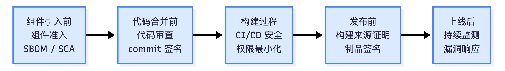

<!-- _class: cover_c -->
<!-- _header: -->
<!-- _paginate: "" -->
<!-- _footer:   -->

# 开源软件供应链安全治理 & 互联网治理专题

Reporter：梁彦阳 张哲源 姚佳 

Date：2026-06-09

## 目录

<!-- _class: cols2_ol_ci fglass toc_c  -->
<!-- _footer: "" -->
<!-- _header: "CONTENTS" -->
<!-- _paginate: "" -->

- [背景](#3)
- [基本概念](#5)
- [重要性](#7)
- [风险来源](#10)
- [治理路径](#14)
- [面临挑战](#21)
- [新场景](#22)
- [总结](#26)

## 1.背景 & 现代软件的供应链依赖 <!-- page 3 -->

<!-- _header: \ ****** **背景** *基本概念* *重要性* *风险来源* *治理路径* *面临挑战* *新场景* *总结* -->
<!-- _class: navbar -->

- 现代软件大量依赖**开源组件、第三方SDK、云服务接口、容器镜像和CI/CD工具**
- 攻击者不再直接攻击目标系统，而是通过**供应链环节**渗透：
  - 开源组件漏洞 / 恶意依赖包 / 软件更新污染
  - 构建流水线篡改 / 供应商被入侵

> 💡 风险一旦发生，可能沿供应链影响大量下游用户和组织

## 1.背景 & 供应链与传统安全的区别 <!-- page 4 -->

<!-- _header: \ ****** **背景** *基本概念* *重要性* *风险来源* *治理路径* *面临挑战* *新场景* *总结* -->
<!-- _class: navbar -->

| 维度 | 传统安全 | 供应链安全 |
|------|---------|-----------|
| **关注对象** | 自身系统漏洞 | 软件生产交付全链条 |
| **攻击路径** | 直接攻击目标 | 攻击上游组件/流程 |
| **治理目标** | 发现并修复漏洞 | 建立可信链条 |
| **涉及主体** | 安全团队 | 开发/安全/采购/法务多部门 |

 

> 💡 供应链安全关注：**来源可见、过程可信、责任可追、风险可控**

## 2.基本概念 & 软件供应链的定义 <!-- page 5 -->

<!-- _header: \ ****** *背景* **基本概念** *重要性* *风险来源* *治理路径* *面临挑战* *新场景* *总结* -->
<!-- _class: navbar -->

**软件供应链**：软件从产生到使用所经历的完整链条

类比食品生产链：
- 食品安全不只看成品，还看**原材料/加工/运输/包装/销售**
- 软件安全不只看最终系统，还看：
  - "原材料"（开源组件）是否可信
  - 生产过程（构建）是否安全
  - 交付渠道是否可靠
  - 后续更新是否可控

> 💡 软件供应链安全是典型的**互联网治理和安全管理**问题，不只是纯技术问题

## 2.基本概念 & 核心关注的五类问题 <!-- page 6 -->

<!-- _header: \ ****** *背景* **基本概念** *重要性* *风险来源* *治理路径* *面临挑战* *新场景* *总结* -->
<!-- _class: navbar -->

1. 软件**用了哪些**开源组件和第三方依赖？
2. 这些组件是否存在**已知漏洞、恶意代码或维护风险**？
3. 软件**构建和发布**过程是否可能被篡改？
4. 软件**供应商、外包团队和第三方SDK**是否可信？
5. 安全事件后能否**快速定位、修复和追责**？

 

> 区别于漏洞管理（关注缺陷修复）和内容安全（关注用户内容），
> 供应链安全关注**软件生产交付链条中的系统性风险**

## 3.重要性 & 开发方式：从自研到组装 <!-- page 7 -->

<!-- _header: \ ****** *背景* *基本概念* **重要性** *风险来源* *治理路径* *面临挑战* *新场景* *总结* -->
<!-- _class: navbar -->

- 现代开发大量复用 npm、PyPI、Maven 等包管理器中的第三方代码
- **"组装式开发"改变了软件安全边界**：
  - 系统安全不只取决于自身代码，还取决于组件的**安全性、维护状态和分发渠道**

NDSS 2021 *Towards Measuring Supply Chain Attacks on Package Managers*：
- 研究 npm、PyPI、RubyGems 中的供应链攻击
- 发现**数百个恶意包**，说明开源包管理生态已成为供应链攻击的重要入口

> 🔑 不仅要关注自己写的代码，还要关注依赖包**从哪里来、是否维护、是否有漏洞**

## 3.重要性 & 攻击目标：从单系统到上游生态 <!-- page 8 -->

<!-- _header: \ ****** *背景* *基本概念* **重要性** *风险来源* *治理路径* *面临挑战* *新场景* *总结* -->
<!-- _class: navbar -->

- 传统攻击：直接针对目标系统（Web漏洞、弱口令、数据库漏洞）
- 供应链攻击：攻击**更上游位置**——维护者账号、构建流水线、分发平台

**更隐蔽，影响范围更广**：
- 恶意代码随正常软件依赖/更新机制传播到大量下游项目
- 利用"开发者信任包管理器、企业信任开源组件"的信任关系

S&P 2023 *SoK: Taxonomy of Attacks on Open-Source Software Supply Chains*：
- 整理了 **107类攻击向量、94个真实攻击事件、33类缓解措施**
- 攻击贯穿代码贡献、维护、构建、发布分发**全过程**

## 3.重要性 & 治理目标：从漏洞修复到可信链条 <!-- page 9 -->

<!-- _header: \ ****** *背景* *基本概念* **重要性** *风险来源* *治理路径* *面临挑战* *新场景* *总结* -->
<!-- _class: navbar cols-2-64 -->

 

**传统安全治理**：代码审计/漏洞扫描/渗透测试/补丁管理

**供应链治理需要回答更基础的问题**：
- 这个组件**谁开发维护**？是否经过审查？
- 依赖是否来自**可信来源**？
- 构建环境是否**可控**？
- 制品是否真的**由对应源码构建**？
- 出现漏洞时，能否快速判断**哪些系统受影响**？

 

**关键治理工具**：

| 工具 | 作用 |
|------|------|
| SBOM | 组件清单 |
| SCA | 依赖漏洞扫描 |
| 制品签名/哈希 | 完整性验证 |
| SLSA | 可信构建框架 |
| NIST SSDF | 安全开发实践 |

## 4.风险来源 & 供应链各环节概览 <!-- page 10 -->

<!-- _header: \ ****** *背景* *基本概念* *重要性* **风险来源** *治理路径* *面临挑战* *新场景* *总结* -->
<!-- _class: navbar -->

软件从代码产生到用户安装运行，经历多个阶段，**每个节点都可能成为攻击入口**：

| 模块 | 核心风险 | 模块 | 核心风险 |
|------|---------|------|---------|
| **贡献者** | 恶意代码从正常入口进入项目 | **构建系统** | 构建过程被污染，制品不可信 |
| **维护者** | 账号接管、权限过度集中 | **分发平台** | 软件包被替换、传播到大量下游 |
| **版本控制** | 源码仓库被污染 | **下游用户** | 继承上游风险，可见性不足 |
| **依赖拉取** | 恶意包、名称混淆、解析机制滥用 | **系统管理员** | 高权限失控，影响整个供应链 |

## 4.风险来源 & 依赖与构建风险 <!-- page 11 -->

<!-- _header: \ ****** *背景* *基本概念* *重要性* **风险来源** *治理路径* *面临挑战* *新场景* *总结* -->
<!-- _class: navbar cols-2 -->

**依赖拉取风险**：
- 创建恶意新包，诱导开发者使用
- **名称混淆** : typosquatting、combosquatting、相似名称
- 滥用依赖解析机制（依赖混淆攻击）
- 传递依赖放大风险：下游无法逐一审查

**构建系统风险**：
- 即使源码可信，**构建过程仍可能被污染**
- CI/CD 平台被攻破 → 篡改构建任务
- 构建系统持有大量敏感凭证
  （仓库Token、云服务密钥、发布凭证）

> 💡 攻击者不一定修改源码，只要能影响构建脚本或环境，就可以改变最终制品

## 4.风险来源 & 账号与权限风险 <!-- page 12 -->

<!-- _header: \ ****** *背景* *基本概念* *重要性* **风险来源** *治理路径* *面临挑战* *新场景* *总结* -->
<!-- _class: navbar cols-2 -->

**账号接管**（攻击者最青睐的路径）：
- 凭据复用 / 钓鱼 / 社会工程 / 弱密码
- 接管后：合并恶意代码、触发恶意构建、发布被污染版本

**社会工程与长期潜伏**：
- 长期提交低风险贡献建立可信形象
- 逐步获得维护权限，再实施攻击

**权限集中放大风险**：
- 单维护者同时持有合并/构建/发布权限
- 账号失陷 → 攻击者绕过多个控制环节

**敏感信息泄露**（USENIX Security 2023 *Pushed by Accident*）：
- 误提交 API key、密钥到公共仓库普遍存在
- 即使后续删除，攻击者可能已捕获利用

## 4.风险来源 & 分发与下游风险 <!-- page 13 -->

<!-- _header: \ ****** *背景* *基本概念* *重要性* **风险来源** *治理路径* *面临挑战* *新场景* *总结* -->
<!-- _class: navbar -->

**分发平台风险**：
- 攻击者发布合法包的恶意版本（接管维护者账号）
- 平台本身被攻破 → 替换软件包
- 网络层攻击：中间人、DNS投毒、URL劫持
- **悬空引用**：废弃域名/包名被重新注册为恶意资源

**下游用户风险**：
- 安装**被污染的预构建包**，难以从版本号/声誉判断可信度
- 从源码构建≠完全安全：构建脚本仍会拉取外部依赖
- 依赖规模过大，无法对每个组件完整审查

> ⚠️ 下游用户**继承上游所有风险**，却很难获得对上游过程的完整可见性

## 5.治理路径 & 开源组件准入 <!-- page 14 -->

<!-- _header: \ ****** *背景* *基本概念* *重要性* *风险来源* **治理路径** *面临挑战* *新场景* *总结* -->
<!-- _class: navbar cols-2 -->

**准入评估五个维度**：
1. **基础可信度**：官方仓库/文档/许可证是否清晰
   → 参考 OpenSSF Best Practices Badge
2. **维护健康度**：是否活跃维护，是否有响应
   → 使用 OpenSSF Scorecard 自动评分
3. **安全实践**：SECURITY.md / 漏洞披露渠道 / 代码审查 / 制品签名
4. **构建可信度**：是否提供哈希/签名/SLSA来源证明
5. **合规风险**：许可证是否兼容，是否有Copyleft义务

**准入五步流程**：

1. 开发人员提交引入申请
2. 自动化工具初筛（Scorecard/SCA/SBOM/许可证扫描）
3. 人工风险分级
4. 准入决策（允许/限制/替换/禁止）
5. 纳入后续依赖治理

> 💡 准入治理解决"进入前的筛选"，组件进入后还需持续管理

## 5.治理路径 & 依赖可视化与影响判断 <!-- page 15 -->

<!-- _header: \ ****** *背景* *基本概念* *重要性* *风险来源* **治理路径** *面临挑战* *新场景* *总结* -->
<!-- _class: navbar -->

**三层治理框架**：

| 层次 | 手段 | 目标 |
|------|------|------|
| **组件可见** | SBOM | 知道用了什么 |
| **漏洞关联** | SCA（CVE/GHSA/OSV） | 发现潜在风险 |
| **影响判断** | 调用路径/可达性分析 | 判断是否真正影响当前项目 |

**研究进展**：
- USENIX Security 2025 *ChainFuzz*：自动生成PoC验证上游漏洞是否在下游可触发
- NDSS 2026 *From Noise to Signal*：包级分析中 **68.28% 是噪声**（漏洞代码不可达）

> ⚠️ 传统SCA容易产生大量误报，需结合**函数级可达性**进行精准风险判断

## 5.治理路径 & 代码贡献治理 <!-- page 16 -->

<!-- _header: \ ****** *背景* *基本概念* *重要性* *风险来源* **治理路径** *面临挑战* *新场景* *总结* -->
<!-- _class: navbar cols-2-64 -->

**三层治理目标**：
1. **变更内容**可信 → 严格PR审查
2. **贡献者身份**可信 → commit signing
3. **协作流程**可信 → 分支保护+审计

**NDSS 2025** *Attributing Open-Source Contributions is Critical but Difficult*：
- 测量50,328个关键开源项目
- **85.9%** 项目贡献工作流存在可被滥用的空间
- 攻击者可操纵贡献工作流伪造可信形象

**关键措施**：
- 所有进主分支的修改必须通过PR
- CODEOWNERS 指定高风险文件责任人
- 要求维护者开启 **MFA**
- 使用 **commit signing / tag signing**
- 启用 **secret scanning**，检测误提交凭证

> 💡 贡献治理核心：每次合并的变更都有可信身份、经过审查、权限受控、可追溯

## 5.治理路径 & CI/CD 流水线安全 <!-- page 17 -->

<!-- _header: \ ****** *背景* *基本概念* *重要性* *风险来源* **治理路径** *面临挑战* *新场景* *总结* -->
<!-- _class: navbar cols-2 -->

**CI/CD 是供应链中的关键攻击目标**，掌握构建环境、访问令牌、发布凭证

**三个风险层面**：
1. **任务触发**：构建任务是否会执行攻击者可控输入（PR标题/branch name）
2. **权限与凭证**：外部PR触发的任务是否能访问secrets？普通任务是否有发布权限？
3. **运行环境**：第三方Action/runner/缓存目录是否可能被污染？

**相关研究**：
- S&P 2023 *Continuous Intrusion*：CI/CD 可引发任务劫持、权限提升、制品劫持
- USENIX Security 2023 *ARGUS*：GitHub Actions workflow 中存在命令注入风险
- NDSS 2026 *Action Required*：关键安全实践**采用率不高**，需组织层面制度化

> ⚠️ workflow 文件的安全影响不亚于业务代码，**需纳入代码审查范围**

## 5.治理路径 & 构建可信与来源证明 <!-- page 18 -->

<!-- _header: \ ****** *背景* *基本概念* *重要性* *风险来源* **治理路径** *面临挑战* *新场景* *总结* -->
<!-- _class: navbar cols-2 -->

**in-toto 框架**（USENIX Security 2019）：把构建从"黑盒执行"变为**可验证证据链**

- **Layout**：预先定义供应链执行蓝图——步骤、执行者、允许的输入输出
- **Link metadata**：每个执行者记录输入/输出的密码学哈希并签名
- **验证**：检查 Products/Materials 哈希匹配、步骤完整、执行者授权

> 💡 步骤间文件被替换 → 前后哈希不匹配 → 验证失败

**三类关键能力**：
① **步骤完整性** ② **产物流完整性** ③ **执行者认证**

## 5.治理路径 & 制品签名：Sigstore <!-- page 19 -->

<!-- _header: \ ****** *背景* *基本概念* *重要性* *风险来源* **治理路径** *面临挑战* *新场景* *总结* -->
<!-- _class: navbar cols-2 -->

**Sigstore**：把"长期密钥管理"转化为"基于现有身份的短期签名"

1. **OIDC 身份认证**：使用 GitHub/Google 等现有身份
2. **短期证书+临时密钥**：签名完成后私钥丢弃（有效期10分钟）
3. **透明日志**：签名行为写入公开日志，可审计异常发布

**核心组件**：Cosign · Fulcio · Rekor · TUF

> 💡 伪造制品无法通过签名验证；透明日志为事后审计提供依据

## 5.治理路径 & 治理路径全景 <!-- page 20 -->

<!-- _header: \ ****** *背景* *基本概念* *重要性* *风险来源* **治理路径** *面临挑战* *新场景* *总结* -->
<!-- _class: navbar -->

**安全嵌入软件生命周期**，而非事后补救

> ✅ 核心原则：**来源可见 → 过程可信 → 责任可追 → 风险可控**

## 6.面临挑战 & 四大落地困难 <!-- page 21 -->

<!-- _header: \ ****** *背景* *基本概念* *重要性* *风险来源* *治理路径* **面临挑战** *新场景* *总结* -->
<!-- _class: navbar cols-2 -->

 
 

1. **可见性难以建立**
   传递依赖/容器镜像/构建临时组件 → SBOM 需持续更新才有效

2. **告警与真实风险存在差距**
   SCA 只能说明"版本存在漏洞"，无法判断是否**可达/可触发**，大量误报

 
 

3. **可信构建落地成本高**
   SLSA/in-toto/Sigstore 需改造现有 CI/CD，小型项目难以完整落地

4. **多主体责任边界复杂**
   贡献者/维护者/平台/CI服务商/下游用户都可能影响供应链，事后责任难划分

> 💡 供应链安全治理需要**技术工具 + 权限管理 + 流程规范 + 平台责任**共同配合

## 7.新场景 & IDE 插件与开发工具链 <!-- page 22 -->

<!-- _header: \ ****** *背景* *基本概念* *重要性* *风险来源* *治理路径* *面临挑战* **新场景** *总结* -->
<!-- _class: navbar cols-2 -->

**开发工具链正成为供应链的新入口**：
- IDE 插件/代码补全工具运行在本机，能访问**源码/配置/凭证**
- 攻击发生在代码**进入仓库之前**

**NDSS 2024** *UntrustIDE: Exploiting Weaknesses in VS Code Extensions*：
- 系统分析了 VS Code 扩展生态中的安全弱点
- IDE 插件需**纳入开发阶段供应链治理**

**治理方向**：
- 建立 IDE 插件白名单，对高权限插件进行安全评估
- 限制插件对源码/凭证/环境变量的访问
- 使用受控开发镜像或统一插件市场

> 💡 供应链治理边界正在**前移到"代码产生和修改的开发环境"**

## 7.新场景 & AI 辅助开发的供应链风险 <!-- page 23 -->

<!-- _header: \ ****** *背景* *基本概念* *重要性* *风险来源* *治理路径* *面临挑战* **新场景** *总结* -->
<!-- _class: navbar cols-2-64 -->

**核心问题**：AI 生成的内容是否可信？
- LLM 可能生成不存在的包名
  （**Package Hallucination**）
- 攻击者预先注册被 AI 幻觉出的包名，植入恶意代码

**USENIX Security 2025** *We Have a Package for You!*：
- 使用 16 个代码生成模型
- 生成并分析 **576,000** 个 Python/JavaScript 样本
- 说明包名幻觉是 AI 辅助开发场景下的**系统性新型供应链风险**

**治理要点**：

把 AI 生成内容视为**不可信输入**：
- 对 AI 生成的依赖声明进行真实性校验
- 将 AI 生成代码纳入 SCA 扫描
- 对 AI 生成的安装命令/workflow/配置文件进行安全审查
- 开发工具加入**依赖真实性检查**

> ⚠️ AI 生成的安装命令可以被直接复制执行，是最危险的入口

## 7.新场景 & 智能汽车与 OTA <!-- page 24 -->

<!-- _header: \ ****** *背景* *基本概念* *重要性* *风险来源* *治理路径* *面临挑战* **新场景** *总结* -->
<!-- _class: navbar cols-2 -->

**挑战**：
- 涉及芯片/零部件供应商、主机厂、OTA平台、车端系统等多方
- 软件更新具有**安全关键属性**，错误/恶意更新可能影响车辆物理安全

**NDSS 2026** *Securing Automotive Software Supply Chains*：
- 车端完整验证所有元数据效率低且非必要
- 更合理方案：**分层验证**——仓库侧/OTA侧多点验证 + 车端轻量最终校验

**三个治理方向**：
1. 供应商/主机厂/OTA 平台建立 SBOM + 制品签名 + 来源证明机制
2. 仓库侧和 OTA 侧部署**完整供应链元数据验证**
3. 车端执行轻量级签名/版本校验，支持安全回滚和审计

> 💡 安全关键行业需根据**资源约束和物理安全要求**进行场景化供应链治理

## 7.新场景 & AI 驱动自动化补丁治理 <!-- page 25 -->

<!-- _header: \ ****** *背景* *基本概念* *重要性* *风险来源* *治理路径* *面临挑战* **新场景** *总结* -->
<!-- _class: navbar cols-2-->

**背景**：依赖漏洞告警数量快速增长，人工分析难以支撑大规模响应

**AI 的价值不只是"生成补丁"**：
- **影响分析**：结合 SBOM/调用路径/代码上下文，判断漏洞是否真正影响当前系统
- **候选修复生成**：根据上游补丁和版本约束生成依赖升级/API替换方案
- **验证辅助**：生成针对漏洞触发路径的测试用例

⚠️ AI 生成补丁**只能作为候选**，不能直接视为可信修复

**USENIX Security 2025** 
*SoK: Automated Vulnerability Repair*
- 自动化漏洞修复 = **漏洞分析 + 补丁生成 + 补丁验证** 三阶段
- APPATCH/VRpilot 等工作探索 LLM 生成真实漏洞补丁，仍依赖编译/测试/人工审查

**治理闭环**：影响分析 → 候选修复 → 验证审查 → 可信发布

> AI 提升效率，但**不替代安全决策**

## 8.总结  <!-- page 26 -->

<!-- _header: \ ****** *背景* *基本概念* *重要性* *风险来源* *治理路径* *面临挑战* *新场景* **总结** -->
<!-- _class: navbar -->

**软件供应链安全治理的核心**：

| 目标 | 含义 |
|------|------|
| **来源可见** | 知道软件中包含哪些组件和依赖 |
| **过程可信** | 开发、构建、发布、更新流程受保护和审计 |
| **责任可追** | 供应商、开发者、平台的责任明确 |
| **风险可控** | 安全事件后快速定位、修复、复盘 |

**更大意义**：
- 一个组件/供应商/更新机制的失控，可能影响**大量下游系统和用户**
- 体现网络空间安全从 **"单点防护"走向"生态治理"** 的趋势
- 为互联网治理提供兼具技术基础和管理意义的重要研究方向

---
<!-- _class: lastpage  -->
<!-- _header: -->
###### Thank you! Q & A 

