<!-- _class: cover_c -->
<!-- _header: -->
<!-- _paginate: "" -->
<!-- _footer:   -->
# <!-- fit --> NetLLM: Adapting Large Language Models for Networking
[SIGCOMM 2024]    Duo Wu, Xianda Wang, Yaqi Qiao et al.   (CUHK-Shenzhen, Tsinghua, UChicago)  


Reporter ：Zhang zheyuan 
Date ：2026-03-31

## 目录

<!-- _class: cols2_ol_ci fglass toc_c  -->
<!-- _footer: "" -->
<!-- _header: "CONTENTS" -->
<!-- _paginate: "" -->

- [Introduction](#3)
- [Background](#4)
- [System-Design](#6)
- [Evaluation](#10)
- [Conclusion](#13)


## 1 Introduction

<!-- _header: \ ****** **Introduction** *Background*  *System-Design* *Evaluation* *Conclusion* --> 
<!-- _class: navbar -->
#### Research Background: Evolution of Network Algorithms

> Rule-Based → DL-Based → LLM-Based

| Paradigm | Representative Work | Core Characteristics | Main Limitations |
| ---------------------- | ---------------- | -------------------------- | ------------------------ |
| **Rule-Based** | Copa, PANDA | Manually designed control rules | High rule engineering cost, weak adaptability |
| **DL-Based** | Pensieve, Decima | Task-specific DNN, automatic strategy discovery | One model per task, poor generalization ability |
| **LLM-Based** (NetLLM) | This paper | Model adaptation based on basic models, one model for multiple tasks | Need to address modality/effectiveness/cost challenges |


## 1 Introduction
<!-- _header: \ ****** **Introduction** *Background*  *System-Design* *Evaluation* *Conclusion* --> 
<!-- _class: navbar -->

#### Two Major Limitations of Existing Learning Methods

 🔹 High Model Engineering Costs

- DNN architecture design is crucial for performance, but it is difficult to optimize manually

- Different tasks require dedicated models, and parameters cannot be shared

- Even with the introduction of Transformer, parameter tuning/designing tokenization scheme is still necessary

## 1 Introduction 
<!-- _header: \ ****** **Introduction** *Background*  *System-Design* *Evaluation* *Conclusion* --> 
<!-- _class: navbar -->
#### Two Major Limitations of Existing Learning Methods
🔹 Weak Generalization

- Performance decreases in unseen data distribution/network environments

- Example: ABR model trained with smooth network → fails in dynamic bandwidth scenarios

- Hinders the deployment of learning-based algorithms in actual production environments

## 1 Introduction
<!-- _header: \ ****** **Introduction** *Background*  *System-Design* *Evaluation* *Conclusion* --> 
<!-- _class: navbar -->


#### New Opportunities Brought by LLM

✨ Core Advantages of LLM

- **Rich Pre-trained Knowledge**: Learning general patterns from massive corpus

- **Reasoning Abilities**: planning, pattern mining, problem solving, generalization

- **Cross-Domain Transfer Potential**: robotics[23], chip design[59], protein prediction[55] have been verified


## 1 Introduction 
<!-- _header: \ ****** **Introduction** *Background*  *System-Design* *Evaluation* *Conclusion* --> 
<!-- _class: navbar -->

#### Contributions of This Paper
**Challenge Identification**: Identifies three major challenges in adapting LLM networks, verifying that natural alternatives such as Prompt Learning are suboptimal in effectiveness (§3)

**Framework Design**: Proposes NetLLM, the first LLM network adaptation framework, with three core modules (§4):

**Experimental Validation**: Validates effectiveness on three tasks (§5):

- VP: MAE↓ 10.1-36.6%

- ABR: QoE↑ 14.5-36.6%

- CJS: JCT↓ 6.8-41.3%

- Generalization Ability: Maintains advantage in unseen environments

## 2 Background
<!-- _header: \ ****** *Introduction* **Background**  *System-Design* *Evaluation* *Conclusion* --> 
<!-- _class: navbar -->

####  Representative Networking Tasks
| Task | Input Modalities | Output | Objective | Learning Paradigm |
|------|-----------------|--------|-----------|------------------|
| **VP** (Viewport Prediction) | Time-series (historical viewports) + Image (saliency map) | Future viewport coordinates (roll/pitch/yaw) | Minimize prediction error | SL |
| **ABR** (Adaptive Bitrate) | Time-series (throughput/delay) + Sequence (bitrates) + Scalar (buffer) | Next chunk bitrate | Maximize QoE | RL |
| **CJS** (Cluster Job Scheduling) | Graph (DAG dependency) + Scalar (resource demand) | Next stage + #executors | Minimize avg. JCT | RL |


## 2 Background
<!-- _header: \ ****** *Introduction* **Background**  *System-Design* *Evaluation* *Conclusion* --> 
<!-- _class: navbar -->
#### Two Major Learning Paradigms

| Paradigm | Applicable Tasks | Representative Works | Training Method |
| :--- | :--- | :--- | :--- |
| **Supervised Learning** | **Prediction Tasks:** Traffic Classification, Bandwidth Prediction, Viewport Prediction | [54, 73, 64, 85] | Labeled Data + Loss Function Optimization |
| **Reinforcement Learning** | **Decision-Making Tasks:** Congestion Control, ABR, CJS | [1, 106, 44, 62, 63] | Environment Interaction + Reward Optimization |

#### Core Limitations

*   **High Model Engineering Costs:** Different tasks require specialized DNN architectures.
*   **Low Generalization:** Performance degrades significantly on unseen data distributions


## 2 Background
<!-- _header: \ ****** *Introduction* **Background**  *System-Design* *Evaluation* *Conclusion* --> 
<!-- _class: navbar -->
#### LLM Inference Process (Figure 1)
**Answer Generation Workflow**
```
Input Text → Tokenizer → Embedding → LLM → LM Head → Output Text
```

#### Core Components

| Component | Function | Key Characteristics |
|-----------|----------|-------------------|
| **Tokenizer** | Split text into token sequence | Sub-word tokenization (e.g., "awesome" → "aw" + "esome") |
| **Vocabulary** | Map token → embedding vector | Fixed dimension, processable by LLM |
| **LM Head** | Predict probability distribution of next token | Autoregressive generation, requires multiple inference rounds |

## 2 Background
<!-- _header: \ ****** *Introduction* **Background**  *System-Design* *Evaluation* *Conclusion* --> 
<!-- _class: navbar -->
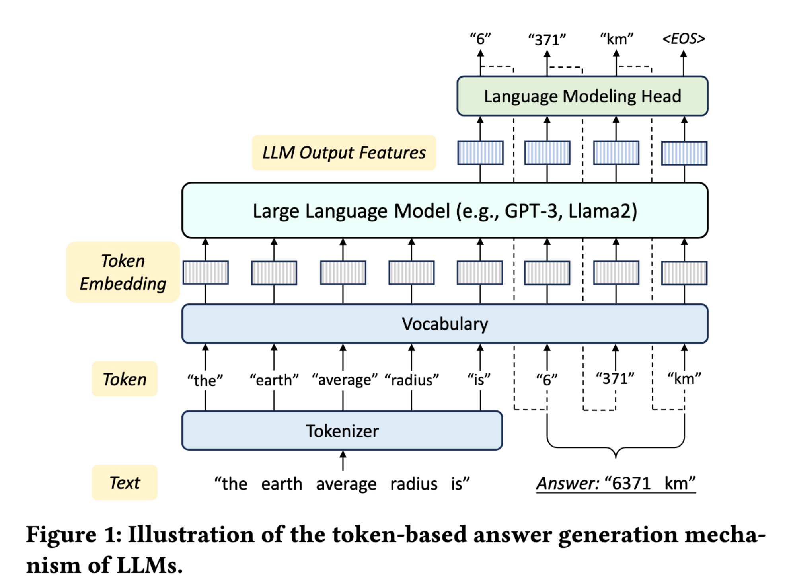

## 2 Background
<!-- _header: \ ****** *Introduction* **Background**  *System-Design* *Evaluation* *Conclusion* --> 
<!-- _class: navbar cols-2-64-->

<div class ="ldiv">

#### Challenge 1: Sub-optimal Performance of Prompt Learning

#### 🔹 The Naive Approach: Prompt Learning
*   **Method**: Transform multimodal network data (time-series, graphs) into textual prompts using templates.
*   **Process** (Figure 17):
    *   Wrap historical viewport data into a text template: *"The past 5 viewports were: (6.76, 4.40...) ... What are the next 5?"*
    *   Feed text into LLM (e.g., Llama2-7B) to generate text answer.
    *   Post-process text back to numerical values.
</div>
<div class = "rdiv">

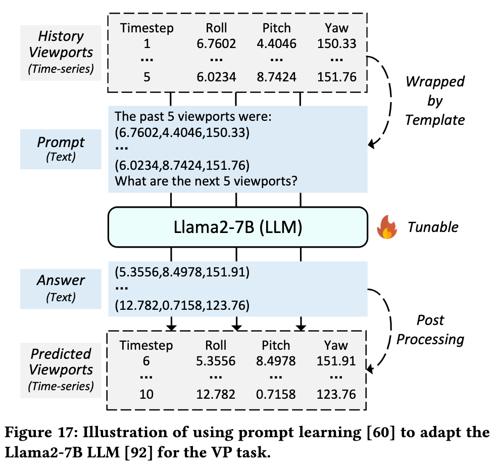
</div>

## 2 Background
<!-- _header: \ ****** *Introduction* **Background**  *System-Design* *Evaluation* *Conclusion* --> 
<!-- _class: navbar cols-2 -->

<div class ="ldiv">

#### Challenge 1: Sub-optimal Performance of Prompt Learning

**Root Cause**:
* Textual representation fails to capture **time-varying patterns** inherent in network data (e.g., throughput fluctuations).
* Complex modalities (like DAGs in CJS) are difficult to textualize faithfully.
</div>
<div class = "rdiv">

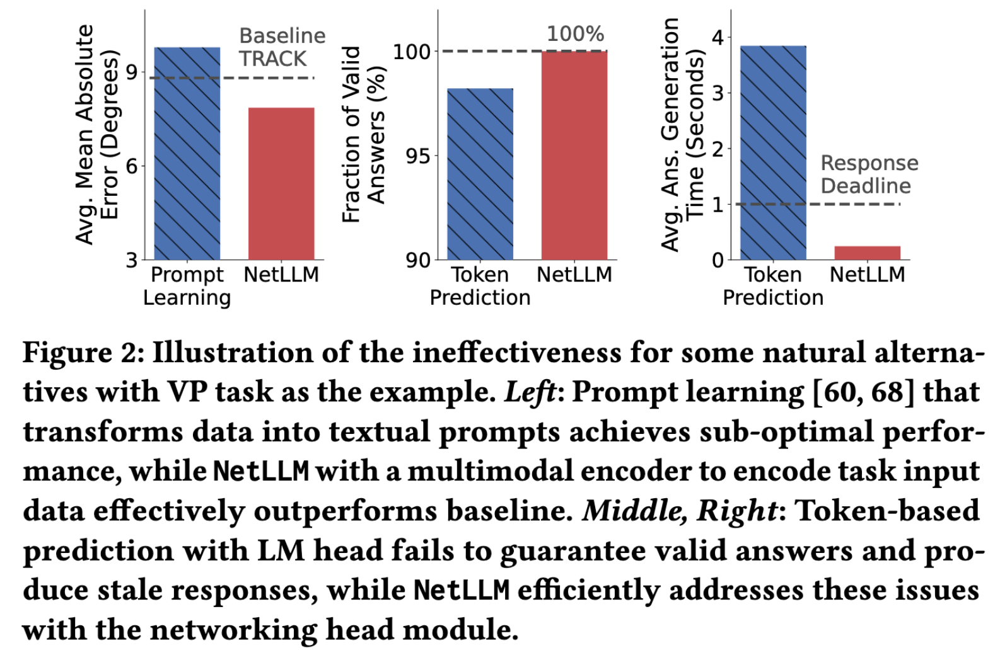

Prompt Learning achieves **higher MAE** (worse performance) than the baseline TRACK.
</div>

## 2 Background
<!-- _header: \ ****** *Introduction* **Background**  *System-Design* *Evaluation* *Conclusion* --> 
<!-- _class: navbar -->

<div class ="ldiv">

#### Challenge 2: Inefficiency & Reliability of Token-Based Generation
   
🔹 The Mechanism: Native LM Head
*   LLMs generate answers **token-by-token** in an autoregressive manner.
*   Requires multiple rounds of inference to complete a single answer.

</div>


## 2 Background
<!-- _header: \ ****** *Introduction* **Background**  *System-Design* *Evaluation* *Conclusion* --> 
<!-- _class: navbar cols-2-->

<div class ="ldiv">

#### Challenge 2: Inefficiency & Reliability of Token-Based Generation
1.  **Reliability Issue: Hallucination** 
    *   Token prediction has inherent uncertainty.
    *   Generated answers may be **physically invalid** 
2.  **Efficiency Issue: High Latency** 
    *   Multiple inference rounds lead to slow generation.
    *   exceeds the **1s response deadline** for real time networking tasks.
</div>
<div class = "rdiv">


- Fraction of valid answers < 100%
- Average generation time **3.84s**
</div>

## 2 Background
<!-- _header: \ ****** *Introduction* **Background**  *System-Design* *Evaluation* *Conclusion* --> 
<!-- _class: navbar cols-2-->

<div class ="ldiv">

#### Challenge 3: High Adaptation Costs
#### Cost 1: RL Environment Interaction (Figure 3)
*   **Standard RL**: Requires active interaction with the environment to collect experiences (Parameter Update vs. Experience Collection).
*   **Overhead**:
    *   **ABR Task**: Experience collection takes **31.18h (52.27%)** of total training time.
    *   **CJS Task**: Experience collection takes **56.42h (39.25%)** of total training time.


</div>
<div class = "rdiv">

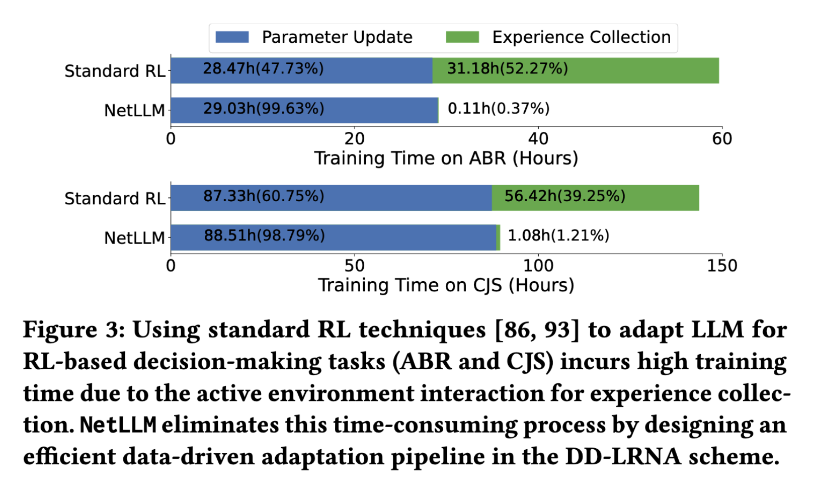

**Impact**: Prohibitively slow for large LLMs due to slow inference speed during interaction.

</div>


## 2 Background
<!-- _header: \ ****** *Introduction* **Background**  *System-Design* *Evaluation* *Conclusion* --> 
<!-- _class: navbar cols-2-->

<div class ="ldiv">

#### Challenge 3: High Adaptation Costs
#### Cost 2: Full-Parameter Fine-Tuning 
*   **Standard Approach**: Update all parameters of the LLM.
*   **Resource Consumption**:
    *   **Trainable Parameters**: 100%.
    *   **GPU Memory**: **65.88 GB** (Requires high-end hardware).
    *   **Training Time**: 7.9 hours.


</div>
<div class = "rdiv">

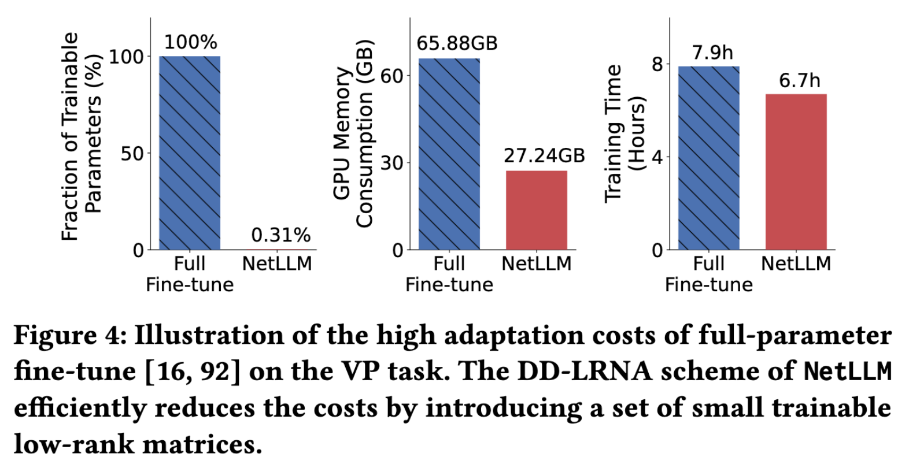
**Impact**: High barrier for deployment and difficult to maintain multiple task-specific models.

</div>


## 3 System Design 
<!-- _header: \ ****** *Introduction* *Background*  **System-Design** *Evaluation* *Conclusion* --> 
<!-- _class: navbar -->
#### Core Design Philosophy:
>  Freeze LLM Backbone + Lightweight Adaptation Modules→ Efficient Domain Knowledge Transfer

**Three-Module Framework (Figure 5)**
```
[Multimodal Input]
↓
[§4.1 Multimodal Encoder] → Project to token space
↓
[Frozen LLM + §4.3 Low-Rank Matrices] → Feature extraction + knowledge transfer
↓
[§4.2 Networking Head] → Single-round valid answer generation
↓
[Task-specific Answer]
```
## 3 System Design & Overview
<!-- _header: \ ****** *Introduction* *Background*  **System-Design** *Evaluation* *Conclusion* --> 
<!-- _class: navbar -->
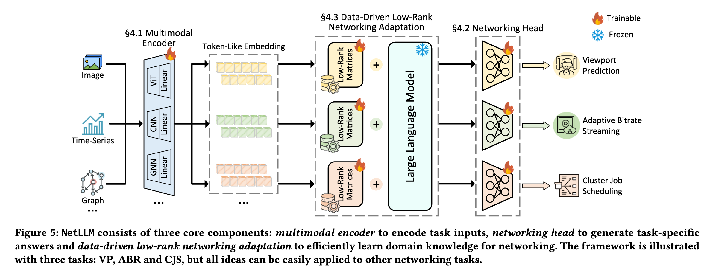

## 3 System Design & Module 1: Multimodal Encoder
<!-- _header: \ ****** *Introduction* *Background*  **System-Design** *Evaluation* *Conclusion* --> 
<!-- _class: navbar -->

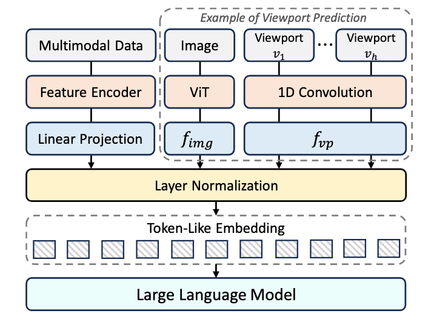

## 3 System Design & Module 2: Networking Head
<!-- _header: \ ****** *Introduction* *Background*  **System-Design** *Evaluation* *Conclusion* --> 
<!-- _class: navbar -->

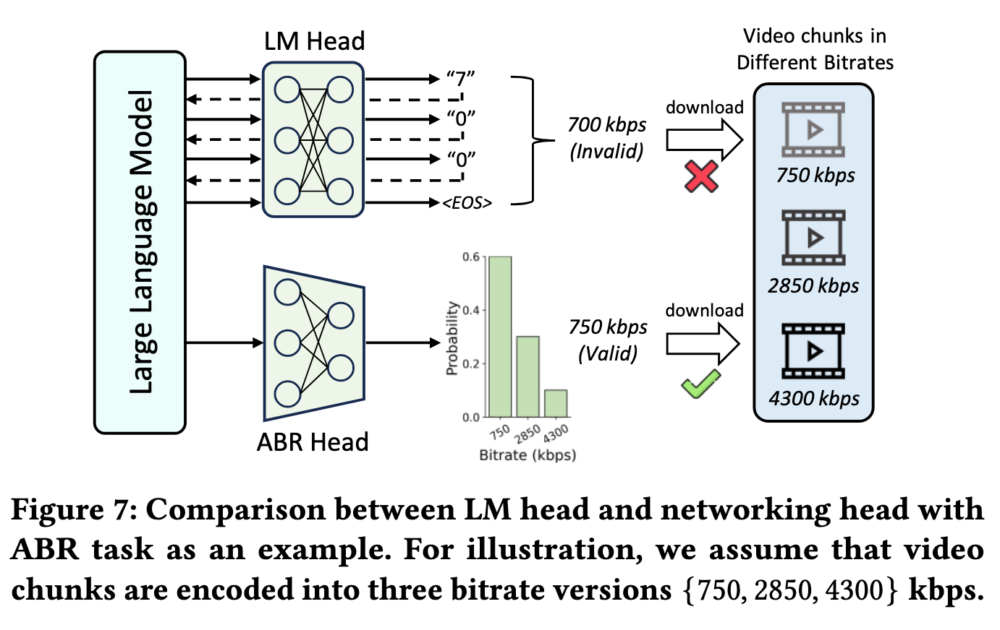

## 3 System Design & Module 3: DD-LRNA
<!-- _header: \ ****** *Introduction* *Background*  **System-Design** *Evaluation* *Conclusion* --> 
<!-- _class: navbar -->


## 4 Evaluation
<!-- _header: \ ****** *Introduction* *Background*  *System-Design* **Evaluation** *Conclusion* --> 
<!-- _class: navbar -->
| Configuration Item | Content |
| ------------ | ------------------------------------------------------------ |
| **Basic Model** | Llama2-7B (default), also tested OPT / Mistral / LLaVa |
| **Evaluation Task** | VP (Viewport Prediction) / ABR (Adaptive Bitrate) / CJS (Cluster Job Scheduling) |
| **Learning Paradigm** | VP: SL; ABR/CJS: RL |
| **Baseline Algorithm** | VP: TRACK / LR / Velocity; ABR: GENET / BBA / MPC; CJS: Decima / FIFO / Fair |
| **Evaluation Metrics** | VP: MAE↓; ABR: QoE↑; CJS: JCT↓ |
| **Hardware Environment** | 8×Xeon Gold 5318Y + 2×A100 40GB |

## 4 Evaluation
<!-- _header: \ ****** *Introduction* *Background*  *System-Design* **Evaluation** *Conclusion* --> 
<!-- _class: navbar cols-2 -->

<div class ="ldiv">

#### Main Experimental Results
| Task | Metric | Baseline (SOTA) | Improvement |
|------|--------|-----------------|-------------|
| **VP** | MAE (Degrees) ↓ | TRACK | **10.1-36.6%⬇️** |
| **ABR** | QoE Scores ↑ | GENET | **14.5-36.6% ⬆️** |
| **CJS** | JCT (Seconds) ↓ | Decima | **6.8-41.3% ⬇️** |
</div>
<div class = "rdiv">

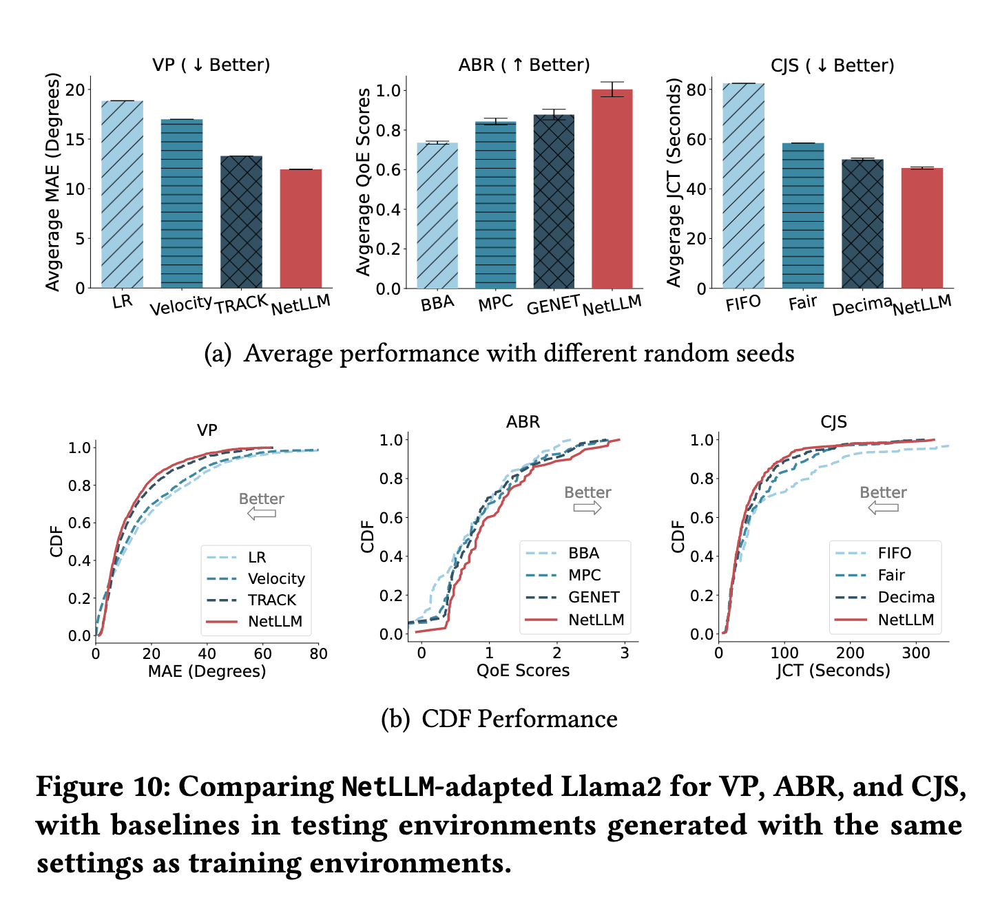
</div>

## 4 Evaluation & Generalization on Unseen Environments
<!-- _header: \ ****** *Introduction* *Background*  *System-Design* **Evaluation** *Conclusion* --> 
<!-- _class: navbar pin-3 -->


<div class = "tdiv">


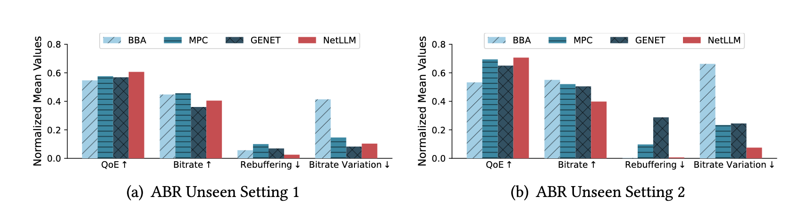

</div>

<div class = "ldiv">

#### 

| Task | Metric | Performance |
| :--- | :--- | :--- |
| **VP** | MAE (↓) | **1.7 - 9.1% lower** |
| **ABR** | QoE (↑) | **3.9 - 24.8% higher** |
| **CJS** | JCT (↓) | **2.5 - 6.8% lower** |
</div>

<div class = "rdiv">

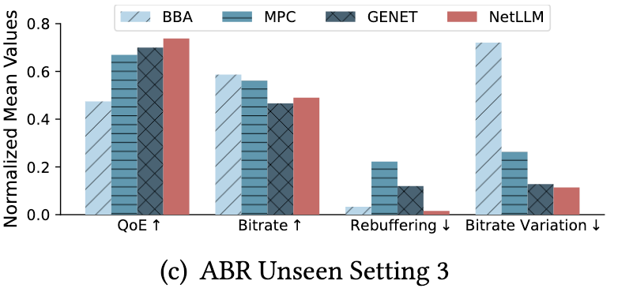
</div>

## 4 Evaluation & Generalization on Unseen Environments
<!-- _header: \ ****** *Introduction* *Background*  *System-Design* **Evaluation** *Conclusion* --> 
<!-- _class: navbar cols-2 -->


<div class = "ldiv">

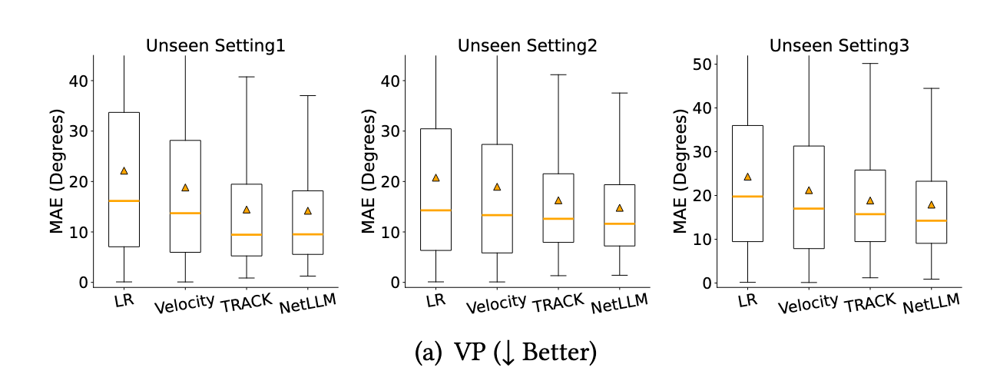

| Task | Metric | Performance |
| :--- | :--- | :--- |
| **VP** | MAE (↓) | **1.7 - 9.1% lower** |
| **ABR** | QoE (↑) | **3.9 - 24.8% higher** |
| **CJS** | JCT (↓) | **2.5 - 6.8% lower** |
</div>

<div class = "rdiv">

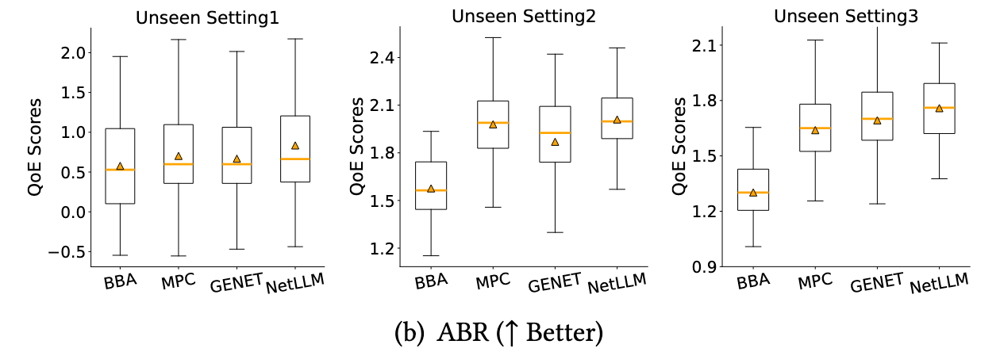

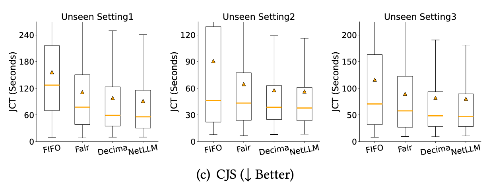
</div>

## 4 Evaluation & Deep Dive Analysis & Overhead

<!-- _header: \ ****** *Introduction* *Background*  *System-Design* **Evaluation** *Conclusion* --> 
<!-- _class: navbar cols-2 -->

<div class = "rdiv">

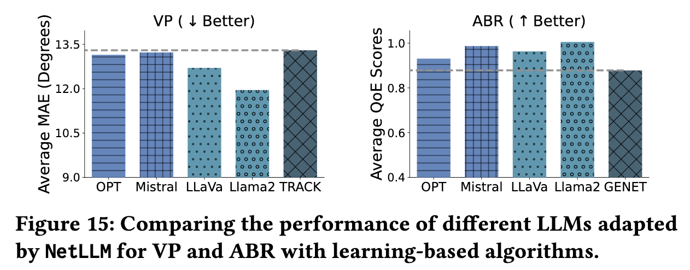
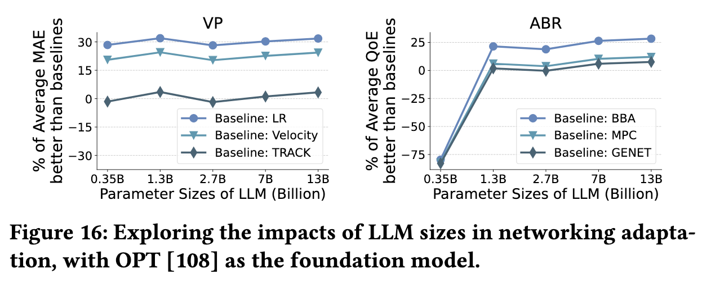

</div>
<div class = "ldiv">

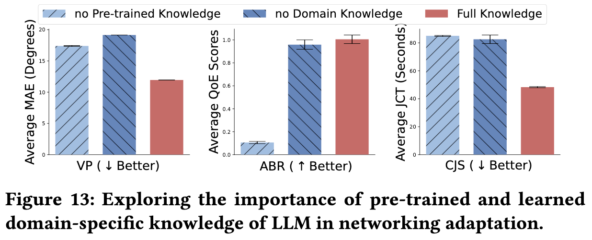
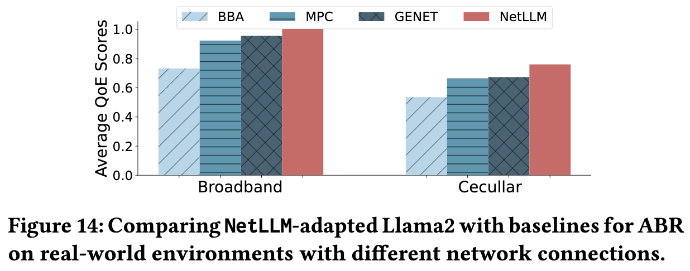

</div>

## 5 Conclusion
<!-- _header: \ ****** *Introduction* *Background*  *System-Design* *Evaluation* *Conclusion* --> 
<!-- _class: navbar -->

> **NetLLM** is the first framework that efficiently adapts LLMs for networking via *multimodal encoder + networking head + low-rank adaptation*, achieving "one model for all tasks" with **10.1–41.3% performance gain** and stronger generalization across VP/ABR/CJS.

| Direction | Brief Note |
|-----------|-----------|
| **Computation Overhead** | Large models still require resource optimization (pruning / quantization / distillation) |
| **Multimodal Potential** | Pre-trained multimodal knowledge may not directly transfer; needs task-specific exploration |
| **Interpretability** | Understanding LLM decision mechanisms is key for trust and debugging |


---

<!-- _class: lastpage  -->
<!-- _header: -->

###### Thank you! Q & A 
<div class = "icons">
</div>
