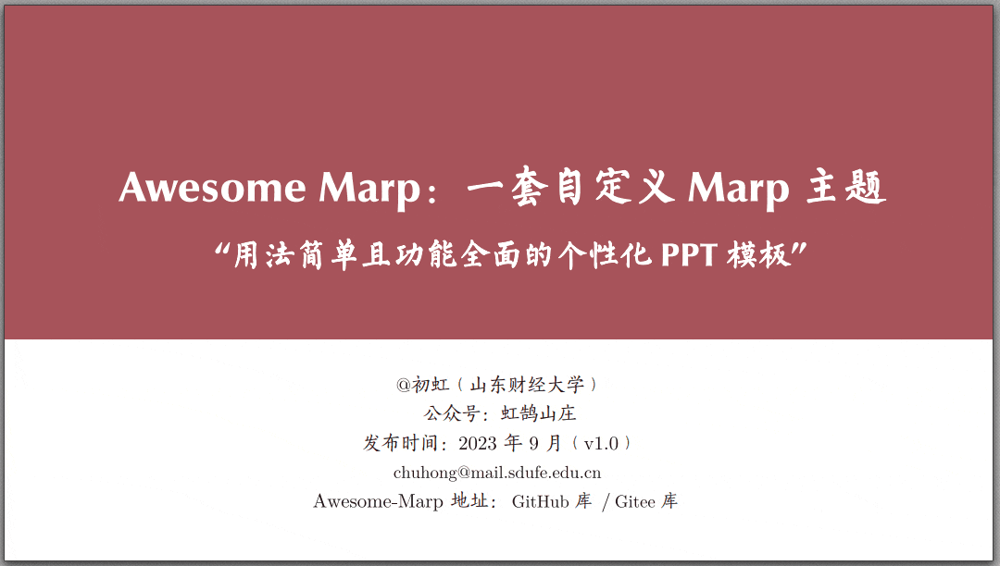

# Tsinghua PPT Templates

基于 [Awesome Marp](https://github.com/favourhong/Awesome-Marp) 定制的清华风格演示文稿模板，感谢原作者 [@favourhong](https://github.com/favourhong) 的出色工作。

---

## 效果预览



| 特性 | 说明 |
|------|------|
| 主题色 | 蓝、绿、红、暗色、棕、紫 共 6 种 |
| 自定义样式 | 38 种（分栏、封面、目录、Callout 等） |
| 导航进度栏 | navbar 样式，支持多节高亮 |
| 数学公式 | MathJax |
| 图片对齐 | `![#c]` `![#l]` `![#r]` + 尺寸控制 |

---

## 快速开始

### 1. 安装依赖

- [Visual Studio Code](https://code.visualstudio.com)
- VS Code 插件：[Marp for VS Code](https://marketplace.visualstudio.com/items?itemName=marp-team.marp-vscode)

### 2. 克隆仓库

```bash
git clone git@github.com:zzhaire/Tsinghua-ppt-templates.git
cd Tsinghua-ppt-templates
```

用 VS Code 打开整个文件夹，`.vscode/settings.json` 已配置好主题路径，Marp 插件会自动加载所有 `themes/*.scss`。

### 3. 创建自己的文件夹

仓库不包含 `Seminar/` 文件夹，按需自建：

```
Now/          # 当前在做的 PPT
Seminar/      # 组会分享（自建，不上传）
Archive/      # 已完成存档
```

### 4. 新建一个 PPT

复制以下 frontmatter 开始写：

```markdown
---
marp: true
size: 16:9
theme: am_blue
headingDivider: [2,3]
footer: \ *Your Topic*
math: mathjax
---

<!-- _class: cover_c -->
<!-- _header: -->
<!-- _paginate: "" -->
<!-- _footer:   -->
# 标题

Reporter：你的名字
Date：YYYY-MM-DD
```

---

## Logo 说明

| 文件 | 用途 |
|------|------|
| `images/logo.png` | 横版长 logo，用于封面大图 `h:100` |
| `images/logo0.png` | 方形圆 logo（"0"很形象），用于 header 小图 `h:40` |

封面用 `logo.png`，内容页 navbar header 用 `logo0.png`（部分模板反之，见各文件注释）。

---

## 文件结构

```
.
├── themes/          # 6 种主题 SCSS
├── images/          # logo + 效果预览图
├── Example/         # 官方示例文件
├── Archive/         # 已完成示例（netllm-share.md）
├── Now/             # 当前 PPT
│   └── YYYY-MM-DD-topic.md
└── .vscode/
    └── settings.json  # Marp 主题路径配置
```

> `Seminar/` 文件夹不上传，自行在本地创建。

---

## Navbar 内容页写法

每张内容页结构：

```markdown
## N. 节名 & 页面标题 <!-- page X -->

<!-- _header: \ ****** **当前节** *节2* *节3* -->
<!-- _class: navbar -->

内容...
```

图文分栏（图片在右列时用 `cols-2-46`，文字在右列时用 `cols-2-64`）：

```markdown
<!-- _class: navbar cols-2-46 -->
<div class="ldiv">

文字内容...

</div>
<div class="rdiv">


</div>
```

分栏比例：`cols-2`（1:1）、`cols-2-64`（6:4）、`cols-2-73`（7:3）、`cols-2-46`（4:6）、`cols-2-37`（3:7）

---

## 与 Claude Code 配合使用

本仓库内置了 `.claude/skills/ppt.md`，在 [Claude Code](https://claude.ai/code) 中输入 `/ppt` 即可唤起 AI 辅助制作 PPT。

**使用方式：**

1. 用 VS Code 打开本仓库
2. 打开 Claude Code（`claude` 命令或 VS Code 扩展）
3. 输入 `/ppt`，按提示选择汇报类型、主题、节划分
4. Claude 生成完整 `.md` 文件，存入 `Now/` 或 `Seminar/`
5. Marp 插件实时预览，导出 PDF

---

## 致谢

本模板基于 [@favourhong](https://github.com/favourhong) 的 [Awesome-Marp](https://github.com/favourhong/Awesome-Marp) 开发，保留全部主题和样式，在此基础上增加了清华 logo、navbar 导航栏规范和 Claude Code 集成。
