<!-- _class: cover_c -->
<!-- _header: -->
<!-- _paginate: "" -->
<!-- _footer:   -->
# <!-- fit --> Intent-Driven Network Management with Multi-Agent LLMs: The Confucius Framework

Open Access Support provided by:  Meta Harvard University  Stony Brook University  Johns Hopkins University


Reporter ：Zhang zheyuan 
Date ：2026-04-09

## 目录

<!-- _class: cols2_ol_ci fglass toc_c  -->
<!-- _footer: "" -->
<!-- _header: "CONTENTS" -->
<!-- _paginate: "" -->

- [Introduction](#3)
- [Motivation](#5)
- [Overview](#6)
- [Detailed Design](#10)
- [Evaluation](#13)


## 1 Introduction & 网络管理的核心挑战

<!-- _header: \ ****** **Introduction** *Motivation*  *Overview* *Detailed Design* *Evaluation* --> 
<!-- _class: navbar row-2 -->

<div class="tdiv">

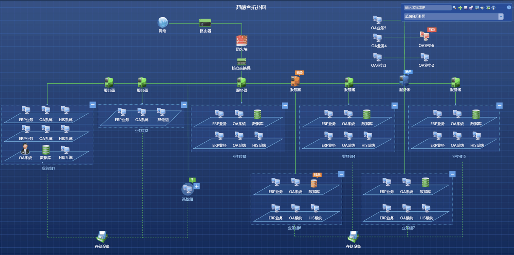
| 挑战维度       | 具体表现                                           | 传统方案局限                         |
| -------------- | -------------------------------------------------- | ------------------------------------ |
| **任务复杂性** | 容量规划/故障诊断等需串联 10+ 步骤，依赖多工具协同 | 人工编排脚本，流程固化，难以复用     |
| **知识异构性** | 40 万+ 数据模型、300 万+ 文档、数百专用工具链      | 新人上手成本高，专家经验难沉淀       |
| **安全约束性** | 配置变更需语法/语义/业务三重校验，容错率极低       | 端到端生成式方案难以满足生产级可靠性 |

</div>


## 1 Introduction & 大模型直接用于网络管理的不足

<!-- _header: \ ****** **Introduction** *Motivation*  *Overview* *Detailed Design* *Evaluation* --> 
<!-- _class: navbar cols-2-64 -->

<div class="ldiv">
<br>
<br>

| 问题类型         | 具体表现                                     | 潜在风险                   |
| ---------------- | -------------------------------------------- | -------------------------- |
| **幻觉**     | 可能编造不存在的设备/配置/指标           | 错误配置      |
| **上下文限制**   | 复杂任务难以全程跟踪 | 丢失信息       |
| **知识缺失** | 协议/语法等专业知识未内嵌   | 不规范操作 |
| **安全风险** | 缺失校验机制               | 无法保证「不改坏生产环境」 |
</div>

<div class="rdiv">

<br><br>

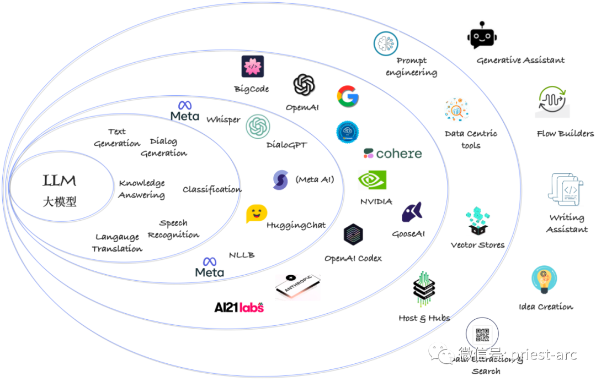
<p style="font-size: 0.8em; color: #666;" align="center">主流大语言模型及其应用</p>
</div>

## 1 Introduction & Confucius 的核心设计

<!-- _header: \ ****** **Introduction** *Motivation*  *Overview* *Detailed Design* *Evaluation* --> 
<!-- _class: navbar -->

> Confucius 用多智能体 LLM 架构，填补「大模型懂意图但不会执行」与「传统工具会执行但不懂人话」之间的鸿沟。

| 设计要素（论文中设计）                                      | 核心思想                                          | 解决痛点                                   |
| ------------------------------------------------------------ | ------------------------------------------------- | ------------------------------------------ |
| **拆解任务**（Enhancing planning with structured network procedures） | LLM 负责理解意图 + 拆解流程，具体执行交给存量工具 | 复杂运维任务难以端到端生成，单步调用易幻觉 |
| **翻译指令**（Connecting tools with Domain-Specific Languages） | 自然语言意图 → 结构化 DSL → 调用现有工具          | 工具链割裂、接口不统一、领域知识难注入     |
| **外挂记忆**（Enhancing memory with domain-specific retrievals） | 短期记对话上下文，长期查领域知识库                | 40 万+ 数据模型无法全量注入，长会话易遗忘  |

<br>

## 1 Introduction & Contribution

<!-- _header: \ ****** **Introduction** *Motivation*  *Overview* *Detailed Design* *Evaluation* --> 
<!-- _class: navbar -->

<br>

> 首个超大规模网络的多智能体 LLM 框架**生产级实践**，已在 Meta 稳定运行 2 年+。

- **用户规模**：4.16K 总用户，2.63K 月活 → 覆盖网络/运维/研发多角色，63% 留存率，真实需求驱动
- **应用生态**：60+ 应用 onboard，AI:人类消息比 20.5:1 → 框架泛化性强，大部分任务自动化完成
- **效率提升**：人均周省 17 工程师小时 → 容量实验 3-4h→30min，故障诊断 2-8h→20min
- **准确率提升**：相比单模型方案 ↑21% → Ensemble 降方差 + Prompt 工程 + Hybrid RAG 协同增益


## 2 Motivation &  Network Management Use Cases

<!-- _header: \ ****** *Introduction* **Motivation**  *Overview* *Detailed Design* *Evaluation* --> 
<!-- _class: navbar -->

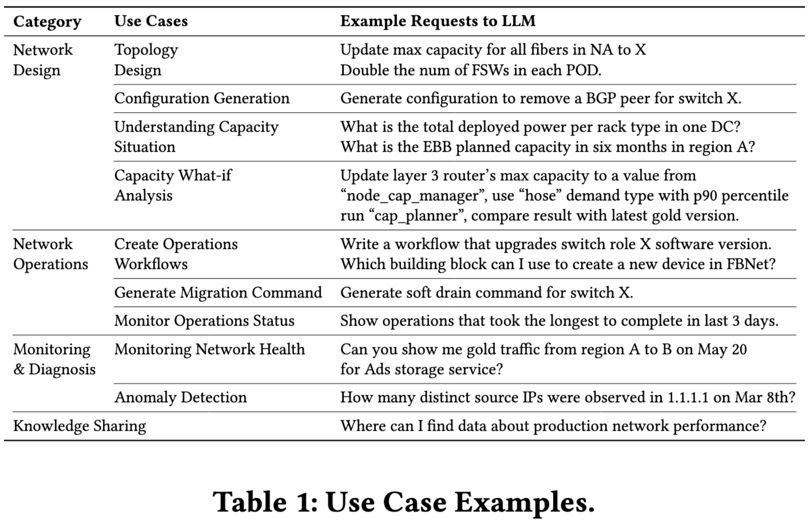

## 2 Motivation &  Network Management Use Cases

<!-- _header: \ ****** *Introduction* **Motivation**  *Overview* *Detailed Design* *Evaluation* --> 
<!-- _class: navbar -->

#### 🔹 Network Design（网络设计）

- **典型示例**：
  - 「把北美所有光纤最大容量调到 X」
  - 「每个 POD 的 FSW 数量翻倍」
  - 「为新 DC 生成 BGP 配置，移除某个 peer」
- **核心难点**：参数组合爆炸、多工具串联、结果需对比分析


## 2 Motivation &  Network Management Use Cases

<!-- _header: \ ****** *Introduction* **Motivation**  *Overview* *Detailed Design* *Evaluation* --> 
<!-- _class: navbar -->

#### 🔹 Network Operations（网络操作）

- **典型示例**：
  - 「写一个升级某角色交换机软件的 workflow」
  - 「为交换机 X 生成软下线命令」
  - 「哪个 Building Block 可以创建新设备？」
- **核心难点**：流程固化、人工执行易出错、新人上手成本高


## 2 Motivation &  Network Management Use Cases

<!-- _header: \ ****** *Introduction* **Motivation**  *Overview* *Detailed Design* *Evaluation* --> 
<!-- _class: navbar -->

#### 🔹 Network Monitoring（网络监控）

- **典型示例**：
  - 「展示过去 3 天耗时最长的操作」
  - 「5 月 20 日 Ads 存储从区域 A 到 B 的黄金流量」
  - 「3 月 8 日 1.1.1.1 观察到多少个独立源 IP？」
- **核心难点**：数据源异构、排查路径动态、专家依赖强


## 2 Motivation &  Network Management Use Cases

<!-- _header: \ ****** *Introduction* **Motivation**  *Overview* *Detailed Design* *Evaluation* --> 
<!-- _class: navbar -->

#### 🔹 Knowledge Sharing（知识共享）

- **典型示例**：
  - 「哪里能找到生产网络性能数据？」
  - 「EBB 是什么？怎么用？」
  - 「推荐一个查拓扑变更的工具」
- **核心难点**：40 万+ 数据模型、300 万+ 文档，知识检索难


## 2 Motivation &  容量假设分析 (Capacity What-if Analysis)

<!-- _header: \ ****** *Introduction* **Motivation**  *Overview* *Detailed Design* *Evaluation* --> 
<!-- _class: navbar -->

**容量假设分析是网络设计中的重要任务**
> Meta 新建 AI 训练数据中心，需评估骨干网扩容方案

新 DC 上线，骨干网怎么扩容才能满足未来流量？

标准流程（5 步串联，图 1）
```
收集当前拓扑 → 预测流量需求 → 生成未来拓扑 → 跑故障仿真 → 分析对比结果
```

## 2 Motivation &  容量假设分析 (Capacity What-if Analysis)

<!-- _header: \ ****** *Introduction* **Motivation**  *Overview* *Detailed Design* *Evaluation* --> 
<!-- _class: navbar -->
> Meta 新建 AI 训练数据中心，需评估骨干网扩容方案（论文图 1）

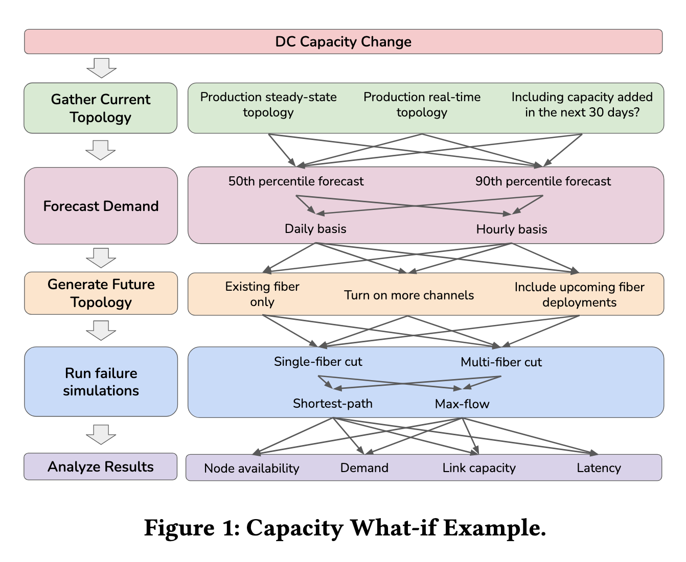

## 2 Motivation &  容量假设分析 (Capacity What-if Analysis)

<!-- _header: \ ****** *Introduction* **Motivation**  *Overview* *Detailed Design* *Evaluation* --> 
<!-- _class: navbar cols-2-64-->

<div class = "ldiv">

为什么这个任务难
#### 1️⃣子任务参数组合爆炸

| 步骤     | 可选参数                           | 组合后果               |
| -------- | ---------------------------------- | ---------------------- |
| 流量预测 | 50th / 90th 百分位？按天/小时？    | 每种组合都要重跑全流程 |
| 拓扑生成 | 仅现有光纤 / 包含计划中新光纤？    | 人工拼接脚本，易出错   |
| 故障仿真 | 单光纤切断 / 多光纤 / 区域级故障？ | 实验难以复用，对比困难 |

</div>
<div class ="rdiv">

#### 2️⃣ 工具链割裂 + 接口不统一

- 拓扑引擎、流量预测、NAPT 规划器用不同系统，输入输出格式各异
- 工程师需掌握多套 CLI/API，新人上手成本高

#### 3️⃣ 结果对比依赖人工

- 跑 20 个实验方案，靠 Excel 比对丢包率、SLO 违约数等关键指标
- 决策效率低，易漏关键差异

## 2 Motivation &  网络性能诊断（Fault Diagnosis）

<!-- _header: \ ****** *Introduction* **Motivation**  *Overview* *Detailed Design* *Evaluation* --> 
<!-- _class: navbar -->
**网络性能诊断是网络监控的典型任务**
>Instagram 推理请求失败，判断是否为网络问题（论文图 2）

Scribe 读操作延迟高，是不是网络问题？哪个区域对受影响？

标准排查流程（图 2）
```
隔离问题域 → 查网络指标 → 主动探测 → 拓扑分析 → 关联变更日志 → 定位根因
```

## 2 Motivation &  网络性能诊断（Fault Diagnosis）

<!-- _header: \ ****** *Introduction* **Motivation**  *Overview* *Detailed Design* *Evaluation* --> 
<!-- _class: navbar -->
>Instagram 推理请求失败，判断是否为网络问题（论文图 2）

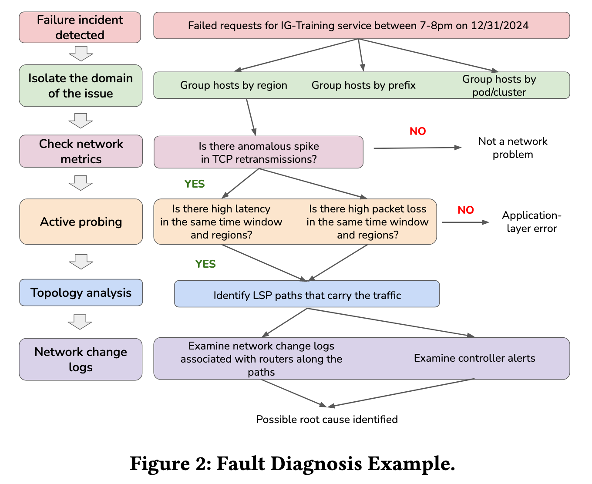

## 2 Motivation &  网络性能诊断（Fault Diagnosis）

<!-- _header: \ ****** *Introduction* **Motivation**  *Overview* *Detailed Design* *Evaluation* --> 
<!-- _class: navbar -->


#### 为什么难？

- **排查路径动态**：根据中间结果决定下一步，传统固定 workflow 难以覆盖所有分支
- **数据源异构**：日志/探测/拓扑用不同接口，工程师需掌握多套查询语法
- **根因定位依赖专家**：同样现象可能有多种根因，人工比对耗时 2-8 小时/案

> 💡 核心矛盾：**诊断需要「动态推理」，但传统工具要求「预定义流程」**


## 2 Motivation 

<!-- _header: \ ****** *Introduction* **Motivation**  *Overview* *Detailed Design* *Evaluation* --> 
<!-- _class: navbar -->

> 网络管理任务的共性 = 多步骤 + 强工具依赖 + 大搜索空间 + 高安全约束 

- **多步骤拆解**：容量规划/故障诊断等任务需串联 10+ 子步骤，依赖关系复杂 → 不能端到端生成，需要**结构化编排**
- **接口异构对接难**：下游工具/任务接口格式不一（拓扑引擎/时序查询/配置模型），任务间数据传递困难 → 不能直接调用，需要**统一翻译层**
- **搜索空间大**：40 万+ 数据模型、300 万+ 文档、数百个专用工具，人工选择成本高 → 不能全量注入 prompt，需要**按需检索**
- **安全约束高**：配置错误可能断网，容错率极低 → 不能信任大模型输出，需要**验证兜底**


> 大模型不能端到端搞定，需要「拆解 + 协作 + 兜底」。

## 3 Design Overview 

<!-- _header: \ ****** *Introduction* *Motivation*  **Overview** *Detailed Design* *Evaluation* --> 
<!-- _class: navbar -->

#### 核心设计思路（挑战 → 解法对照）


| 挑战             | Confucius 解法（通俗 + 术语）                                |
| ---------------- | ------------------------------------------------------------ |
| **多步骤拆解**   | DAG 建模 + LLM 智能编排（Enhancing planning with structured network procedures） |
| **接口异构对接** | NL → DSL 翻译原语（Connecting tools with Domain-Specific Languages） |
| **搜索空间大**   | 树状记忆 + Hybrid RAG（Enhancing memory with domain-specific retrievals） |
| **安全约束高**   | 语法/语义/业务三重校验（Validation-by-Design）               |

<br>

> 💡 设计原则：**Reasoning ≠ Knowledge**｜**Leverage Legacy Tools**｜**Validation-by-Design**
>
> Confucius 用多智能体架构，把「大模型推理」安全嵌入「现有运维体系」。

## 3 Design Overview & 纵向数据流（从上到下，6 层）

<!-- _header: \ ****** *Introduction* *Motivation*  **Overview** *Detailed Design* *Evaluation* --> 
<!-- _class: navbar cols-2-64 -->
<div class="ldiv">

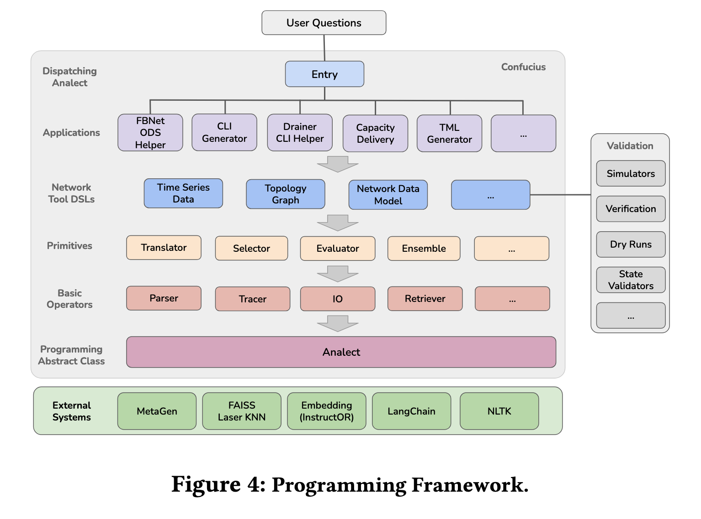
</div>
<div class = "rdiv">

1. **统一入口 (Entry)** 自然语言提问
2. **应用层 (Applications)** 60+具体业务
   (容量规划、CLI生成、拓扑修改等)。
3. **领域语言层 (DSLs)** 通过标准中间语言交互：TSD TG,NDModel

4. **核心原语层 (Primitives)**
提供原子能力，桥接自然语言与DSL：Translator,Selector,Ensemble..
5. **基础支撑层 (Basic Operators + Analect)**

6. **外部系统 (External Systems)**

## 3 Design Overview  & 横向安全机制

<!-- _header: \ ****** *Introduction* *Motivation*  **Overview** *Detailed Design* *Evaluation* --> 
<!-- _class: navbar cols-2 -->

<div class ="ldiv">

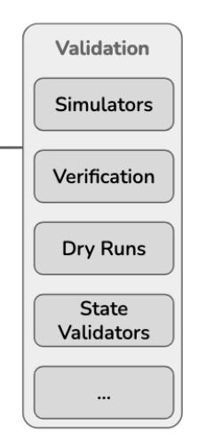
</div>
<div class="rdiv">

#### 右侧 Validation

独立于主执行流的**验证侧车模块**：

- `Simulators`：仿真模拟
- `Dry Runs`：空跑测试（不改生产）
- `State Validators`：状态校验器

**核心作用**：关键操作下发前必须通过语法/语义/业务三重检查，任一失败则阻断并反馈给 LLM 重试，确保**"不改坏生产环境"**。
</div>

## 4 Detailed  Design  & 1. Planning 层（任务拆解与多 Agent 编排）
<!-- _header: \ ****** *Introduction* *Motivation*  *Overview* **Detailed Design** *Evaluation* --> 
<!-- _class: navbar-->

#### DAG 建模（§4.1.1-4.1.2）

<br>

**核心思想**：把复杂任务拆成 DAG，每个节点是一个 Building Block

- 传统 workflow vs Confucius DAG
  - 传统 workflow：固定流程，分支爆炸，难以覆盖所有场景
  - Confucius DAG：动态生成，子任务并行，依赖自动调度，结果复用
- DAG 优势：子任务并行、依赖自动调度、结果复用
- 举例：容量 What-if 的 5 步流程 → DAG 节点拆解


## 4 Detailed  Design  & 1. Planning 层（任务拆解与多 Agent 编排）
<!-- _header: \ ****** *Introduction* *Motivation*  *Overview* **Detailed Design** *Evaluation* --> 
<!-- _class: navbar cols-2 -->

<div class="ldiv">
<br>

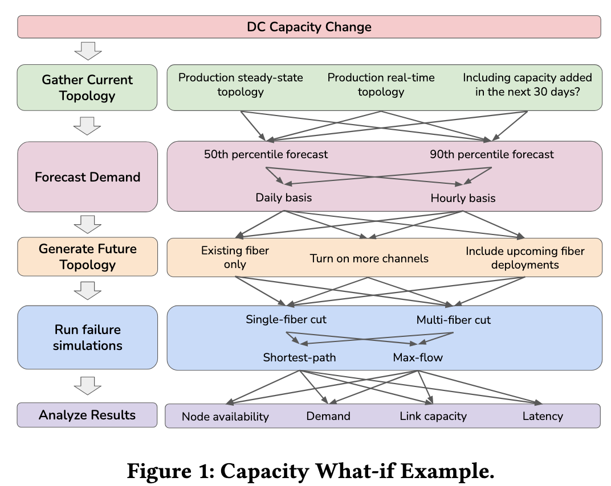
</div>
<div class="rdiv">
<br>

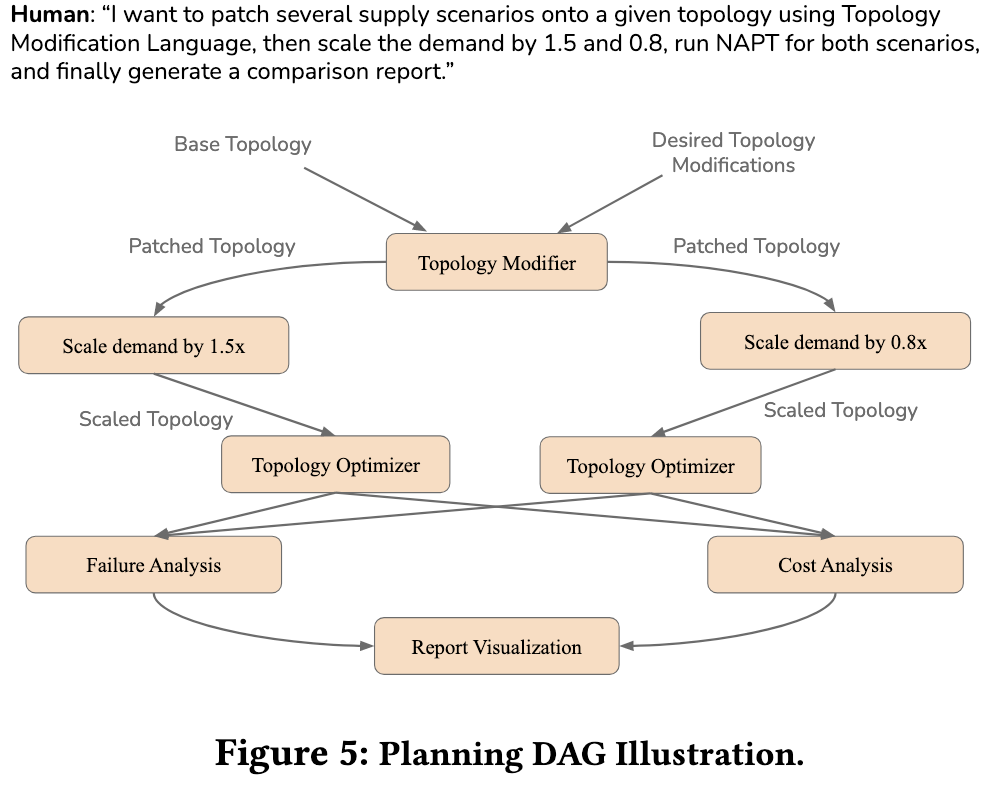
</div>  

## 4 Detailed  Design  & 1. Planning 层（任务拆解与多 Agent 编排）
<!-- _header: \ ****** *Introduction* *Motivation*  *Overview* **Detailed Design** *Evaluation* --> 
<!-- _class: navbar cols-2 -->

<div class = "ldiv">

<br>
<br>

#### 辅助工作流检索（§4.1.2）

> 从数百个 workflow 中智能推荐合适的 Building Blocks

- 数百个 workflow + 数千个 BBs，人工选择困难
- 两阶段检索
  - Coarse：向量相似度搜索 → top-10 候选
  - Fine：LLM 语义重排序 → top-3
  </div>
<div class="rdiv">
<br>

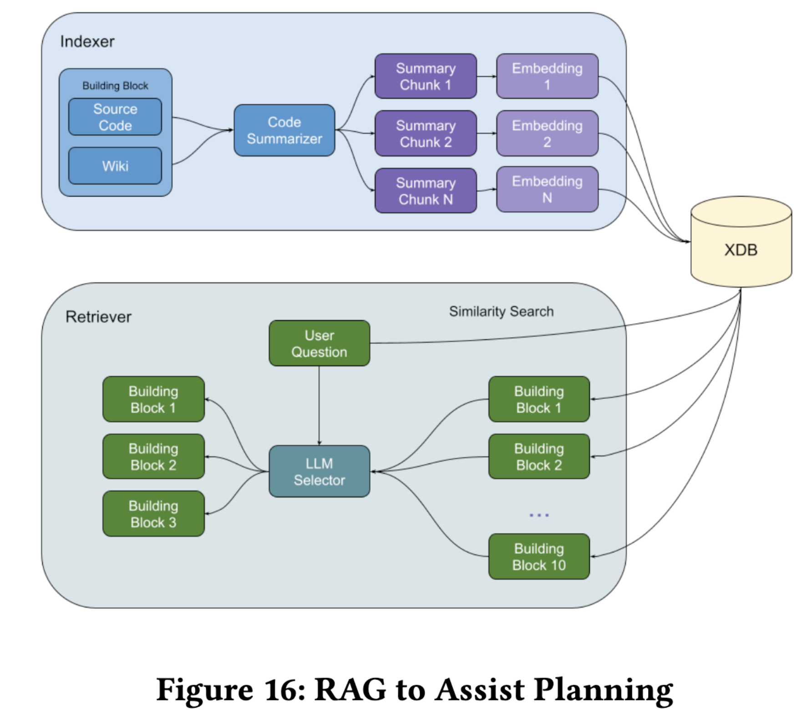

</div>


## 4 Detailed  Design  & 2. Tool 层（DSL 翻译与原语）
<!-- _header: \ ****** *Introduction* *Motivation*  *Overview* **Detailed Design** *Evaluation* --> 
<!-- _class: navbar cols-2-46 -->


<div class ="ldiv">

#### 三类核心 DSL（§4.2.2）

用标准化中间语言对接存量工具,用 Primitives 桥接自然语言与 DSL

| DSL                      | 用途              |
| ------------------------ | ----------------- |
| **TML**（拓扑图）        | 修改网络设备/链路 |
| **ODS**（时序数据）      | 查询监控指标      |
| **Robotron**（数据模型） | 生成配置对象      |

<br>
翻译原语（§4.2.1）

**Translator** NL → DSL（人话转指令）

</div>

<div class="rdiv">


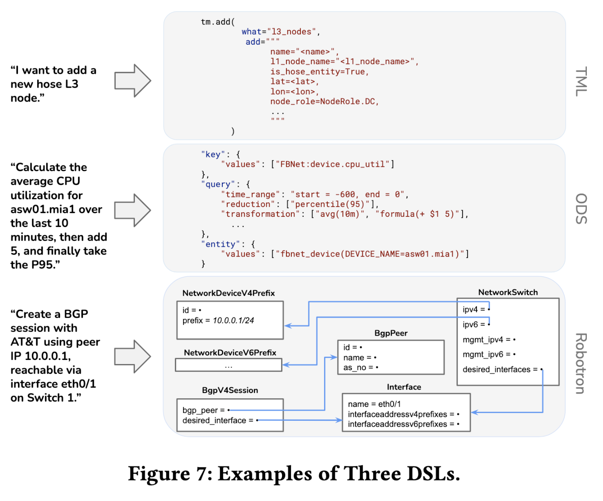
</div>


## 4 Detailed  Design  & 2. Tool 层（DSL 翻译与原语）

<!-- _header: \ ****** *Introduction* *Motivation*  *Overview* **Detailed Design** *Evaluation* --> 
<!-- _class: navbar -->
#### 其他原语（§4.2.1）

- **Collector**：澄清歧义 + 人机交互
  - 「上次那个拓扑」→ 追问具体时间/版本

- **Selector**：海量数据中筛选相关实体
  - 从 40 万+ 数据模型中选出相关的 3 个


**关键图**：Figure 6（Collector implementation）+ Figure 8（ODS use case composition）


## 4 Detailed  Design  & 2. Tool 层（DSL 翻译与原语）

<!-- _header: \ ****** *Introduction* *Motivation*  *Overview* **Detailed Design** *Evaluation* --> 
<!-- _class: navbar  -->

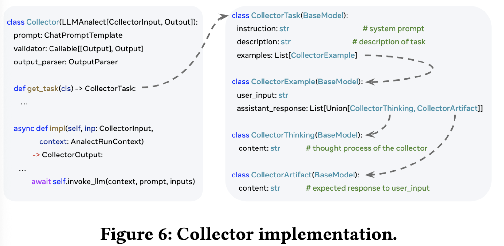

## 4 Detailed  Design  & 2. Tool 层（DSL 翻译与原语）

<!-- _header: \ ****** *Introduction* *Motivation*  *Overview* **Detailed Design** *Evaluation* --> 
<!-- _class: navbar  bq-blue -->
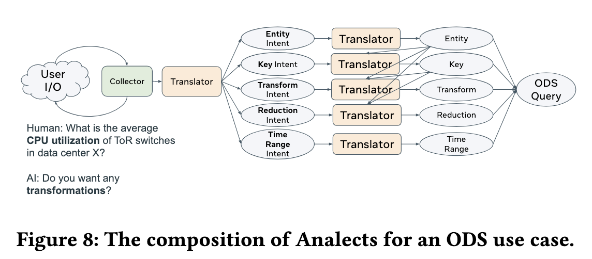

> Step 1: 用户输入（自然语言）
> 
> Human: "What is the average CPU utilization of ToR switches in data center X?"
（数据中心 X 中 ToR 交换机的平均 CPU 利用率是多少？）


## 4 Detailed  Design  & 2. Tool 层（DSL 翻译与原语）

<!-- _header: \ ****** *Introduction* *Motivation*  *Overview* **Detailed Design** *Evaluation* --> 
<!-- _class: navbar  bq-blue -->


> Step 2: Collector 澄清意图
> 
> AI: "Do you want any transformations?"
（你想要任何数据变换吗？比如平滑、差分等）

## 4 Detailed  Design  & 2. Tool 层（DSL 翻译与原语）

<!-- _header: \ ****** *Introduction* *Motivation*  *Overview* **Detailed Design** *Evaluation* --> 
<!-- _class: navbar  bq-blue -->

| 子意图                | 作用               | 得到                                    |
| --------------------- | ------------------ | --------------------------------------- |
| **Key Intent**        | 确定查询的指标类型 | `FBNet:device.cpu_util`                 |
| **Entity Intent**     | 确定涉及的具体实体 | `ToR switches in data center X`         |
| **Reduction Intent**  | 确定聚合操作       | `average` → `avg()`                     |
| **Time Range Intent** | 确定时间窗口       | `last 10 minutes` → `start=-600, end=0` |
| **Transform Intent**  | 确定后处理函数     | `none` 或 `diff()` 等                     |

> Step 3: Intent Translator 拆解查询意图
> 
> 把完整查询拆成 5 个独立子意图

## 4 Detailed  Design  & 2. Tool 层（DSL 翻译与原语）

<!-- _header: \ ****** *Introduction* *Motivation*  *Overview* **Detailed Design** *Evaluation* --> 
<!-- _class: navbar  bq-blue -->


> Step 4: 并行翻译5 个 Translator
> 
> 每个子意图由独立的 Translator 处理

## 4 Detailed  Design  & 2. Tool 层（DSL 翻译与原语）

<!-- _header: \ ****** *Introduction* *Motivation*  *Overview* **Detailed Design** *Evaluation* --> 
<!-- _class: navbar  bq-blue -->

```json
{
  "key": {"values": ["FBNet:device.cpu_util"]},
  "entity": {"values": ["fbnet_device(ROLE=ToR, DC=X)"]},
  "reduction": ["avg"],
  "time_range": "start=-600, end=0",
  "transformation": []
}
```
> 组装成最终 ODS 查询


## 4 Detailed  Design  & 2. Tool 层（DSL 翻译与原语）

<!-- _header: \ ****** *Introduction* *Motivation*  *Overview* **Detailed Design** *Evaluation* --> 
<!-- _class: navbar  bq-blue -->

#### 内置验证机制（§4.2.4）

**核心思想**：三重校验确保「不改坏生产环境」

**内容要点**：

```
生成的 DSL
    ↓
[1] 语法关 (Built-in Parser) → 自定义解析器查语法
    ↓
[2] 语义关 (External API)   → ORM dry-run（模拟执行）
    ↓
[3] 业务关 (External Tools) → 拓扑连通性/路径约束校验
    ↓
任一失败 → 错误反馈给 LLM → 自动重试/人工介入
```

**关键数据**：验证框架自动化拦截 92%+ 语法错误


## 4 Detailed  Design  & 3. Memory 层-短期记忆（§4.3.1）

<!-- _header: \ ****** *Introduction* *Motivation*  *Overview* **Detailed Design** *Evaluation* --> 
<!-- _class: navbar  bq-blue cols-2 -->

<div class = "ldiv">
<br>
<br>
<br>

**核心思想**：树状消息结构，指针传递上下文
- 问题：长会话中早期约束易丢失
- 解法：分层树状记忆
  - Session（会话根节点）
  - Analect-A/B/C（子任务节点，带指针继承）
- 优势：子 Analect 自动继承父/会话级消息，避免重复传递

</div>
<div class="rdiv">

```
📦 Session_Root (会话根节点)
│
├─ 🔷 Analect_Planning (规划节点)
│  ├─ 📜 私有消息: ["用户意图: 扩容评估"]
│  └─ 🔗 ptr: ↑Session_Root
│
│  ├─ 🔹 Analect_Translator (翻译子任务)
│  │  ├─ 📜 私有消息: ["查询: 平均CPU利用率"]
│  │  └─ 🔗 ptr: ↑Planning (继承父节点上下文)
│  │
│  │  ├─ 🔸 Analect_Selector (筛选子任务)
│  │  │  ├─ 📜 私有消息: ["实体: ATN区域设备"]
│  │  │  └─ 🔗 ptr: ↑Translator (指向直接父节点)
│  │  │
│
└─ 🔹 Analect_Validator (验证节点，并行分支)
   ├─ 📜 私有消息: ["校验: TML语法通过"]
   └─ 🔗 ptr: ↑Session_Root
```
</div>

## 4 Detailed  Design  & 3. Memory 层-长期记忆 RAG（§4.3.2）

<!-- _header: \ ****** *Introduction* *Motivation*  *Overview* **Detailed Design** *Evaluation* --> 
<!-- _class: navbar  bq-blue -->


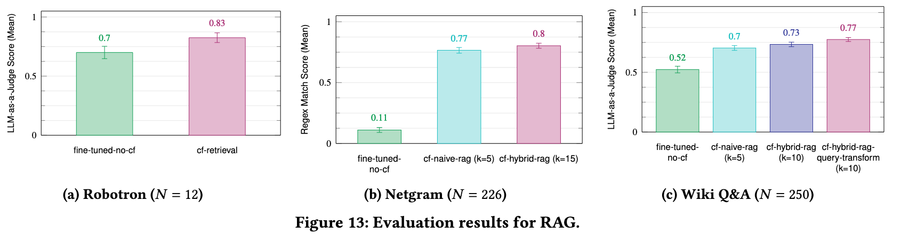
| RAG 策略                 | 适用场景                    | 流程                                               | 效果             |
| ------------------------ | --------------------------- | -------------------------------------------------- | ---------------- |
| **Naive RAG**            | 小数据集（<1 万）           | 向量检索 top-k → 直接注入 prompt                   | 简单直接         |
| **Hybrid RAG**           | 中大数据集（Wiki/Robotron） | ① 向量粗筛 top-15 → ② LLM 语义重排序 top-3         | 查准率↑3-4%      |
| **Query Transformation** | 歧义多的查询                | ① LLM 提炼关键词 → ② Collector 追问澄清 → ③ 再检索 | 准确率 0.73→0.77 |

## 4 Detailed  Design  & 4. 隐私保护

<!-- _header: \ ****** *Introduction* *Motivation*  *Overview* **Detailed Design** *Evaluation* --> 
<!-- _class: navbar  bq-blue -->

#### 隐私保护机制（§4.3.3）

双向匿名化，敏感信息「出域必脱敏，回域必还原」

```
用户输入
    ↓
[Identifier Redaction Service]
   ├─ 识别 40+ 类敏感信息（IP/设备/人名/邮箱/位置...）
   └─ 替换为虚构占位符：10.0.0.1 → [REDACTED_IP_001]
    ↓
[LLM 处理] → 生成响应
    ↓
[逆向替换]
   └─ [REDACTED_IP_001] → 10.0.0.1（仅用户可见）
    ↓
返回结果
```

</div>
<div class="rdiv">
<br>

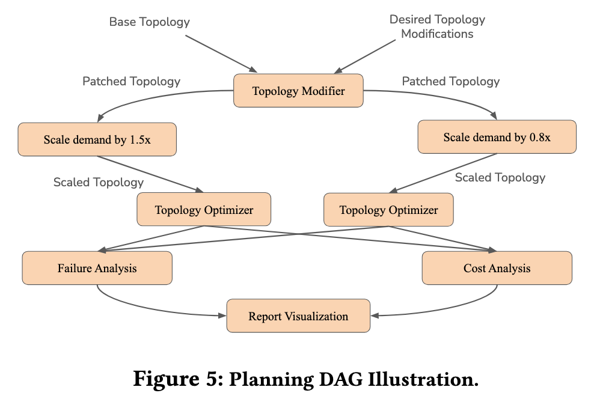
</div>

## 5 Evaluation 

<!-- _header: \ ****** *Introduction* *Motivation*  *Overview* *Detailed Design* **Evaluation** --> 
<!-- _class: navbar   -->

> 💡 说明：Confucius 是首个生产级多智能体网络管理框架，无直接可比的开源系统，故采用消融实验验证各组件贡献。

**数据集**：6 类任务（TML/ODS/Robotron/Netgram/Wiki Q&A 等），合成 + 真实混合数据

**指标**：

- Exact Match / Regex Match：确定性输出（如设备计数）
- LLM-as-a-Judge：复杂语义输出，0-1 分制

**基线设计**（内部消融为主）：

- 单模型 vs 集成（Ensemble）
- 微调模型 vs Prompt 工程（CoT）
- Naive RAG vs Hybrid RAG vs Query Transformation

## 5 Evaluation 

<!-- _header: \ ****** *Introduction* *Motivation*  *Overview* *Detailed Design* **Evaluation** --> 
<!-- _class: navbar   -->

**① Ensemble 集成降方差**（图 11）

- 异构集成（Llama+Claude+Gemini）：ODS 翻译准确率 ↑12%，输出方差 ↓57.6%
- 核心思想：多模型投票 ≈ 专家会诊，关键任务更可靠

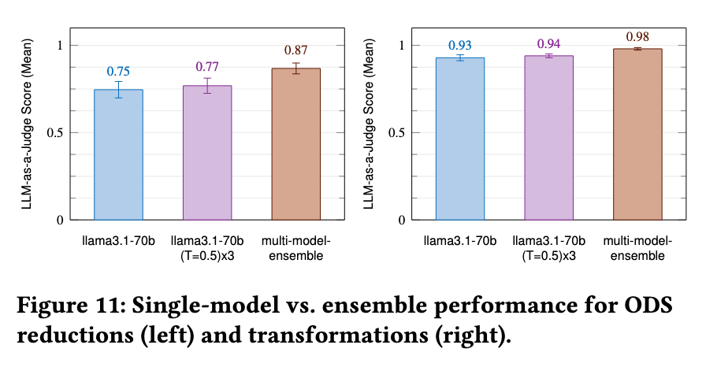

## 5 Evaluation 

<!-- _header: \ ****** *Introduction* *Motivation*  *Overview* *Detailed Design* **Evaluation** --> 
<!-- _class: navbar   -->
**② Prompt 工程 > 微调**（图 12）

- CoT + 领域 Prompt + 验证兜底：TML 翻译 +35%，ODS 聚合 +23%
- 优势：不依赖微调，换模型零成本，泛化性更强

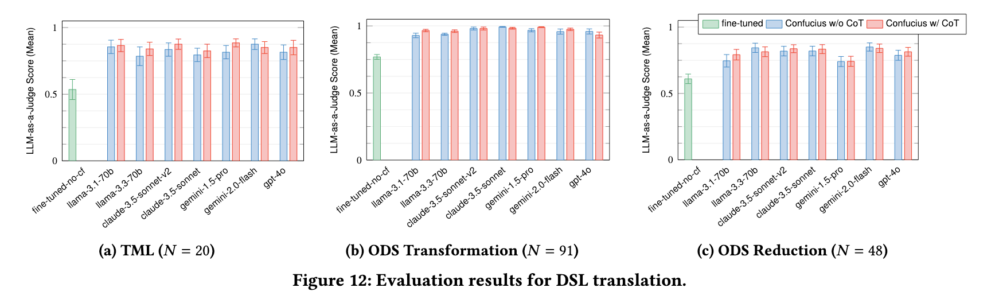


## 5 Evaluation 

<!-- _header: \ ****** *Introduction* *Motivation*  *Overview* *Detailed Design* **Evaluation** --> 
<!-- _class: navbar   -->

**③ Hybrid RAG 提升查准率**（图 13）

- 粗筛 + LLM 精排：Netgram/Wiki Q&A 查准率 ↑3-4%
- Query Transformation：歧义查询场景准确率 0.73→0.77


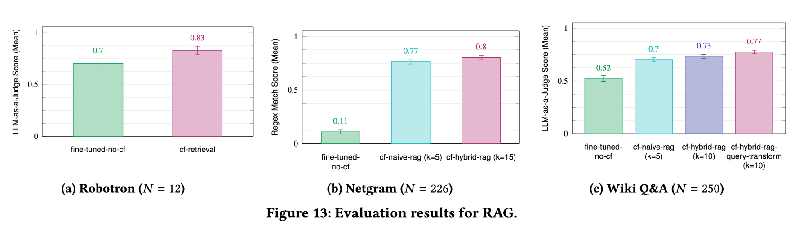
> 💡「集成降方差 + Prompt 超微调 + Hybrid RAG 查准」三招协同，准确率 ↑21%。


## 5 Evaluation 

<!-- _header: \ ****** *Introduction* *Motivation*  *Overview* *Detailed Design* **Evaluation** --> 
<!-- _class: navbar cols-2 -->
<div class="ldiv">

<br>
<br>

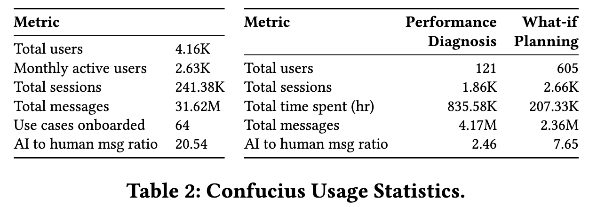

- 用户：4.16K 总用户，2.63K 月活，63% 留存
- 应用：64 个 onboard，AI:人类消息比 20.5:1

</div>
<div class="rdiv">

<br>
<br>

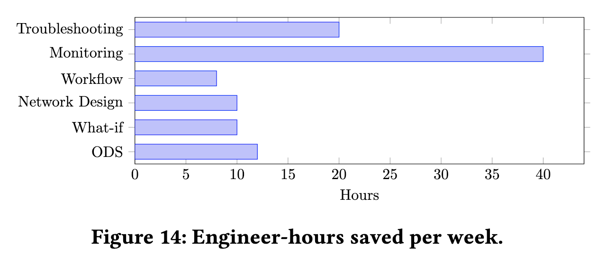

 人均周省 17 工程师小时（容量实验 3-4h→30min，故障诊断 2-8h→20min）

</div>


---
<!-- _class: lastpage  -->
<!-- _header: -->
###### Thank you! Q & A 
<div class = "icons">
</div>
