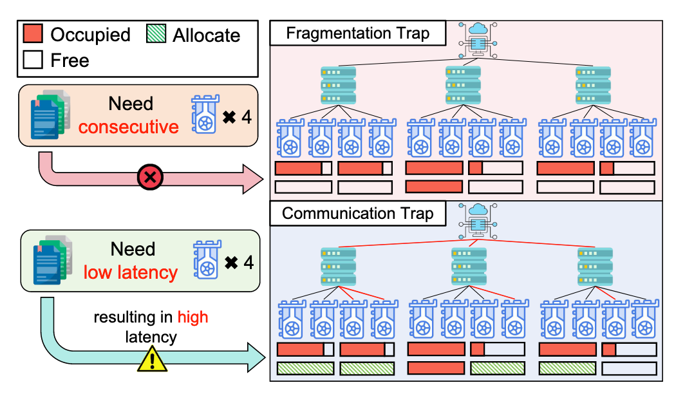
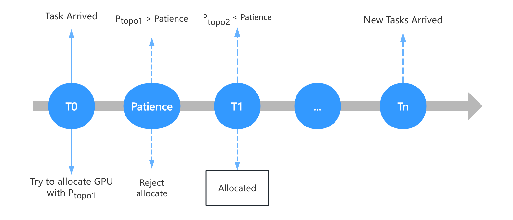
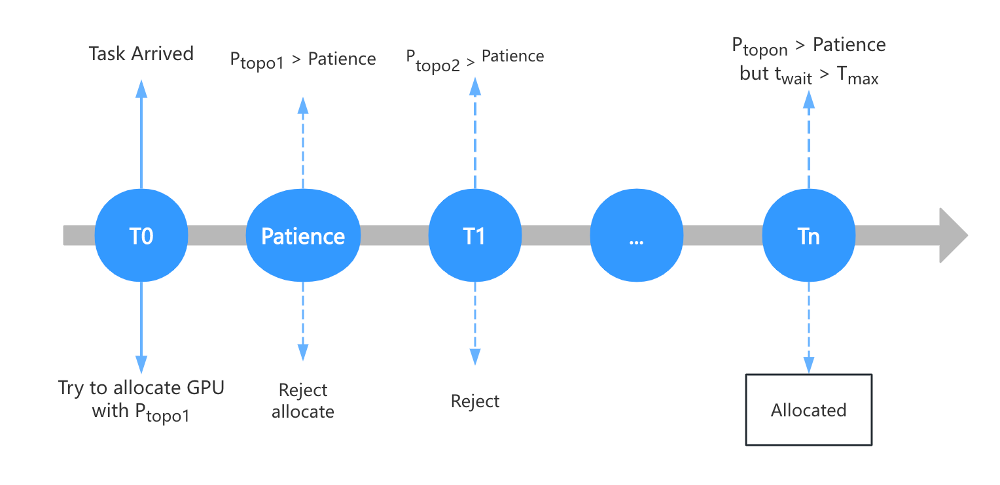
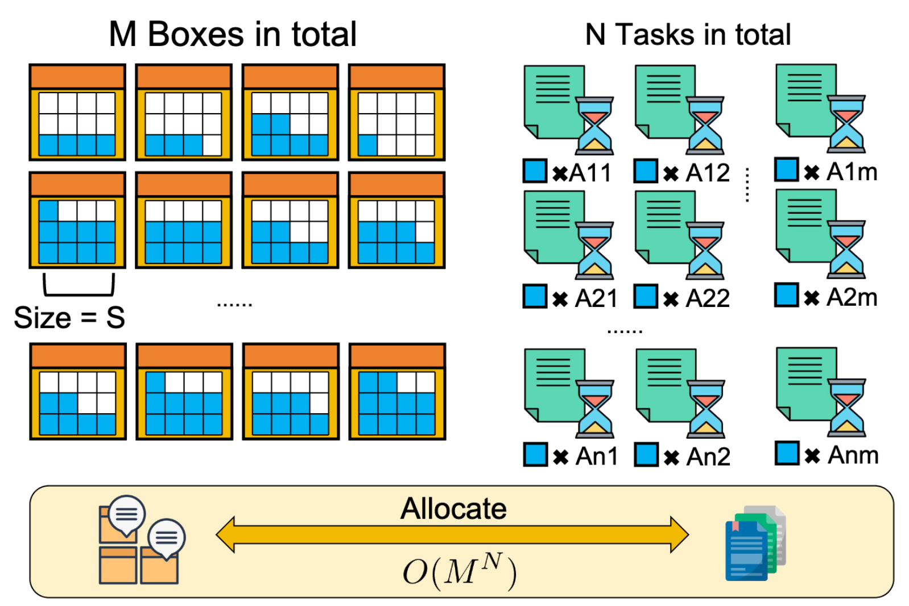
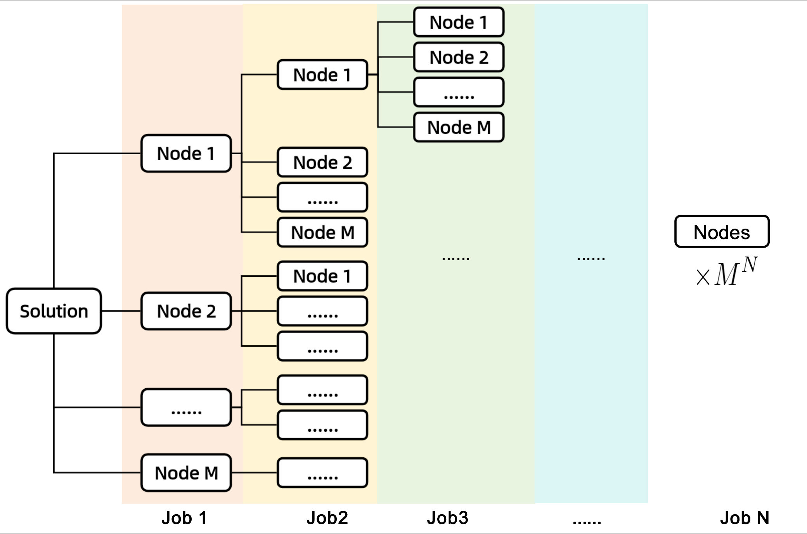
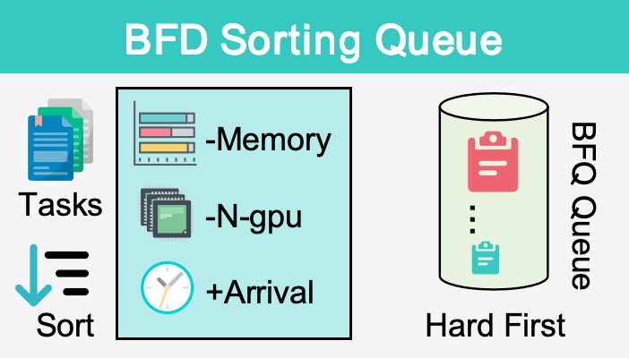
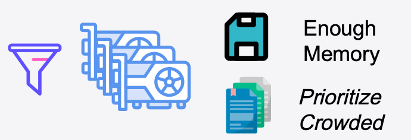
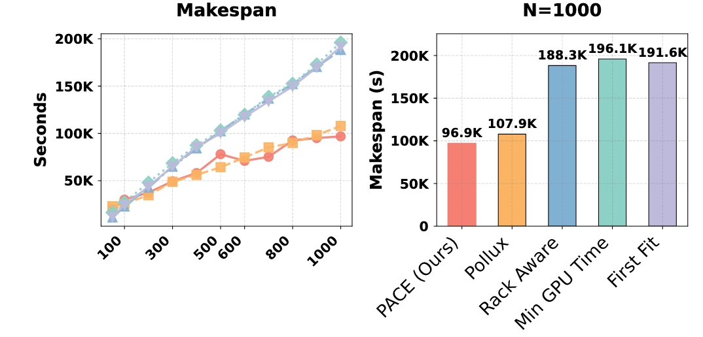
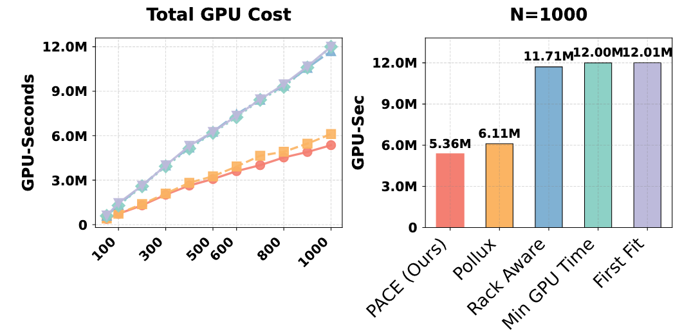

<!-- _class: cover_c -->
<!-- _header: -->
<!-- _paginate: "" -->
<!-- _footer:   -->
# <!-- fit --> PACE: Topology-Aware GPU Cost Minimization

Reporter ：Zhang zheyuan 
Date ：2026-03-31

## 目录

<!-- _class: cols2_ol_ci fglass toc_c  -->
<!-- _footer: "" -->
<!-- _header: "CONTENTS" -->
<!-- _paginate: "" -->

- [Introduction](#3)
- [Related Work](#5)
- [Motivation](#6)
- [System-Design](#10)
- [Evaluation](#13)

## 1 Introduction

<!-- _header: \ ****** **Introduction** *Related Work*  *Motivation* *System-Design* *Evaluation* --> 
<!-- _class: navbar -->
#### Challenges in Distributed Deep Learning Cluster Scheduling

- **Compute power demand surges:** Large models such as GPT-4 and LLaMA have proposed an exponential requirement for the scale of GPU clusters.

- **Heterogeneity of physical topology:** Modern data centers adopt hierarchical topology (Compute Node -> Rack -> Cluster), with huge differences in communication bandwidth between different levels.

  - Intra-node computation: NVLink/PCIe high-speed interconnect.

  - Cross-rack: Through Ethernet switches, with high latency and bandwidth constraints.

- **Communication bottleneck:** Distributed training (such as Data Parallelism) relies on gradient synchronization, and its efficiency is limited by the slowest communication link in the cluster (bottleneck effect).

## 1 Introduction

<!-- _header: \ ****** **Introduction** *Related Work*  *Motivation* *System-Design* *Evaluation* --> 
<!-- _class: navbar cols-2 -->

**Topology Awareness vs. Resource Utilization: 
The Hard-to-Resolve "Dilemma Trap"**

- **Trap One: Fragmentation Trap**

In order to pursue ultimate performance, the traditional "rack-aware" strategy (such as Rack-Aware) forces tasks to be deployed within a single rack.

- **Trap Two: Communication Trap**

Naive Packing strategy to fill in fragments, spreading 4-card jobs across racks.

- **Intra-rack:** NVLink/PCIe provides extremely high bandwidth.

- **Inter-rack:** Cross-switch communication, latency is often several times that of intra-rack.

## 2 Related Work

<!-- _header: \ ****** *Introduction* **Related Work**  *Motivation* *System-Design* *Evaluation* --> 
<!-- _class: navbar -->

**Evolution from "Performance-First" to "Cost-Aware"**

| **Scheduling Strategy Classification** | **Representative Work** | **Core Objective**                                     | **Topology/Interference Modeling** |
| -------------------------------------- | ----------------------- | ------------------------------------------------------ | ---------------------------------- |
| **JCT-Guided**                         | Tiresias, Pollux        | Minimize Job Completion Time (JCT)                     | Performance Adaptive Adjustment    |
| **Topology/Isolation-Based**           | HiveD, Rack-Aware       | Ensure Communication Bandwidth (Performance Isolation) | Static/Hard Topology Constraints   |
| **Cost and resource efficiency**          | Salus, Antman           | Improve Single-Card Throughput                         | Fine-Grained Resource Preemption   |
|                                        |                         |                                                        |                                    |

## 2 Related Work

<!-- _header: \ ****** *Introduction* **Related Work**  *Motivation* *System-Design* *Evaluation* --> 
<!-- _class: navbar -->

**Evolution from "Performance-First" to "Cost-Aware"**

JCT-Oriented Optimization 
   - Represented Work: Gandiva (Time Slicing), Tiresias (Discrete Priority), Pollux (Adaptive Scaling). 
   - Core Logic: Pursuit of the minimization of Job Completion Time (JCT), essentially "maximizing performance." 
   - Defect: Lack of economic mechanism. Often, to achieve a 10% acceleration, 50% more resources are used, leading to serious "resource bloating."

## 2 Related Work

<!-- _header: \ ****** *Introduction* **Related Work**  *Motivation* *System-Design* *Evaluation* --> 
<!-- _class: navbar -->

**Evolution from "Performance-First" to "Cost-Aware"**

Topology & Interference-Aware Strategy 

- Represents the work: HiveD (Static Unit Isolation), Salus (Fine-Grained Sharing), Mudi (SLO Feedback Control). 
- Core Logic: Improve the efficiency of single tasks by managing hardware topology and runtime interference. 
- Defect: Fragmented perspective. Topology algorithms usually assume resource exclusivity, while interference-aware algorithms only consider single nodes, and both lack global collaborative modeling.

## 2 Related Work

<!-- _header: \ ****** *Introduction* **Related Work**  *Motivation* *System-Design* *Evaluation* --> 
<!-- _class: navbar -->
**Evolution from "Performance-First" to "Cost-Aware"**
Cost & Resource Efficiency Optimization 
- Represents the work: Varuna, Cynthia (utilizing cloud bidding instance fluctuations). 
- Current situation: In the private computing power pool, efficiency bottlenecks arise from resource fragmentation and hidden waste (such as I/O waiting). 
- Defect: It belongs to "reactive" governance. At the decision-making stage, the existing scheduler cannot pre-quantify how much additional time cost "poor topology" or "potential interference" will convert into.

## 3 Motivation: **Achieving GPU time minimization through "dynamic coexistence" and "topological optimization".** 
<!-- _header: \ ****** *Introduction* *Related Work*  **Motivation** *System-Design* *Evaluation* --> 
<!-- _class: navbar -->

- Current situation: Mainstream schedulers (such as Pollux) often pursue performance isolation to avoid resource competition between tasks. 
- Core insight: In a fixed computing power pool, "absolute isolation" leads to significant resource fragmentation. 
- Our logic: If **multiple tasks** can be accommodated within a single GPU, even if there is a **moderate level of resource interference** 

## 3 Motivation: **Achieving GPU time minimization through "dynamic coexistence" and "topological optimization".** 
<!-- _header: \ ****** *Introduction* *Related Work*  **Motivation** *System-Design* *Evaluation* --> 
<!-- _class: navbar -->

Solve the coupling problem of "topology-fraction" 

- Status: Traditional methods either stubbornly adhere to topology (**leading to fragmentation deadlock**) or ignore topology (**leading to communication bottlenecks**). 
  
- Challenge: Currently, there is a lack of a model that can quantitatively judge which is more cost-effective, "cross-rack communication delay" or "waiting locally for better resources."

## 3 Motivation: **Achieving GPU time minimization through "dynamic coexistence" and "topological optimization".** 
<!-- _header: \ ****** *Introduction* *Related Work*  **Motivation** *System-Design* *Evaluation* --> 
<!-- _class: navbar -->

Introduce a "time-space" deep exchange mechanism. 
- Current situation: scheduling decisions are often instantaneous and greedy. 
- Our innovation: We not only find the optimal solution in the existing vacancies but also introduce a patience mechanism (Patience). 
- Decision logic: If the current topology space allocation is extremely unreasonable, the system will actively choose to **wait a while before placing**, sacrificing a tiny amount of time to achieve a more compact and efficient topology layout, thereby minimizing GPU time throughout the entire lifecycle.

## 4 System Design: **Dynamic Coexistence and Topological Optimization** 
<!-- _header: \ ****** *Introduction* *Related Work*  *Motivation* **System-Design** *Evaluation* --> 
<!-- _class: navbar -->

**High-Density Compression of GPU Resources through Dynamic Pricing**

- **Pricing Formula: Quantify Compression Gains**

$$C_{urc}(g,k) = \frac{1}{k \times \eta(k)}$$

- **$k$ (Number of Shared Tasks)**: Represents resource utilization. The higher the $k$, the lower the physical cost per task.

- **$\eta(k)$ (Execution Efficiency)**: Represents the interference cost. This value is provided by an experimental **lookup table**, reflecting the performance retention rate when $k$ tasks are compressed together.

## 4 System Design: **Dynamic Coexistence and Topological Optimization** 
<!-- _header: \ ****** *Introduction* *Related Work*  *Motivation* **System-Design** *Evaluation* --> 
<!-- _class: navbar -->

**Candidate Solution Evaluation: How to Select the Optimal GPU Resource Combination?**

- **1. What is Combination $\mathcal{A}$?**

- When job $j$ requests $n$ GPUs, the scheduler needs to select a set of locations from the cluster, which is defined as the **solution $\mathcal{A}$**.

- **2. Global Cost Calculation Formula**

$$C_{total}(\mathcal{A}) = P_{topo}(\mathcal{A}) \times \left( \frac{1}{|\mathcal{A}|} \sum_{g \in \mathcal{A}} C_{urc}(g,k_g) \right)$$

- **Average Pricing Term**: Reflects the degree of congestion of this set of GPUs. The tighter the congestion, the lower the average price.

- **Topological Penalty Term $P_{topo}(\mathcal{A})$**: Reflects the communication cost of this set of GPUs. Cross-rack allocation will significantly increase this value.

## 4 System Design: **Dynamic Coexistence and Topological Optimization** 
<!-- _header: \ ****** *Introduction* *Related Work*  *Motivation* **System-Design** *Evaluation* --> 
<!-- _class: navbar -->

#### Patience Mechanism: Threshold Check of Topological Cost

**1. Decision Conflict: When the Best Combination is Still Not Ideal**

**2. Comparison of $P_{topo}$ and Patience Threshold**  then trigger **WAIT**.

## 4 System Design: **Dynamic Coexistence and Topological Optimization** 
<!-- _header: \ ****** *Introduction* *Related Work*  *Motivation* **System-Design** *Evaluation* --> 
<!-- _class: navbar -->

- **3. Dynamic Balance: Bottom-line Protection against Starvation**

- The system records the cumulative waiting time $t_{wait}$ of the task.

- Once $t_{wait} > T_{max}$ (starvation threshold), the system will shut down the patience mechanism and forcibly enter "emergency mode" for allocation to ensure the SLA bottom line.

## 4 System Design: **Dynamic Coexistence and Topological Optimization** 
<!-- _header: \ ****** *Introduction* *Related Work*  *Motivation* **System-Design** *Evaluation* --> 
<!-- _class: navbar -->
Problem Reduction: Equivalent to the Generalized Assignment Problem (GAP)

**Theoretical Conclusion**: GAP belongs to the **strong NP-Hard** class of problems, and finding an absolute global optimal solution in polynomial time is **computationally infeasible**.

## 4 System Design: **Dynamic Coexistence and Topological Optimization** 
<!-- _header: \ ****** *Introduction* *Related Work*  *Motivation* **System-Design** *Evaluation* --> 
<!-- _class: navbar -->

Explosive Growth of Search Space

- **Decision Tree Model**: As shown in Figure 3, each task choice will branch out into $M$ node options.

- **Complex Measure Level**: For the entire task flow, the theoretical search space is **$O(M^N)$**.

## 4 System Design: **Dynamic Coexistence and Topological Optimization** 
<!-- _header: \ ****** *Introduction* *Related Work*  *Motivation* **System-Design** *Evaluation* --> 
<!-- _class: navbar cols-2 -->

#### Online scheduling implementation
**Pre-sorting and heuristic candidate generation**

**Task Preprocessing: Hard-First Sorting Strategy**

**Logic**: To prevent small tasks from fragmenting large continuous resources, the system reorders the waiting queue.

**Priority Vector**: $\mathcal{P}(j) = \langle -m_j, -n_j, +t_{arr} \rangle$.

- **Memory Requirement ($-m_j$)**: Prioritize tasks with large memory to prevent being stuck.

- **GPU Scale ($-n_j$)**: Prioritize multi-card tasks to get compact topology.

- **Arrival Time ($+t_{arr}$)**: As a fair bottom line to break ties.

## 4 System Design: **Dynamic Coexistence and Topological Optimization** 
<!-- _header: \ ****** *Introduction* *Related Work*  *Motivation* **System-Design** *Evaluation* --> 
<!-- _class: navbar cols-2 -->

**Node Pre-screening: Build a candidate pool**
- **Memory Filtering**: Exclude nodes with insufficient VRAM.
- **Unit Price Sorting**: Sort available GPUs in ascending order by **IAUP unit cost ($C_{curc}$)** and place them into a priority queue.
- **Result**: The semi-full nodes that "already have load but still have spare capacity" will automatically be placed at the front of the queue (because the surcharge unit cost is the cheapest).

**Combination Search: Sliding Window Scanning**

- The scheduler only performs sliding window searches on the top $K$ high-potential nodes in the priority queue.

## 5 Evaluation 
<!-- _header: \ ****** *Introduction* *Related Work*  *Motivation* *System-Design* **Evaluation** --> 
<!-- _class: navbar -->
**TRACE Driver Simulation: PACE Demonstrates Significant Cost and Efficiency Advantages**

- **1. Experimental Setup**

- **Environment**: High-fidelity discrete event simulator based on real cluster data (such as Microsoft Philly, Alibaba PAI) driving.

- **Topology**: Simulates 64 A100 GPUs, divided into 8 racks, with hierarchical communication penalties set.

- **Benchmark Algorithms**: Compared with Pollux (Strongest Interference Awareness), Rack-Aware (Strict Topology Awareness), and First-Fit, etc.

## 5 Evaluation 
<!-- _header: \ ****** *Introduction* *Related Work*  *Motivation* *System-Design* **Evaluation** --> 
<!-- _class: navbar pin-3-->

Under the high-load scenario of $N=1000$, PACE reduced resource consumption by **54.2%** compared to Rack-Aware, and further reduced it by **12.3%** compared to Pollux.

**Conclusion**: The excellent efficiency of the **IAUP pricing mechanism** in "high-density compression" tasks has been verified.

---

<!-- _class: lastpage  -->
<!-- _header: -->

###### Thank you! Q & A 

