<!-- _class: cover_c -->
<!-- _header: -->
<!-- _paginate: "" -->
<!-- _footer:   --> 
# PACE: Topology-Aware GPU Cost Minimization
Reporter ：Zhang zheyuan 
Date ：2026-05-21

## 目录

<!-- _class: cols2_ol_ci fglass toc_c  -->
<!-- _footer: "" -->
<!-- _header: "CONTENTS" -->
<!-- _paginate: "" -->

- [Introduction](#3)
- [Related Work](#5)
- [Motivation](#6)
- [System-Design](#10)
- [Evaluation](#13)

## 1 Introduction  <!-- page3 -->
<!-- _header: \ ****** **Introduction** *Related Work*  *Motivation* *System-Design* *Evaluation* --> 
<!-- _class: navbar -->
#### Challenges in Distributed Deep Learning Cluster Scheduling

- **计算功率需求激增：** GPT-4和LLaMA等大型模型对GPU集群规模的指数级需求。

- **物理拓扑异构性：** 现代数据中心采用分层拓扑（计算节点 -> 机架 -> 集群），不同层级之间的通信带宽存在巨大差异。

  - 节点内计算：NVLink/PCIe高速互连。

  - 机架间：通过以太网交换机，具有高延迟和带宽限制。

- **通信瓶颈：** 分布式训练（如数据并行）依赖于梯度同步，其效率受限于集群中最慢的通信链路（瓶颈效应）。

## 1 Introduction  <!-- page4 -->

<!-- _header: \ ****** **Introduction** *Related Work*  *Motivation* *System-Design* *Evaluation* --> 
<!-- _class: navbar cols-2 -->

#### 多个任务需要 GPU

- 最少需要 $n$ 个 GPU。
- 每个GPU 需要显存 $mem$。
- 弹性调度和非弹性调度， 估算完成时间
 

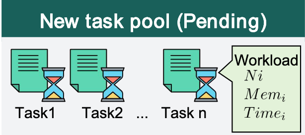

#### 数据中心分层摆放 GPU
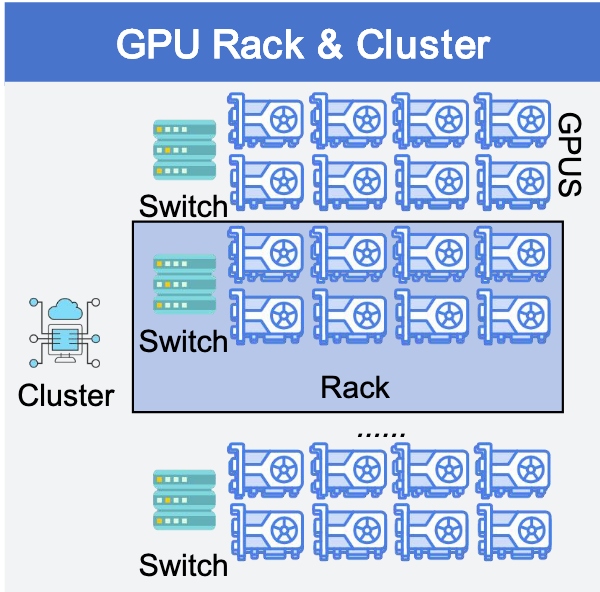

## 1 Introduction  <!-- page5 --> 

<!-- _header: \ ****** **Introduction** *Related Work*  *Motivation* *System-Design* *Evaluation* --> 
<!-- _class: navbar cols-2 -->

**拓扑感知与资源利用：** 难以解决的“困境陷阱”

- **陷阱一：碎片化陷阱**

  为了追求极致性能，传统的“机架感知”策略（如Rack-Aware）迫使任务部署在单个机架内。 
   
- **陷阱二：通信陷阱**
  只填充碎片，将4卡任务分散到各个机架。

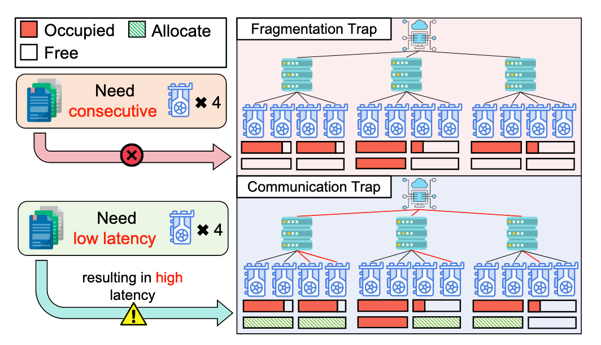

- **机架内：** NVLink/PCIe提供极高的带宽。
  
- **机架间：** 跨交换机通信，延迟通常是机架内的几倍。

## 1 Introduction  <!-- page6 -->
#### 忽略数据中心拓扑结构， 简化为装箱问题
<!-- _header: \ ****** **Introduction** *Related Work*  *Motivation* *System-Design* *Evaluation* --> 
<!-- _class: navbar -->
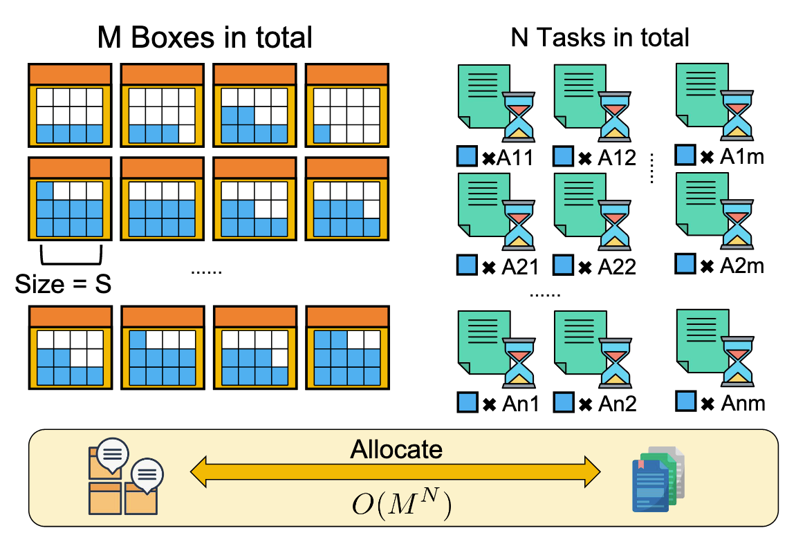

## 2 Related Work <!-- page7 -->

<!-- _header: \ ****** *Introduction* **Related Work**  *Motivation* *System-Design* *Evaluation* --> 
<!-- _class: navbar -->

**从“性能优先”到“成本意识”的演变**

| **调度策略分类** | **代表性工作** | **核心目标** | **拓扑/干扰建模** |
| -------------------------------------- | ----------------------- | ------------------------------------------------------ | ---------------------------------- |
| **JCT-Guided**                         | Tiresias, Pollux        | Minimize Job Completion Time (JCT)                     | Performance Adaptive Adjustment    |
| **Topology/Isolation-Based**           | HiveD, Rack-Aware       | Ensure Communication Bandwidth (Performance Isolation) | Static/Hard Topology Constraints   |
| **Cost and resource efficiency**          | Salus, Antman           | Improve Single-Card Throughput                         | Fine-Grained Resource Preemption   |
|                                        |                         |                                                        |                                    |

## 2 Related Work <!-- page8 -->

<!-- _header: \ ****** *Introduction* **Related Work**  *Motivation* *System-Design* *Evaluation* --> 
<!-- _class: navbar -->

> **从“性能优先”到“成本意识”的演变**

**面向JCT的优化**

- 代表性工作：Gandiva（时间切片）、Tiresias（离散优先级）、Pollux（自适应缩放）。

- 核心逻辑：追求最小化作业完成时间（JCT），本质上“最大化性能。”

- 缺陷：缺乏经济机制。通常，为了实现10%的加速，需要使用50%更多的资源，导致严重的“资源膨胀。”

## 2 Related Work <!-- page9 -->

<!-- _header: \ ****** *Introduction* **Related Work**  *Motivation* *System-Design* *Evaluation* --> 
<!-- _class: navbar -->

> **从“性能优先”到“成本意识”的演变**

**拓扑与干扰感知策略**

- 代表性工作：HiveD（静态单元隔离）、Salus（细粒度共享）、Mudi（SLO反馈控制）。

- 核心逻辑：通过管理硬件拓扑和运行时干扰来提高单个任务的效率。

- 缺陷：碎片化视角。拓扑算法通常假设资源独占，而干扰感知算法仅考虑单个节点，两者都缺乏全局协作建模。

## 2 Related Work <!-- page10 -->

<!-- _header: \ ****** *Introduction* **Related Work**  *Motivation* *System-Design* *Evaluation* --> 
<!-- _class: navbar -->

**从“性能优先”到“成本意识”的演变**

**成本与资源效率优化**

- 代表性工作：Varuna, Cynthia（利用云竞价实例波动）。

- 当前情况：在私有计算能力池中，由于资源碎片化和隐藏浪费（如I/O等待），出现效率瓶颈。

- 缺陷：它属于“反应式”治理。在决策阶段，现有的调度器无法预先量化“糟糕的拓扑”或“潜在干扰”将转化为多少额外的时间成本。

## 3 Motivation  <!-- page11 -->
#### 新的切入点
<!-- _header: \ ****** *Introduction* *Related Work*  **Motivation** *System-Design* *Evaluation* --> 
<!-- _class: navbar -->

- 现有工作都在使用不同的算法做上述三种策略的优化，相关工作已经非常成熟，想要在算法上有新的突破非常困难。
- 能否找到一个新的切入点，有实际应用意义并且能够量化其指标并围绕此来指导调度？

## 3 Motivation:  <!-- page12 -->
#### 新的切入点 ： 最小 GPU 占用时间
<!-- _header: \ ****** *Introduction* *Related Work*  **Motivation** *System-Design* *Evaluation* --> 
<!-- _class: navbar -->

- GPU资源往往是有限的， 我们能否在有限的资源上， 尽可能多的跑一些任务， 以此来提升资源利用率？
- 上述资源利用率的指标可以用什么来衡量， 用什么来量化
- 最小化 GPU 的占用时间， 能否表示在单位时间内， 可以跑更多的任务， 以此来提升资源利用率？

## 3 Motivation:  <!-- page13 -->
#### 如何最小化 GPU 占用时间 
<!-- _header: \ ****** *Introduction* *Related Work*  **Motivation** *System-Design* *Evaluation* --> 
<!-- _class: navbar -->

PACE的基本理念：**动态共存和拓扑优化**
- **动态共存**：允许多个任务共享单个GPU，即使存在适度干扰，也能实现高密度资源压缩。

- **考虑拓扑**：由于数据中心的分层拓扑结构， 多卡训练任务可能会产生通讯开销， 能否通过调度算法， 尽可能避免不好的拓扑结构，从而减少通讯开销，达成最小化整体的GPU占用时间。

> **通过“动态共存”和“考虑拓扑”实现GPU时间最小化。**

## 3 Motivation:  <!-- page14 -->
####  动态共存 ： 尝试让 GPU 尽可能多的被利用起来
<!-- _header: \ ****** *Introduction* *Related Work*  **Motivation** *System-Design* *Evaluation* --> 
<!-- _class: navbar -->

- 当前情况：主流调度器（如Pollux ， 21'OSDI sota）通常追求性能隔离，以避免任务之间的资源竞争。

- 核心见解：在固定的计算能力池中，“绝对隔离”会导致资源碎片化。

- 我们的逻辑：如果**多个任务**可以容纳在单个GPU中，即使存在**中等程度的资源干扰** ，也能实现更高的资源利用率，从而最小化GPU占用时间。

## 3 Motivation:  <!-- page15 -->
#### 考虑拓扑：避免不好的拓扑结构，减少通讯开销，也要防止死锁
<!-- _header: \ ****** *Introduction* *Related Work*  **Motivation** *System-Design* *Evaluation* --> 
<!-- _class: navbar -->

- 状态：传统方法要么顽固地坚持拓扑（导致碎片化僵局），要么忽略拓扑（导致通信瓶颈）。

- 挑战：目前缺乏一个可以弹性**定量**判断哪种更经济高效的模型，“跨机架通信延迟”或“等待本地以获取更好的资源”。

## 3 Motivation:  <!-- page16 -->
#### 耐心机制 ： 未来某个时间， 可能有机会避免跨拓扑通信。
<!-- _header: \ ****** *Introduction* *Related Work*  **Motivation** *System-Design* *Evaluation* --> 
<!-- _class: navbar -->

- 当前情况：调度决策通常是**即时**和贪婪的。

- 创新：我们尝试找到现有空缺中的最优解，并引入了耐心机制（耐心）。

- 决策逻辑：如果当前拓扑空间分配极其不合理 **比如说跨机架分配 GPU 导致的通信开销**，系统会选择**等待一段时间后再调度任务上台**，牺牲一小部分时间以实现更紧凑和高效的拓扑布局，从而在整个生命周期中最小化GPU时间。

## 4 System Design <!-- page17 -->
#### 动态共存建模
<!-- _header: \ ****** *Introduction* *Related Work*  *Motivation* **System-Design** *Evaluation* --> 
<!-- _class: navbar -->

**通过动态定价实现GPU资源的密集压缩**

- **定价公式：量化压缩收益**

$$C_{urc}(g,k) = \frac{1}{k \times \eta(k)}$$

- **$k$（共享任务数量）**：表示资源利用率。$k$ 越高，每个任务的物理成本越低。

- **$\eta(k)$（执行效率）**：表示干扰成本。此值参考 Gandiva (OSDI‘18)，反映了当 $k$ 个任务压缩在一起时的性能保留率。

## 4 System Design <!-- page18 -->
<!-- _header: \ ****** *Introduction* *Related Work*  *Motivation* **System-Design** *Evaluation* --> 
<!-- _class: navbar cols-2-73-->

 

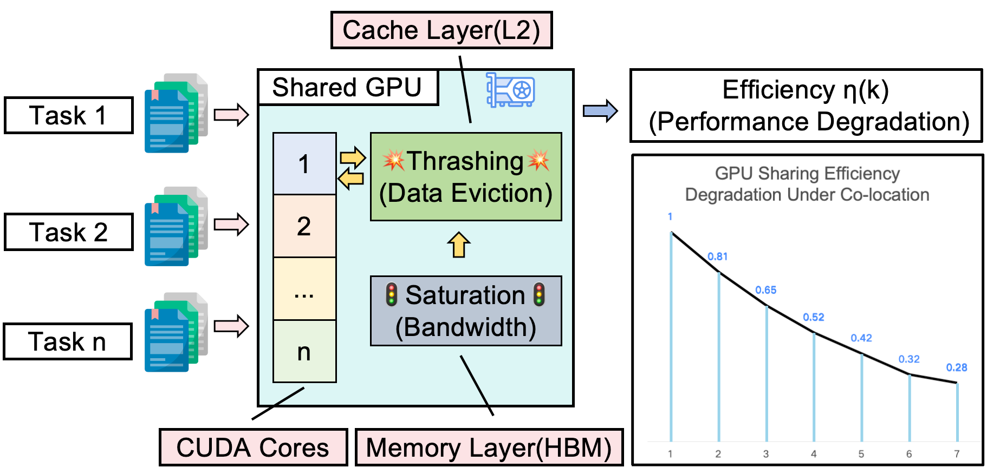

$$
\eta(k)=\max\left(\eta_{\mathrm{floor}},\exp\left(-\lambda\cdot(k-1)^{\beta}\right)\right)
$$

- k :GPU 上并行的任务数
- η(k) :k 个任务共享时，单任务的吞吐率相对于独占时的比例。
- λ: 初始敏感度。由 Gandiva (OSDI'18) 锚点 k=2,η=0.81 标定。
- β:非线性退化, β>1 反映 L2 Cache 踩踏和 HBM 带宽饱和导致的超线性性能
- $η_{floor}$:硬件最低带宽。
​

## 4 System Design <!-- page19 -->
<!-- _header: \ ****** *Introduction* *Related Work*  *Motivation* **System-Design** *Evaluation* --> 
<!-- _class: navbar -->
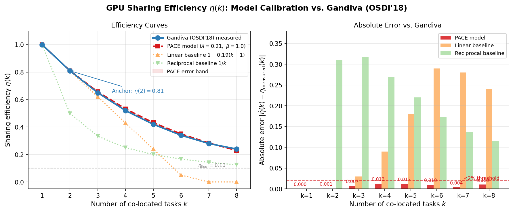

## 4 System Design 拓扑量化建模 <!-- page20 -->
<!-- _header: \ ****** *Introduction* *Related Work*  *Motivation* **System-Design** *Evaluation* --> 
<!-- _class: navbar -->
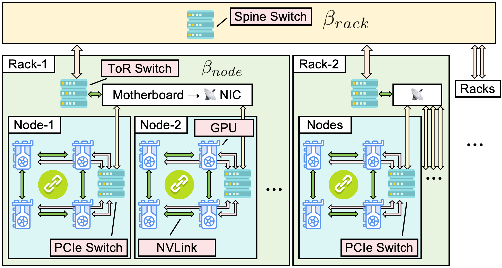

$$
  P_{\mathrm{topo}}(A)=1+\beta_{\mathrm{node}}\cdot\underbrace{\frac{n_{\mathrm{rack_max}}-n_{\mathrm{node_max}}}{n}}_{\text{跨节点比例(同机架内)}}+\beta_{\mathrm{rack}}\cdot\underbrace{\frac{n-n_{\mathrm{rack_max}}}{n}}_{\text{跨机架比例}}
$$

## 4 System Design 拓扑量化建模 <!-- page21 -->
<!-- _header: \ ****** *Introduction* *Related Work*  *Motivation* **System-Design** *Evaluation* --> 
<!-- _class: navbar -->

$$
  P_{\mathrm{topo}}(A)=1+\beta_{\mathrm{node}}\cdot\underbrace{\frac{n_{\mathrm{rack_max}}-n_{\mathrm{node_max}}}{n}}_{\text{跨节点比例(同机架内)}}+\beta_{\mathrm{rack}}\cdot\underbrace{\frac{n-n_{\mathrm{rack_max}}}{n}}_{\text{跨机架比例}}
$$

- $n$: 任务所需 GPU 总数（本例中 n=4）。
- $n_{node\_max}$: 分配方案中，单个节点内包含的最大 GPU 数。
- $n_{rack\_max}$: 分配方案中，单个机架内包含的最大 GPU 数。
- $β_{node}=0.4$: 跨节点通信的相对代价（反映 ToR 交换机带宽瓶颈）。
- $β_{rack}=1.0$: 跨机架通信的相对代价（反映 Spine 核心网带宽瓶颈及拥塞）。

## 4 System Design 拓扑量化建模 <!-- page22 -->
#### 假设集群结构：每机架 2 节点，每节点 4 GPU, 讨论(n = 4) 
<!-- _header: \ ****** *Introduction* *Related Work*  *Motivation* **System-Design** *Evaluation* --> 
<!-- _class: navbar -->
$$
  P_{\mathrm{topo}}(A)=1+\beta_{\mathrm{node}}\cdot\underbrace{\frac{n_{\mathrm{rack_max}}-n_{\mathrm{node_max}}}{n}}_{\text{跨节点比例(同机架内)}}+\beta_{\mathrm{rack}}\cdot\underbrace{\frac{n-n_{\mathrm{rack_max}}}{n}}_{\text{跨机架比例}}
$$

**场景 A：完美局部性 (Best Case)**
- 分配：4 GPU 全部在 Node 1 (Rack 1)。
- 参数：$n_{\text{node\_max}} = 4$, $n_{\text{rack\_max}} = 4$。
- 计算：
  - $f_{\text{cn}} = (4 - 4)/4 = 0$, $f_{\text{cr}} = (4 - 4)/4 = 0$
  - $P_{\text{topo}} = 1 + 0.4 \cdot 0 + 1.0 \cdot 0 = 1.0$
- 结论：所有通信均在 NVLink/NVSwitch 内部完成，无额外网络开销。

## 4 System Design 拓扑量化建模 <!-- page23 -->
#### 假设集群结构：每机架 2 节点，每节点 4 GPU, 讨论(n = 4) 
<!-- _header: \ ****** *Introduction* *Related Work*  *Motivation* **System-Design** *Evaluation* --> 
<!-- _class: navbar -->

$$
  P_{\mathrm{topo}}(A)=1+\beta_{\mathrm{node}}\cdot\underbrace{\frac{n_{\mathrm{rack_max}}-n_{\mathrm{node_max}}}{n}}_{\text{跨节点比例(同机架内)}}+\beta_{\mathrm{rack}}\cdot\underbrace{\frac{n-n_{\mathrm{rack_max}}}{n}}_{\text{跨机架比例}}
$$
**场景 B: 同机架跨节点 (Medium Case)**
- 分配：2 GPU 在 Node 1, 2 GPU 在 Node 2 (均在 Rack 1)。
- 参数：$n_\mathrm{node\_max}=2,n_\mathrm{rack\_max}=4$。

- 计算：

  - $f_{\mathrm{cn}}=(4-2)/4=0.5$ (50% 的流量需走出节点)  , $f_{\mathrm{cr}}=(4-4)/4=0$
  - $P_{\mathrm{topo}}= 1+ 0. 4\cdot 0. 5+ 1. 0\cdot 0= \mathbf{1. 2}$
- 结论：部分通信需经过 ToR 交换机，带宽下降导致等效代价增加 20%。

## 4 System Design 拓扑量化建模 <!-- page24 -->
#### 假设集群结构：每机架 2 节点，每节点 4 GPU, 讨论(n = 4) 
<!-- _header: \ ****** *Introduction* *Related Work*  *Motivation* **System-Design** *Evaluation* --> 
<!-- _class: navbar -->

$$
  P_{\mathrm{topo}}(A)=1+\beta_{\mathrm{node}}\cdot\underbrace{\frac{n_{\mathrm{rack_max}}-n_{\mathrm{node_max}}}{n}}_{\text{跨节点比例(同机架内)}}+\beta_{\mathrm{rack}}\cdot\underbrace{\frac{n-n_{\mathrm{rack_max}}}{n}}_{\text{跨机架比例}}
$$

**场景 C: 跨机架分散 (Worst Case)**

- 分配：2 GPU 在 Rack 1 (Node 1), 2 GPU 在 Rack 2 (Node 3)。
- 计算：
  - $f_{\mathrm{cn}}=(4-2)/4=0.5$ (50% 的流量需走出节点，失去 NVLink 优势) 
  - $f_{\mathrm{cr}}=(4-2)/4=0.5$ (50% 的流量需走出机架，面临 Spine 拥塞) 
  - $P_{\mathrm{topo}}=1+0.4\cdot0.5+1.0\cdot0.5=1+0.2+0.5=1.7$
- 结论：代价叠加。通信既无法享受节点内高速互联，又需经过核心交换机，等效资源代价激增 70%,是调度器极力避免的最差情况。

## 4 System Design:  <!-- page25 -->
<!-- _header: \ ****** *Introduction* *Related Work*  *Motivation* **System-Design** *Evaluation* --> 
<!-- _class: navbar -->

**候选解决方案评估：如何选择最优的GPU资源组合？**

  **1. 组合 $\mathcal{A}$？**

  - 当作业 $j$ 请求 $n$ 个 GPU 时，调度器需要从集群中选择一组位置，这被定义为 **解决方案 $\mathcal{A}$**。

  **2. 全局成本计算公式**

$$C_{total}(\mathcal{A}) = P_{topo}(\mathcal{A}) \times \left( \frac{1}{|\mathcal{A}|} \sum_{g \in \mathcal{A}} C_{urc}(g,k_g) \right)$$

- **平均定价项**：反映了这组 GPU 的拥堵程度。拥堵越严重，平均价格越低。

- **拓扑惩罚项 $P_{topo}(\mathcal{A})$**：反映了这组 GPU 的通信成本。跨机架分配将显著增加此值。

## 4 System Design:  <!-- page26 -->
<!-- _header: \ ****** *Introduction* *Related Work*  *Motivation* **System-Design** *Evaluation* --> 
<!-- _class: navbar -->

#### 耐心机制：拓扑成本的阈值检查

**1. 决策冲突：当最佳组合仍不理想时**

**2. 比较 $P_{topo}$ 和耐心阈值** 然后触发 **等待**。

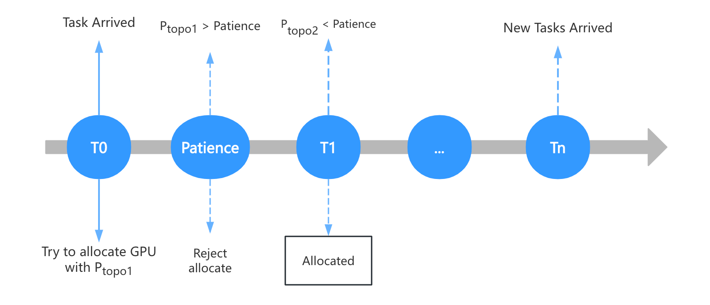

## 4 System Design: <!-- page27 --> **Dynamic Coexistence and Topological Optimization** 
<!-- _header: \ ****** *Introduction* *Related Work*  *Motivation* **System-Design** *Evaluation* --> 
<!-- _class: navbar -->

**动态平衡：防止饥饿的底线保护**

- 系统记录任务的累积等待时间 $t_{wait}$。

- 一旦 $t_{wait} > T_{max}$（饥饿阈值），系统将关闭耐心机制并强制进入“紧急模式”进行分配，以确保SLA底线。

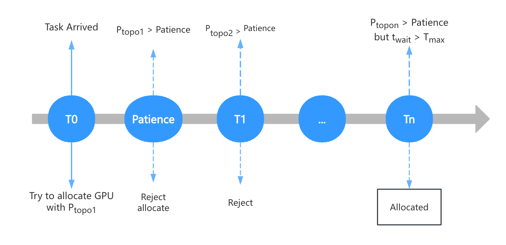

## 4 System Design: <!-- page28 -->
<!-- _header: \ ****** *Introduction* *Related Work*  *Motivation* **System-Design** *Evaluation* --> 
<!-- _class: navbar -->
**问题约简：** 等同于广义分配问题（GAP）

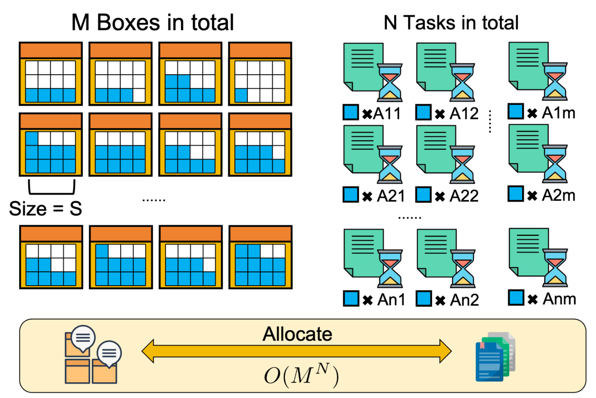

**理论结论**：GAP属于**强NP**问题，在多项式时间内找到绝对全局最优解是**计算上不可行的**。

## 4 System Design: <!-- page29 -->
<!-- _header: \ ****** *Introduction* *Related Work*  *Motivation* **System-Design** *Evaluation* --> 
<!-- _class: navbar -->

搜索空间爆炸性增长

- **决策树模型**：如图3所示，每个任务选择将分支成$M$个节点选项。

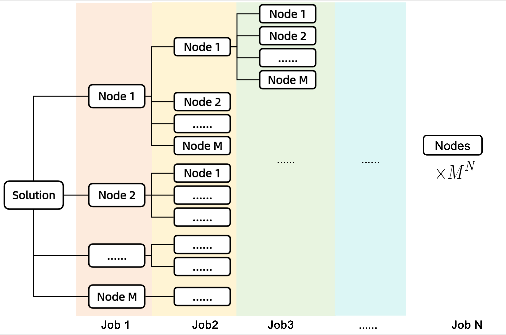
- **复杂度级别**：对于整个任务流程，理论搜索空间是 **$O(M^N)$**。

## 4 System Design: <!-- page30 -->
<!-- _header: \ ****** *Introduction* *Related Work*  *Motivation* **System-Design** *Evaluation* --> 
<!-- _class: navbar cols-2 -->

#### 使用贪心的思想，不求最优，接近最优
 
 

#### 预排序和启发式候选任务

- **任务预处理：硬优先级排序策略**

- **逻辑**：为了防止小任务分割大连续资源，系统重新排列等待队列。

- **优先级向量**：$\mathcal{P}(j) = \langle -m_j, -n_j, +t_{arr} \rangle$。

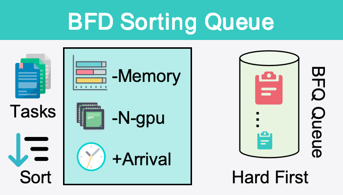

- **Memory Requirement ($-m_j$)**: 优先处理内存需求大的任务，防止卡住。

- **GPU Scale ($-n_j$)**: 优先处理多卡任务以获得紧凑拓扑。

- **Arrival Time ($+t_{arr}$)**: 先来先服务

## 4 System Design: <!-- page31 -->**Dynamic Coexistence and Topological Optimization** 
<!-- _header: \ ****** *Introduction* *Related Work*  *Motivation* **System-Design** *Evaluation* --> 
<!-- _class: navbar cols-2 -->

#### 节点预筛选：建立候选节点库

 

- **内存过滤**：排除VRAM不足的节点。

- **单价排序**：按 **IAUP单位成本（$C_{curc}$）** 升序排序可用的GPU，并将它们放入优先队列。

- **结果**：那些“已有负载但仍有空闲容量”的半满节点将自动排在队列前面（因为附加单位成本是最便宜的）。

#### 组合搜索：滑动窗口扫描

 

- 调度器仅在优先队列中顶部 $K$ 个高潜力节点上执行滑动窗口搜索。

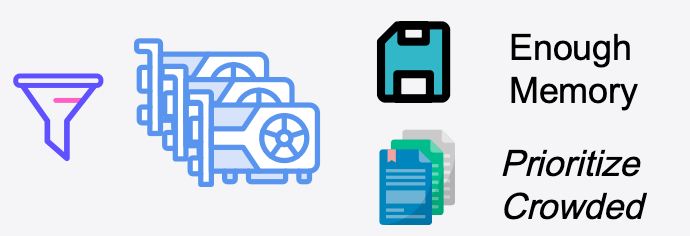

## 4 System Design: <!-- page31 -->
<!-- _header: \ ****** *Introduction* *Related Work*  *Motivation* **System-Design** *Evaluation* --> 
<!-- _class: navbar -->
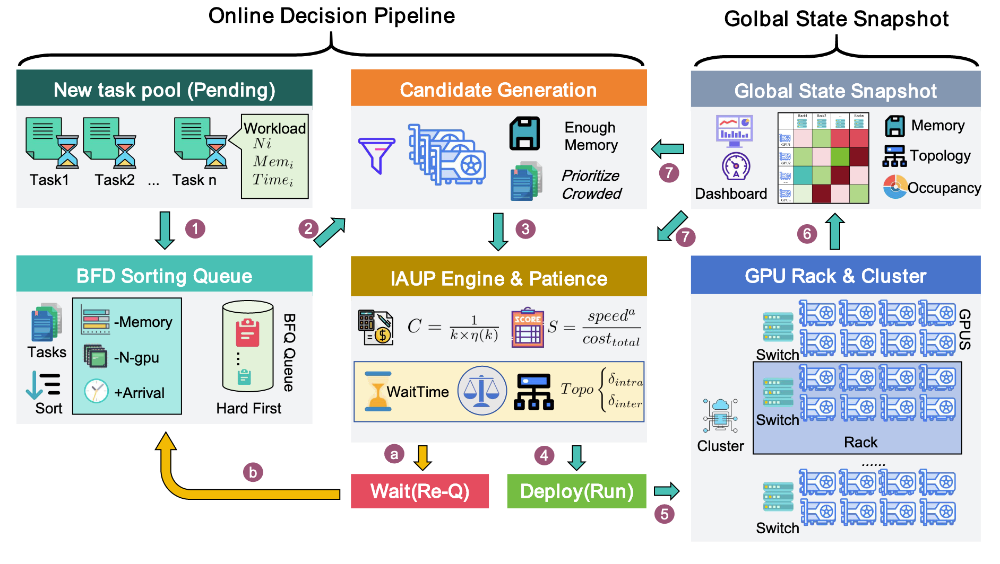

## 5 Evaluation 
<!-- _header: \ ****** *Introduction* *Related Work*  *Motivation* *System-Design* **Evaluation** --> 
<!-- _class: navbar -->

**TRACE驱动模拟：PACE展示显著的成本和效率优势**

- **实验设置**

- **环境**：基于真实集群数据的高保真离散事件模拟器驱动。

- **拓扑**：模拟64个A100 GPU，分为8个机架，设置分层通信惩罚。

- **基准算法**：与Pollux（最强干扰感知）、Rack-Aware（严格拓扑感知）和First-Fit等比较。

## 5 Evaluation 
<!-- _header: \ ****** *Introduction* *Related Work*  *Motivation* *System-Design* **Evaluation** --> 
<!-- _class: navbar pin-3-->

在$N=1000$的高负载场景下，PACE相比Rack-Aware降低了**54.2%**的资源消耗，与Pollux相比进一步降低了**12.3%**。

**结论**：在“高密度压缩”任务中，**IAUP定价机制**的卓越效率得到了验证。

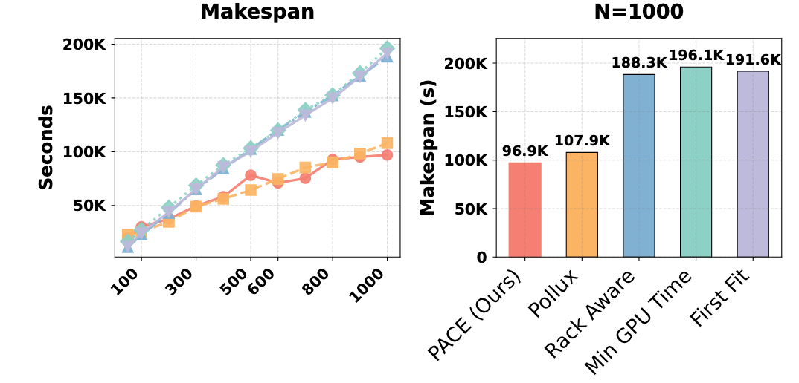

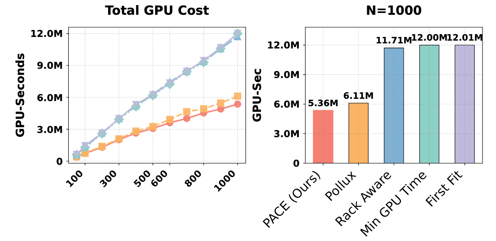

---

<!-- _class: lastpage  -->
<!-- _header: -->

###### Q & A 

