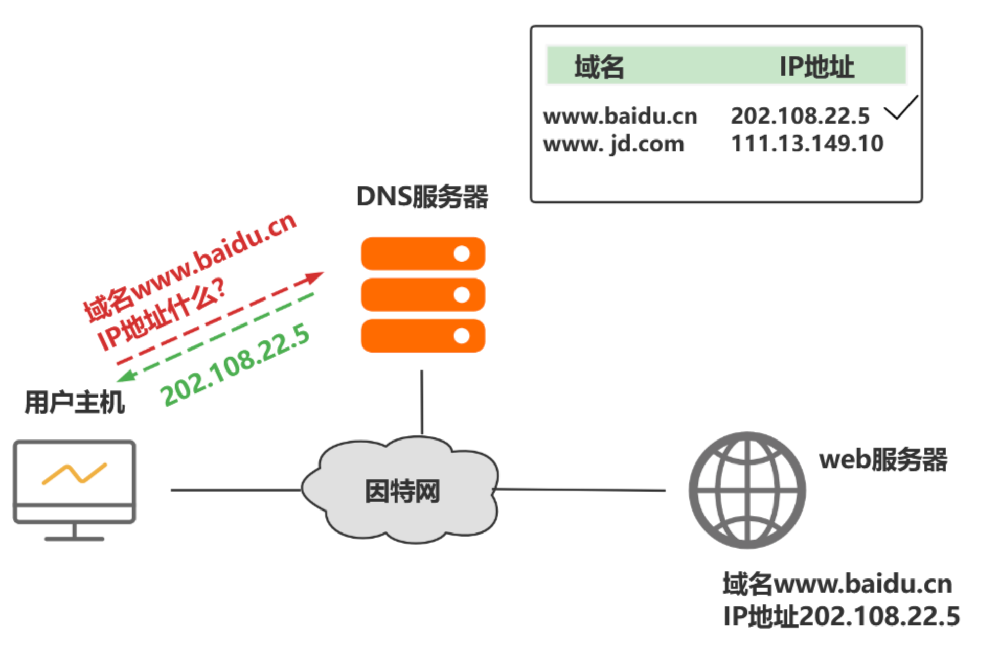
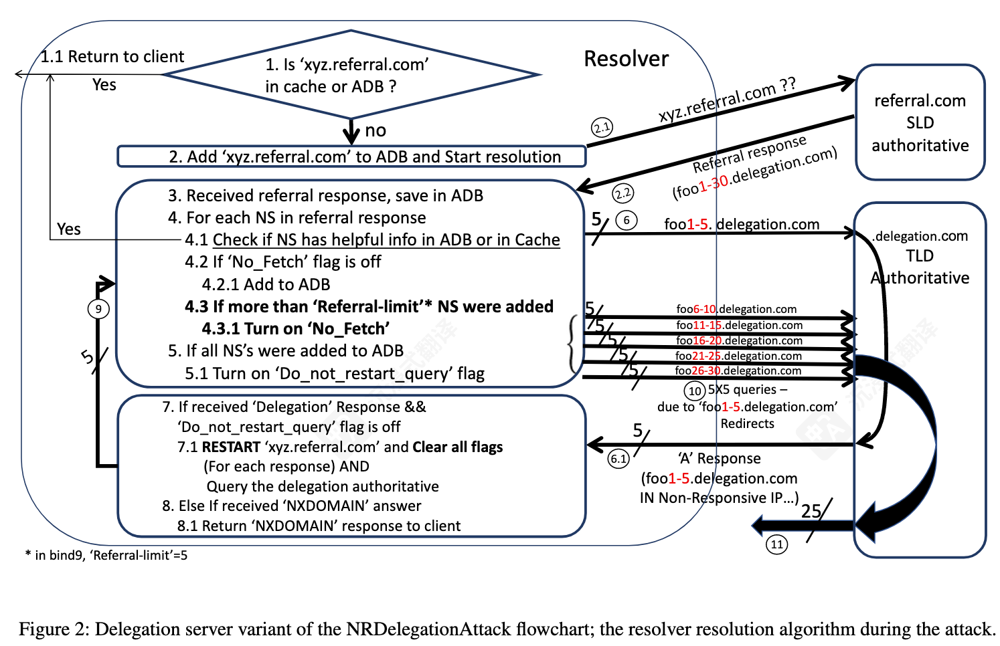
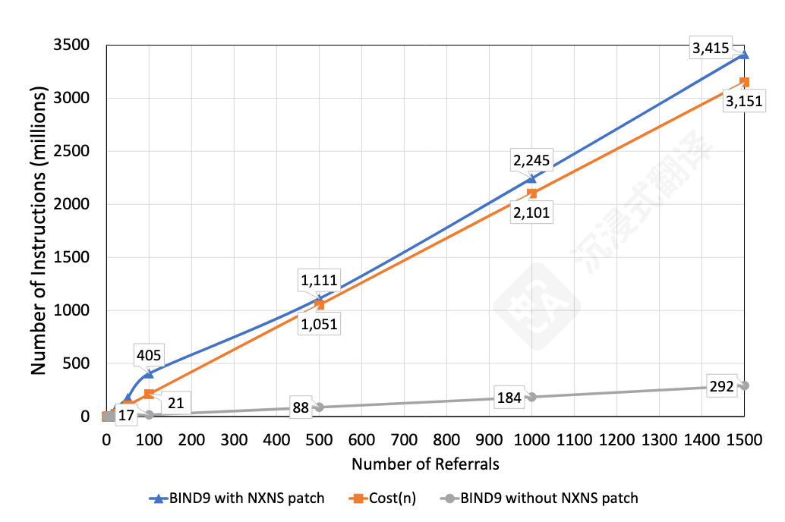
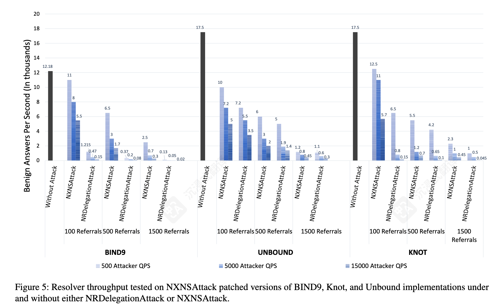
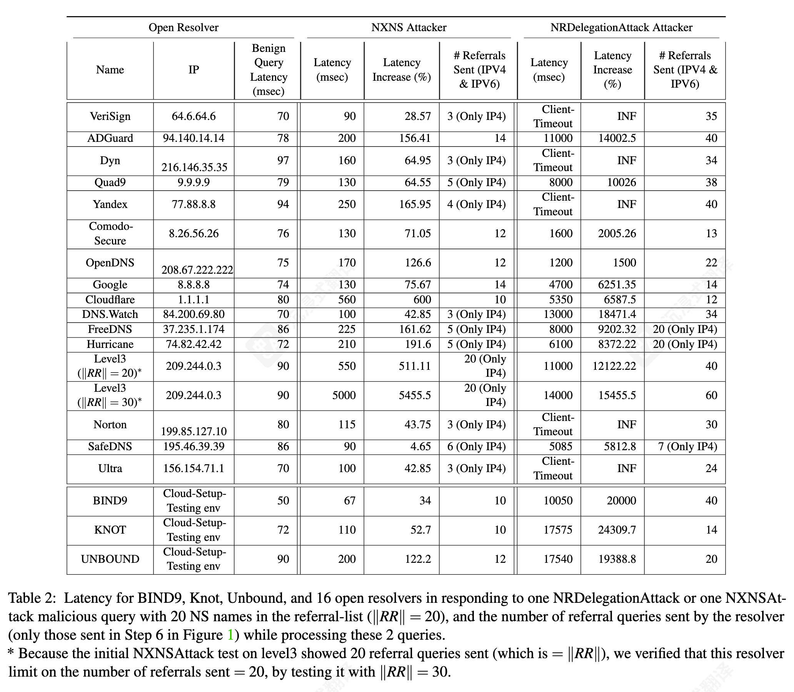
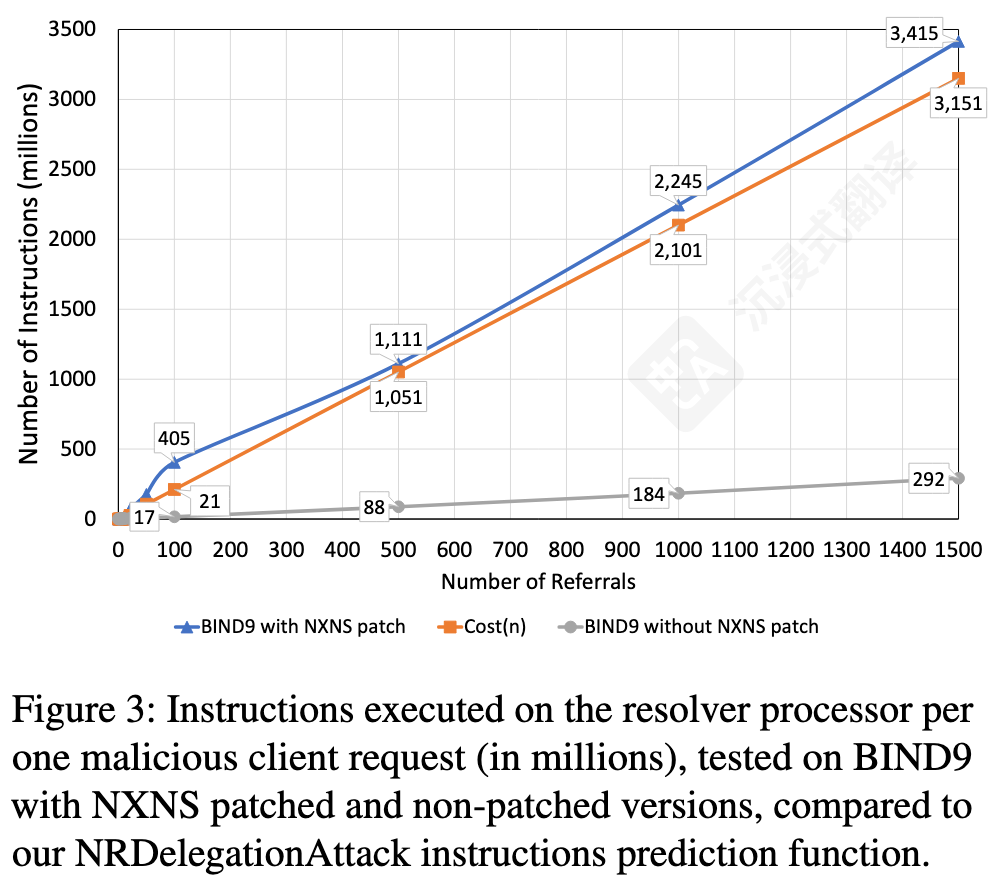

<!-- _class: cover_e -->
<!-- _paginate: "" -->
<!-- _footer: 互联网体系结构及其安全基础 -->

# <!-- fit -->基于 [USENIX Security '23] NRDelegationAttack 的研究复现 DNS 复杂度攻击

###### NRDelegationAttack: Complexity DDoS attack on DNS Recursive Resolvers
Reporter ：田思源 张哲源
Date ：2025 年 11 月 11 日

## 目录

<!-- _class: cols2_ol_ci fglass toc_c  -->
<!-- _footer: "" -->
<!-- _header: "CONTENTS" -->
<!-- _paginate: "" -->

- [研究背景](#3)
- [核心漏洞](#6)
- [严重性量化](#10)
- [研究计划](#12)
- [讨论与分工](#13)

## 1. 研究背景：从“通信”到“复杂度”

<!-- _header: \ ****** **研究背景** *核心漏洞* *严重性量化* *研究计划* *讨论与分工* -->
<!-- _class: navbar cols-2 -->

- **DNS 与 DDoS 攻击：** DNS（域名系统）是互联网的关键基础设施，也一直是 DDoS 攻击的主要目标 。

- **传统的 DNS DDoS：**

  - 绝大多数攻击是 **“通信放大”** 攻击 。

  - **目标：** 耗尽**网络带宽**或**数据包处理能力** 。

  - **手段：** 利用一个查询诱使解析器发出`大量`的外部查询包。例如，`NXNSAttack` 就会触发解析器与权威服务器之间的大量消息交换 。
- 本文提出了一种针对 DNS 解析器的 **“复杂度”攻击** (complexity attack) 。

图 1 : DNS 解析器工作流程 

> **核心区别：** 这种攻击不以网络流量为目标，而是利用单个恶意查询，迫使解析器陷入高消耗的**内部算法循环**，从而耗尽其**计算资源 (CPU)** 

## 1. 研究背景：DNS 解析器

<!-- _header: \ ****** **研究背景** *核心漏洞* *严重性量化* *研究计划* *讨论与分工* -->
<!-- _class: navbar cols-2 -->

**引荐响应 (Referral Response, RR):**

- 当一个权威服务器（如 `.com` 服务器）无法提供最终答案时，它会“引荐”解析器去问下一个服务器（如 `example.com` 的服务器）。

- 这个响应中包含一个 **NS 名称列表**（Name Server list），告诉解析器“你应该去问谁” 。

**大型引荐响应 (Large Referral Response, LRR):**

- 这是指一个包含**巨量**（例如 $n=1500$）NS 名称的恶意引荐响应。
- 这是 NXNSAttack 和 NRDelegationAttack 共同的攻击“弹药”。

**胶水记录 (Glue Records):**

- "胶水记录" 是指在引荐响应中**附带**的 NS 名称所对应的 **IP 地址**。
- 它的作用是防止“先有鸡还是先有蛋”的死循环。  

**攻击的关键前提：无胶水记录 (No Glue Records)**

- 攻击者**故意不提供**胶水记录 。
- 这**迫使**受害解析器必须启动**新的解析流程**，去查找这 1500 个 NS 名称各自的 IP 地址 。
- 这个“被迫启动新解析”的动作，正是整个攻击链的**起点**。  

## 1. 研究背景：DNS 解析器
<!-- _header: \ ****** **研究背景** *核心漏洞* *严重性量化* *研究计划* *讨论与分工* -->
<!-- _class: navbar cols-2-64 bq-green -->

> NXNSAttack 补丁
> 
>   为缓解 NXNSAttack，现代解析器引入了 **“引荐响应限制”** 
>   **这个“补丁”规定：** 无论引荐列表（LRR）有多长（例如 $n=1500$），解析器一次**只启动** $k$ 个（例如 $k=5$ 或 $k=6$）NS 名称的解析 。 
>   在启动这 $k$ 个解析后，解析器会设置一个 `"No_Fetch"` 标志，表示“已达到本轮限制”。

#### 前代攻击：NXNSAttack (洪水攻击)

- **攻击原理：**
  - 攻击利用上一步的 LRR（大型列表、无胶水记录），并让所有 $n$ 个 NS 名称都指向 **“不存在”的 (NXDOMAIN) 域名**。
- **触发“洪水” (Flood)：**
  - 当一个**未打补丁**的解析器收到这个 LRR 时，它会**同时启动 $n$ 个（例如 1500 个）解析进程**，去查询那些“不存在”的域名。
- **后果：**
  - 这一个恶意查询，就引发了**海量的对外 DNS 查询**(数据包)

## 2. 核心漏洞: NRDelegationAttack 的利用链（“重启循环”）
<!-- _header: \ ****** *研究背景* **核心漏洞** *严重性量化* *研究计划* *讨论与分工* -->
<!-- _class: navbar -->

1. **恶意 LRR 变体：** 攻击者发送一个 LRR（$n=1500$, 无胶水），但 NS 名称指向 **“不响应 DNS 查询” (NR) 的服务器** 。
2. **触发“重启”：** 解析器按补丁规定，解析前 $k$ 个名称。这 $k$ 个名称被恶意配置为返回 **“委托响应” (Delegation Response)** 。
3. **关键漏洞：** 每一个“委托响应”都会触发一个“**重启事件**” (Restart Event)。这个重启事件有一个致命副作用：它会**清除 "No_Fetch" 标志。**
4. **循环：** 解析器“失忆”，**重新开始处理 LRR 列表**。
5. **耗尽 CPU：** 这个过程迫使解析器**再次执行**高 CPU 消耗的“遍历 $n$ 个名称列表以检查缓存/ADB”的操作 。然后它处理*接下来*的 $k$ 个名称，再次触发重启 。
6. **结果：** 高 CPU 消耗的核心步骤被循环执行上百次，导致 **CPU 资源**被耗尽。

## 2. 核心漏洞：NRDelegationAttack 的利用链（“重启循环”）
<!-- _header: \ ****** *研究背景* **核心漏洞** *严重性量化* *研究计划* *讨论与分工* -->
<!-- _class: navbar -->

## 2. 核心漏洞：NRDelegationAttack 的利用链（“重启循环”）
<!-- _header: \ ****** *研究背景* **核心漏洞** *严重性量化* *研究计划* *讨论与分工* -->
<!-- _class: navbar -->

## 3.严重性量化：从“洪水”到“CPU 放大 5600 倍”
<!-- _header: \ ****** *研究背景* *核心漏洞* **严重性量化** *研究计划* *讨论与分工* -->
<!-- _class: navbar cols-2-46 -->

- **内部复杂度 (图 3)：**
  
  - 使用 `Valgrind` 工具测量，一次 NRDelegationAttack 恶意查询（$n=1500$）在打了补丁的 BIND9 上消耗了 **34 亿**条机器指令 。
  - 相比之下，一个良性查询仅消耗 **19.5 万**条指令 。
  - **结论：** CPU 复杂度**放大了 5600 倍以上** 。
  

## 3.严重性量化：从“洪水”到“CPU 放大 5600 倍”
<!-- _header: \ ****** *研究背景* *核心漏洞* **严重性量化** *研究计划* *讨论与分工* -->
<!-- _class: navbar -->

**性能影响 (图 5)：**

- 在云环境中，NRDelegationAttack 导致的良性用户吞吐量 (QPS) **下降幅度远超 NXNSAttack** 
  

## 3.严重性量化：从“洪水”到“CPU 放大 5600 倍”
<!-- _header: \ ****** *研究背景* *核心漏洞* **严重性量化** *研究计划* *讨论与分工* -->
<!-- _class: navbar cols-2-64 -->

- **真实世界 (表 2)：**
  - 即使是“削弱版”攻击（$n=20$）：
  - 8.8.8.8 (Google) 延迟从 74ms 飙升至 **4700ms** 。
  - 1.1.1.1 (Cloudflare) 延迟从 80ms 飙升至 **5350ms** 。
  - VeriSign, Dyn, Yandex 等多个主流解析器**完全超时**。

## 4. 研究计划：复现与验证
<!-- _header: \ ****** *研究背景* *核心漏洞* *严重性量化* **研究计划** *讨论与分工* -->
<!-- _class: navbar -->

- **研究目标：** 在隔离环境中，复现 NRDelegationAttack，并量化其对 BIND9 解析器造成的“复杂度”和“性能”影响。
- **复现环境：** 使用论文作者提供的官方模拟器：
  - **`dnssim` (Inner-Emulator)** 。这是一个基于 Docker 的 DNS 隔离实验室，包含了所有必要的组件。
- **核心组件：**
  - **受害者：** BIND9 9.16.6（论文中测试的 NXNS-patched 易受攻击版本）。
  - **攻击者：** 本地配置的 NSD（Name Server Daemon）服务器，用于模拟：
    1. 一个 `referral.com` 服务器（用于发送 LRR）。
    2. 一个 `delegation.com` 服务器（用于发送“委托-无响应”响应链）。

## 4. 研究计划：复现与验证
<!-- _header: \ ****** *研究背景* *核心漏洞* *严重性量化* **研究计划** *讨论与分工* -->
<!-- _class: navbar cols-2 -->
 
 

**复现指标 (MOMs)：**

  1. **CPU 复杂度 (对标图 3)：**

     - **工具：** `Valgrind` 。
     - **指标：** 测量在不同 $n$ 值（例如 $n=100, 500, 1500$）下，单次恶意查询消耗的**机器指令数** 。

  2. **吞吐量 (对标图 5)：**

     - **工具：** `Resperf` 。

     - **指标：** 测量在持续攻击下，“良性”客户端的**QPS 吞吐量**下降情况 。
  

## 5. 讨论与分工
<!-- _header: \ ****** *研究背景* *核心漏洞* *严重性量化* **研究计划** *讨论与分工* -->
<!-- _class: navbar cols-2 -->

#### 张哲源:

#### 田思源:

---
<!-- _class: lastpage  -->
<!-- _header: -->

###### Q & A

