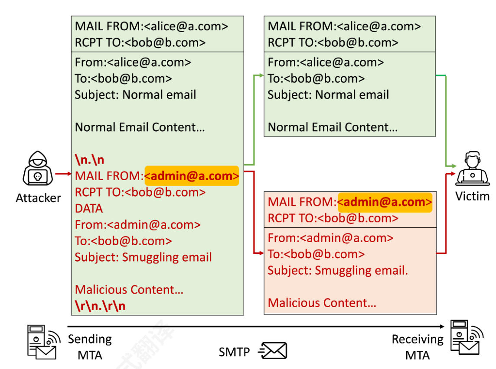
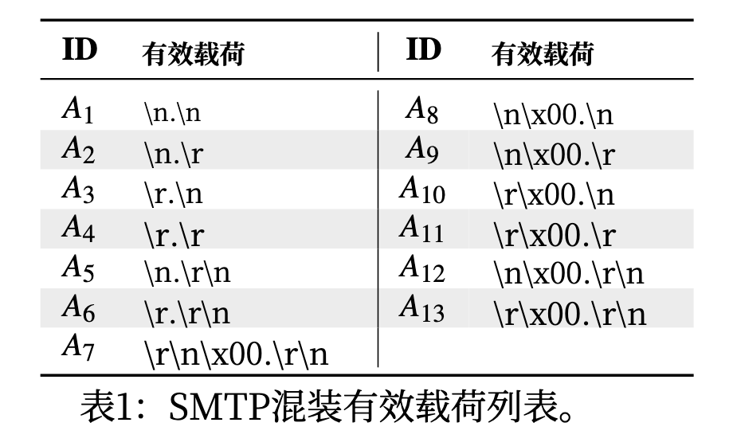
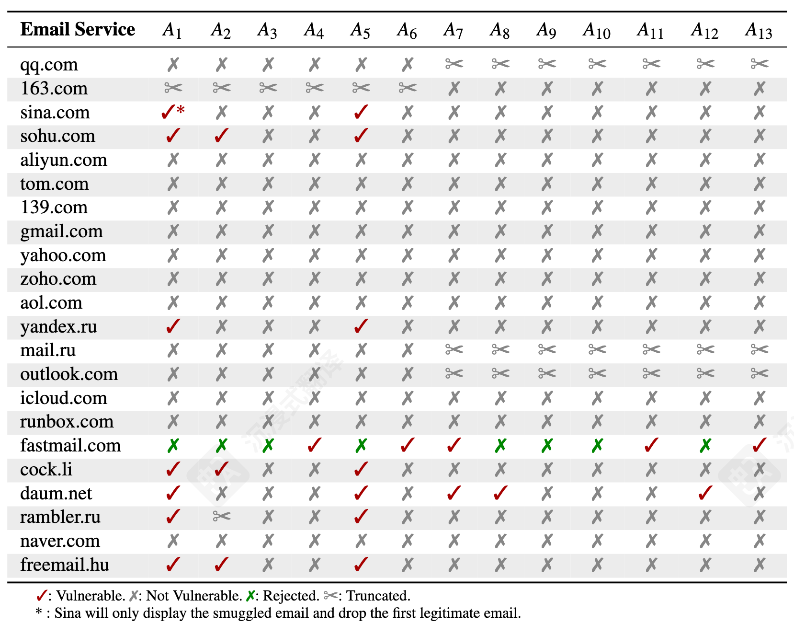
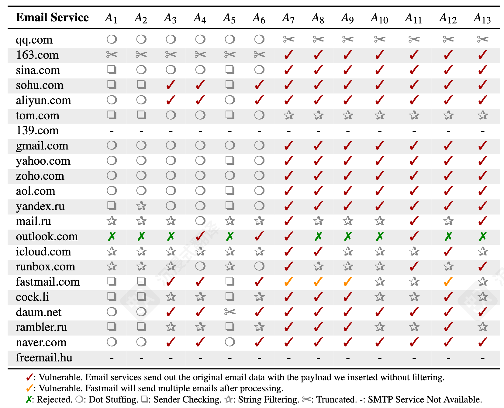
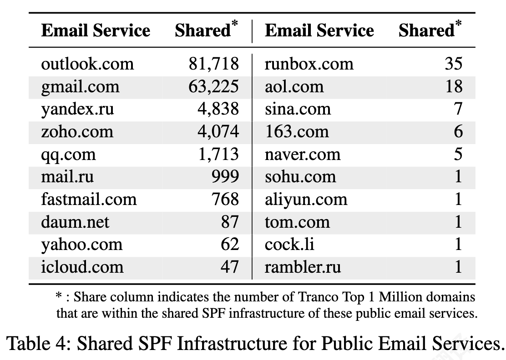
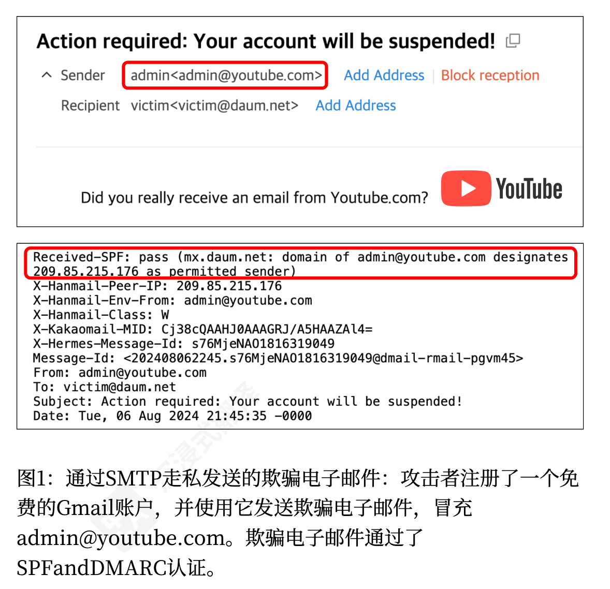
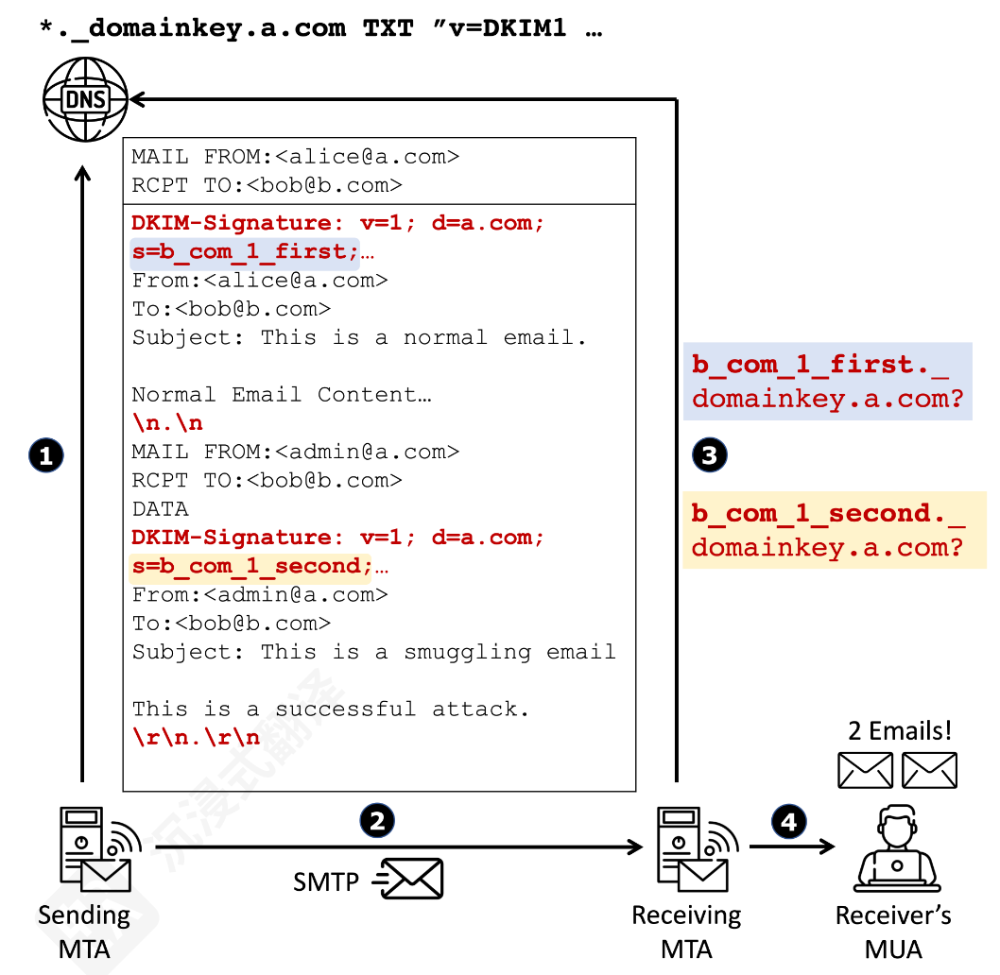
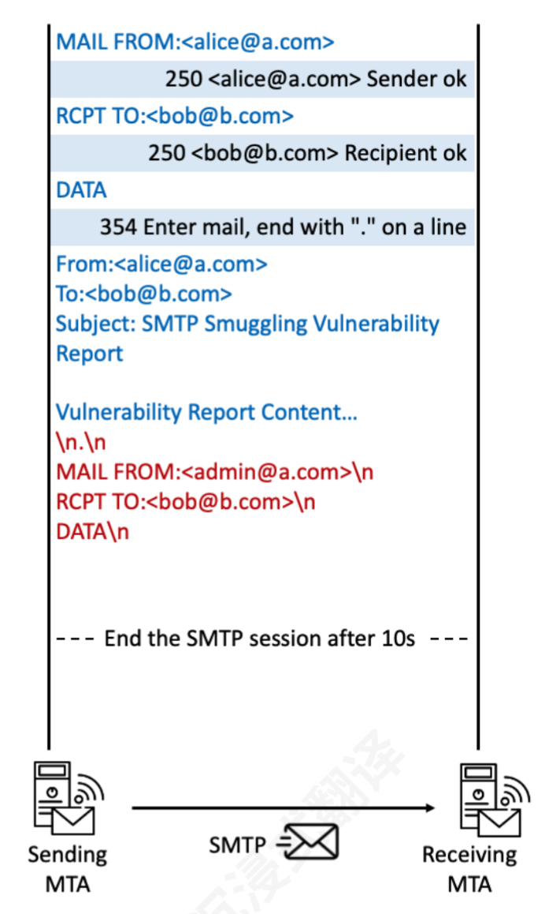
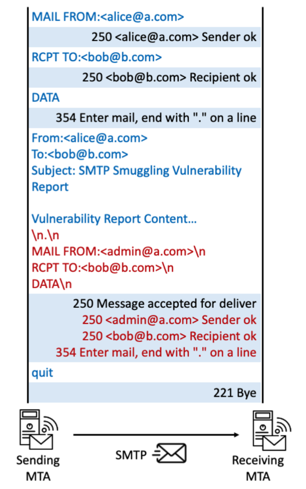

<!-- _class: cover_c -->
<!-- _paginate: "" -->
<!-- _footer: 网络协议安全设计与分析 -->

# <!-- fit -->Email Spoofing with SMTP Smuggling:  

###### How the Shared Email Infrastructures Magnify this Vulnerability

Reporter ：张哲源
Date ：2025 年 11 月 11 日

## 目录

<!-- _class: cols2_ol_ci fglass toc_a  -->
<!-- _footer: "" -->
<!-- _header: "CONTENTS" -->
<!-- _paginate: "" -->

- [问题背景](#3)
- [核心漏洞](#6)
- [实验一](#10)
- [威胁放大](#12)
- [实验二](#13)
- [源头追踪](#19)
- [解决方案与结论](#30)

## 1. 问题背景
<!-- _header: \ ****** **背景** *漏洞* *实验 1* *威胁放大* *实验2* *源头追踪* *解决与讨论*-->
<!-- _class: navbar -->

#### 邮件欺骗与网络钓鱼

- 电子邮件是网络钓鱼攻击的主要媒介 。

- **邮件欺骗 (Email Spoofing)：** 冒充可信发件人（如CEO、管理员）的技术 。

现有防御机制：

- SPF： 检查发件人 IP 是否被授权 。

- DKIM： 通过加密签名验证邮件未被篡改 。

- DMARC： 统一 SPF/DKIM，并检查“From”字段的域对齐 。

> 如果这些防御都通过了，是否还存在威胁？

## 2. 核心漏洞
<!-- _header: \ ****** *背景* **漏洞** *实验 1* *威胁放大* *实验2* *源头追踪* *解决与讨论*-->
<!-- _class: navbar cols-2 -->

#### SMTP 走私 (SMTP Smuggling)
> 定义： 一种新型的邮件欺骗技术，可以绕过 SPF 和 DMARC 认证 。

- 核心原理：利用“不一致性” 
- 发送方 (Sending MTA)： 只认标准结束符 `\r\n.\r\n`。
- 接收方 (Receiving MTA)： 为了兼容性，也认非标准结束符 (如 `\n.\n`) 。

#### 攻击流程
1. 攻击者在邮件正文中嵌入“非标准结束符” `(\n.\n)` + 新的 SMTP 命令 。
2. 发送方“粗心”地将其视为一封邮件发出。
3. 接收方“上当”，将一封邮件错误地解析为两封。
4. 第二封“走私”的欺骗邮件成功绕过 SPF/DMARC 验证。

## 2. 核心漏洞
<!-- _header: \ ****** *背景* **漏洞** *实验 1* *威胁放大* *实验2* *源头追踪* *解决与讨论*-->
<!-- _class: navbar cols-2 -->

#### SMTP 走私 (SMTP Smuggling)

> 定义： 一种新型的邮件欺骗技术，可以绕过 SPF 和 DMARC 认证 。

攻击者(alice@a.com)
冒充
可信发送者(admin@a.com)
向受害者( bob@b.com)发送电子邮件。

通过将`第二封(攻击)` 电子邮件`嵌入`第一封(合法)电子邮件的正文
并在第二封 电子邮件的开头放置恶意数据结束指示符`\n`来完成的。

## 3. 实验1 : 公共邮件服务
<!-- _header: \ ****** *背景* *漏洞* **实验 1** *威胁放大* *实验2* *源头追踪* *解决与讨论*-->
<!-- _class: navbar cols-2 -->

#### 测试方法:
> 目标： 测试 22 个主流公共邮箱 (Gmail, Outlook, Yahoo...) 。

- 方法： 必须将发送方和接收方分开测试 。
  - 接收方测试 (Receiving MTA Test)：
    - 自建“发送方” -> 发送13种攻击载荷 -> 登录公共邮箱，检查是否被分为两封邮件 。
  - 发送方测试 (Sending MTA Test)：
    - 登录公共邮箱 -> 向自建“接收方”发送邮件 -> 检查公共邮箱是否过滤了攻击载荷 。

#### 通过模糊测试得到的 13个攻击载荷 

## 3. 实验1 : 公共邮件服务
<!-- _header: \ ****** *背景* *漏洞* **实验 1** *威胁放大* *实验2* *源头追踪* *解决与讨论*-->
<!-- _class: navbar cols-2-37 -->

#### 接收方

> **总体情况：** 在22个被测试的公共邮件服务中，有8个在接收端被发现是脆弱的 

- 包括Sina (新浪)、Sohu (搜狐) 和 Yandex (俄罗斯) 在内的流行邮件服务商被证实存在漏洞 。

- Gmail、Yahoo、Outlook和iCloud，在接收端被证实是安全的，它们没有被攻击载荷误导。

Sina (新浪) 的漏洞尤其值得注意，因为它会丢弃第一封正常邮件，而只显示“走私”进来的第二封恶意邮件，这对攻击者可能特别有用 。

163.com (网易) 和 Mail.ru 会“截断”(Truncated) 邮件，即它们只显示攻击载荷之前的内容，丢弃了“走私”的部分 。

## 3. 实验1 : 公共邮件服务
<!-- _header: \ ****** *背景* *漏洞* **实验 1** *威胁放大* *实验2* *源头追踪* *解决与讨论*-->
<!-- _class: navbar cols-2-37 -->

#### 发送方

> **总体情况：** 重灾区。被测试的20个服务中，18个是脆弱的 。
- 几乎所有主流服务商都**中招**了，包括 Gmail、Yahoo、Outlook、Zoho 和 Yandex

- Gmail、Yahoo、Outlook和iCloud，在接收端被证实是安全的，它们没有被攻击载荷误导。

**关键绕过:** 研究发现，这些防御措施无法正确处理空字符 (\x00) 。攻击者可以将 \x00 字符插入到攻击载荷中（如 $A_7$ 到 $A_{13}$），导致服务器将其误判为字符串结尾，从而绕过了过滤机制

## 4. 威胁放大

<!-- _header: \ ****** *背景* *漏洞* *实验 1* **威胁放大** *实验2* *源头追踪* *解决与讨论*-->
<!-- _class: navbar cols-2-46 -->

SMTP走私漏洞其最大的威胁在于，它可以和“共享SPF基础设施”相结合 ，允许攻击者利用一个免费的公共邮箱账户成功冒充成千上万个其他高信誉度的域名
**什么是共享SPF？**
- 许多组织（youtube.com为例）为了方便，会委托`第三方邮件服务商`（如Google）来代表它们发送邮件
- 它们通过在自己的SPF记录中 **include** 谷歌的SPF记录来实现这一点

- **结果：** 谷歌的邮件服务器IP地址被同时授权代表 `gmail.com` 和 `youtube.com` 发送邮件

#### 威胁模型如何运作？

1. 攻击者注册一个免费的 Gmail 账户（已知其发送端是脆弱的） 
2. 目标接收方（如 victim@daum.net）的接收端是脆弱的

3. 攻击者从他的Gmail账户发起SMTP走私攻击，但在“走私”的第二封邮件中，他将发件人设置为 **admin@youtube.com** 

4. 接收方 daum.net 收到这封伪造的 admin@youtube.com 邮件。它会检查SPF：发现邮件来自谷歌的IP地址 。它查询 youtube.com 的SPF记录，发现 youtube.com 也授权谷歌的IP地址发信 
**成功攻击!**

## 4. 威胁放大

<!-- _header: \ ****** *背景* *漏洞* *实验 1* **威胁放大** *实验2* *源头追踪* *解决与讨论*-->
<!-- _class: navbar cols-2 -->

> 影响范围有多大？(见表4)

- 研究人员分析了Tranco百万域名，发现这种共享现象极为普遍 。
- Outlook 的SPF被超过 `81,718` 个域名共享
- Gmail 的SPF被超过 `63,225` 个域名共享

## 5. 实验2：私有电子邮件服务实验

<!-- _header: \ ****** *背景* *漏洞* *实验 1* *威胁放大* **实验2** *源头追踪* *解决与讨论*-->
<!-- _class: navbar cols-2-46 -->

> （第4章）解决了一个核心难题：研究人员如何能在不注册账户、不干扰正常用户的情况下，合乎道德地测试那些他们无法进入的私有邮件系统（如大学、企业）？

#### 阶段一：用户研究 (User Study)
这是最基础的“Ground Truth”收集阶段，通过招募内部人员来获取一手数据 

  - 确认私有邮件服务（以大学为例）是否存在漏洞 
  - 为后续的自动化测试方法收集“标准答案”，以验证其准确性 。

**招募与伦理：** 研究获得了机构审查委员会 (IRB) 的批准 。他们招募了来自48所大学的参与者，并获得了他们的知情同意

**测试：** 研究人员向每位参与者的大学邮箱发送了13封测试邮件，每封包含一种不同的“走私暗号”（Payloads）。

**结果判断：**

如果攻击成功（邮件被一分为二），第二封“走私”邮件的标题会被设为 `“Successful! Please report it to us.”` 。

如果攻击失败，参与者收到`“Normal; Please Ignore.”` 

**反馈：** 参与者通过提交在线问卷 。

**结果：** 在48个被测试的大学邮件服务中，有 23个 被证实存在漏洞 。

缺点： 这种方法依赖人工，难以规模化，且用户报告可能出错 。

## 5. 实验2：私有电子邮件服务实验

<!-- _header: \ ****** *背景* *漏洞* *实验 1* *威胁放大* **实验2** *源头追踪* *解决与讨论*-->
<!-- _class: navbar cols-2-46 -->

#### 阶段二：DKIM 侧信道

为了解决“用户研究”的缺点，研究人员验了一种更高级的**自动化**探测技术。

**核心思想:** 利用 DKIM（邮件签名）验证时，接收方服务器会查询DNS的特性，来充当“信使” 。

在每封测试邮件中都添加了两个合法的DKIM签名 。
- **签名A:** 覆盖整封邮件 (正常+走私)
- **签名B:** 只覆盖被“走私”的恶意邮件

<!-- 如果不脆弱： 接收服务器将邮件视为一个整体，只查询一次DNS（验证签名A）。
如果脆弱： 接收服务器将邮件“一分为二”，因此会查询两次DNS（一次验证签名A，一次验证签名B）。
结果： 这种自动化探测的结果与“用户研究”的人工报告结果 100% 匹配，证明了该方法高度可靠 。 -->

## 5. 实验2：私有电子邮件服务实验

<!-- _header: \ ****** *背景* *漏洞* *实验 1* *威胁放大* **实验2** *源头追踪* *解决与讨论*-->
<!-- _class: navbar -->

#### 阶段二：DKIM 侧信道
- **如果不脆弱：** 接收服务器将邮件视为一个整体，只查询一次DNS（验证签名A）。
- **如果脆弱：** 接收服务器将邮件“一分为二”，因此会查询两次DNS（一次验证签名A，一次验证签名B）。

> 结果： 这种自动化探测的结果与“用户研究”的人工报告结果 100% 匹配，证明了该方法高度可靠 。

## 5. 实验2：私有电子邮件服务实验

<!-- _header: \ ****** *背景* *漏洞* *实验 1* *威胁放大* **实验2** *源头追踪* *解决与讨论*-->
<!-- _class: navbar -->

#### 阶段三：大规模非侵入式测试
这是最精妙的一步。虽然DKIM方法是自动的，但它仍然会向目标（包括无漏洞的）发送测试邮件 。为了进行更大规模（如Tranco Top 10,000域名）的测试，研究人员设计了一种 **完全“非侵入式”** 的方法 。

**目的：** 只在对方脆弱的情况下才发送邮件；如果不脆弱，则不留任何痕迹 。

**核心思想：**
- 研究人员构造一封特殊的测试邮件，邮件正文（蓝色部分）是一份完整的“漏洞报告” 。

- 在“报告”末尾，他们附加了“走私暗号”（如 \n.\n）和新的SMTP指令（红色部分）。

- 最关键的一点： 这封邮件故意不包含那个标准的、正确的邮件结束标记（\r\n.\r\n）。

## 5. 实验2：私有电子邮件服务实验

<!-- _header: \ ****** *背景* *漏洞* *实验 1* *威胁放大* **实验2** *源头追踪* *解决与讨论*-->
<!-- _class: navbar cols-2 -->

#### 阶段三：大规模非侵入式测试

**情况A：** 如果服务器不脆弱 (图4a)

- 服务器不认 `\n.\n`，它会一直等待那个“正确”的结束标记 。

- 研究人员的发送服务在等待10秒后，`主动终止`了SMTP会话 。

**结果：** 没有邮件被发送，管理员的收件箱完全不受打扰 。

## 5. 实验2：私有电子邮件服务实验

<!-- _header: \ ****** *背景* *漏洞* *实验 1* *威胁放大* **实验2** *源头追踪* *解决与讨论*-->
<!-- _class: navbar cols-2 -->
#### 阶段三：大规模非侵入式测试

**情况B：** 如果服务器脆弱 (图4b)

- 服务器错误地把 `\n.\n` 当作了第一封邮件的结束标记 。

- 它接收了这第一封邮件（即那份“漏洞报告”）。

- 服务器接着开始处理后续的“走私”指令（红色部分），并返回了响应 。

- 研究人员的发送服务一检测到这个响应，就立即发送 QUIT 命令终止会话，防止第二封（恶意）邮件被发送 。

**结果：** 管理员收到了（且仅收到）一封漏洞报告邮件 。

---
<!-- _class: lastpage -->

###### Q && A

