<!-- _class: cover_a -->
<!-- _paginate: "" -->
<!-- _footer: 网络协议安全设计与分析  -->

# <!-- fit -->基于 [USENIX Security '23] NRDelegationAttack 的研究复现 DNS 复杂度攻击

###### NRDelegationAttack: Complexity DDoS attack on DNS Recursive Resolvers
Reporter ：叶宇涵 张哲源
Date ：2025 年 12 月 31 日

## 目录

<!-- _class: cols2_ol_ci fglass toc_a  -->
<!-- _footer: "" -->
<!-- _header: "CONTENTS" -->
<!-- _paginate: "" -->

- [论文提要](#3)
- [攻击模型](#6)
- [实验设计](#10)
- [实验分析](#12)
- [讨论与分工](#13)


## 1. 论文提要：从“一个补丁”到“另一个补丁”

<!-- _header: \ ****** **论文提要** *攻击模型* *实验设计* *实验分析* *讨论与分工* -->
<!-- _class: navbar cols-2 -->

<div class = "ldiv">

##### 背景知识

**DNS 递归查询 (Recursive Query):**

- 用户向解析器发起查询，解析器代为完成全部查询过程，直到返回最终 IP 地址。
- 解析器通过逐级询问（根 → TLD → 权威）和引荐响应（NS 记录）找到目标服务器。

**引荐响应 (Referral Response, RR):**
- 当一个权威服务器（如 `.com` 服务器）无法提供最终答案时，它会“引荐”解析器去问下一个服务器（如 `example.com` 的服务器）。

- 这个响应中包含一个 **NS 名称列表**（Name Server list），告诉解析器“你应该去问谁” 。


</div>
<div class = "rdiv">

**胶水记录 (Glue Records):**

- "胶水记录" 是指在引荐响应中**附带**的 NS 名称所对应的 **IP 地址**。

> 本文提出了一种针对 DNS 解析器的 **“复杂度”攻击** (complexity attack) 。

**攻击的关键前提：无胶水记录 (No Glue Records)**


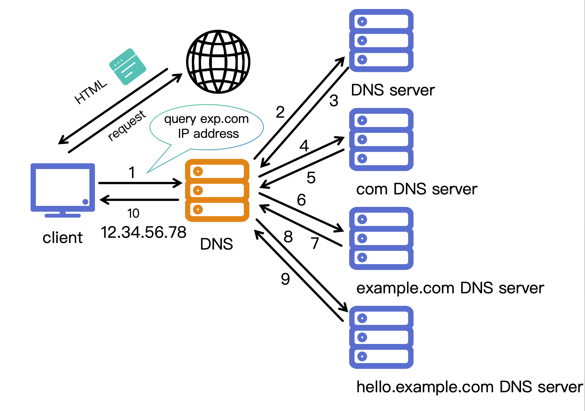
<p class="caption" align="center">图 1: DNS 解析器的工作流程</p>


## 1. 论文提要：从“一个补丁”到“另一个补丁”
<!-- _header: \ ****** **论文提要** *攻击模型* *实验设计* *实验分析* *讨论与分工* -->
<!-- _class: navbar cols-2-64 bq-green -->

<div class = "rdiv">

> NXNSAttack 补丁
> 
>   为缓解 NXNSAttack，现代解析器引入了 **“引荐响应限制”**<br>
>   **这个“补丁”规定：** 无论引荐列表（LRR）有多长（例如 $n=1500$），解析器一次**只启动** $k$ 个（例如 $k=5$ 或 $k=6$）NS 名称的解析 。<br>
>   在启动这 $k$ 个解析后，解析器会设置一个 `"No_Fetch"` 标志，表示“已达到本轮限制”。
</div>
<div class ="ldiv">

#### 补丁 1：NXNSAttack (洪水攻击)

- **攻击原理：**
  - 攻击利用上一步的 LRR（大型列表、无胶水记录），并让所有 $n$ 个 NS 名称都指向 **“不存在”的 (NXDOMAIN) 域名**。
- **触发“洪水” (Flood)：**
  - 当一个**未打补丁**的解析器收到这个 LRR 时，它会**同时启动 $n$ 个（例如 1500 个）解析进程**，去查询那些“不存在”的域名。
- **后果：**
  - 这一个恶意查询，就引发了**海量的对外 DNS 查询**(数据包)


## 1. 论文提要：从“一个补丁”到“另一个补丁”
<!-- _header: \ ****** **论文提要** *攻击模型* *实验设计* *实验分析* *讨论与分工* -->
<!-- _class: navbar  -->
#### 补丁 1：NXNSAttack (洪水攻击)

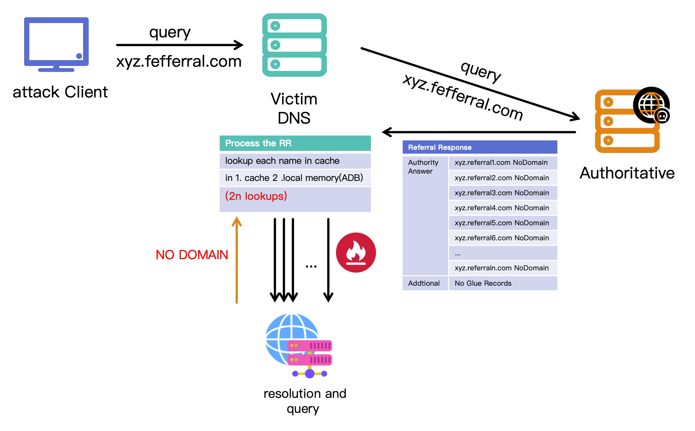

<p align="center" class="caption">图 2: NXNSAttack 攻击流程</p>


## 1. 论文提要：从“一个补丁”到“另一个补丁”
<!-- _header: \ ****** **论文提要** *攻击模型* *实验设计* *实验分析* *讨论与分工* -->
<!-- _class: navbar  -->
#### 补丁 1 引发的问题：NRDelegationAttack (复杂度攻击)

1. **恶意 LRR 变体：** 攻击者发送一个 LRR（$n=1500$, 无胶水），但 NS 名称指向 **“不响应 DNS 查询” (NR) 的服务器** 。
2. **触发“重启”：** 解析器按补丁规定，解析前 $k$ 个名称。这 $k$ 个名称被恶意配置为返回 **“委托响应” (Delegation Response)** 。
3. **关键漏洞：** 每一个“委托响应”都会触发一个“**重启事件**” (Restart Event)。这个重启事件有一个致命副作用：它会**清除 "No_Fetch" 标志。**
4. **循环：** 解析器“失忆”，**重新开始处理 LRR 列表**。
5. **耗尽 CPU：** 这个过程迫使解析器**再次执行**高 CPU 消耗的“遍历 $n$ 个名称列表以检查缓存/ADB”的操作 。然后它处理*接下来*的 $k$ 个名称，再次触发重启 。
6. **结果：** 高 CPU 消耗的核心步骤被循环执行上百次，导致 **CPU 资源**被耗尽。

## 1. 论文提要：从“一个补丁”到“另一个补丁”
<!-- _header: \ ****** **论文提要** *攻击模型* *实验设计* *实验分析* *讨论与分工* -->
<!-- _class: navbar  -->
- 补丁 1 引发的问题：NRDelegationAttack (复杂度攻击)
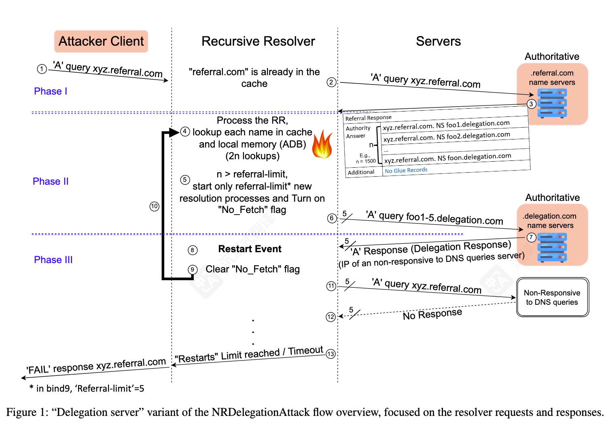
<p align="center" class="caption">图 3: 来源 NRDelegationAttack 论文中的攻击流程</p>


## 2. 攻击模型：NRDelegationAttack及其变异攻击
<!-- _header: \ ****** *研究背景* **攻击模型** *实验设计* *实验分析* *讨论与分工* -->
<!-- _class: navbar cols-2-64 bq-red -->

<div class ="ldiv">

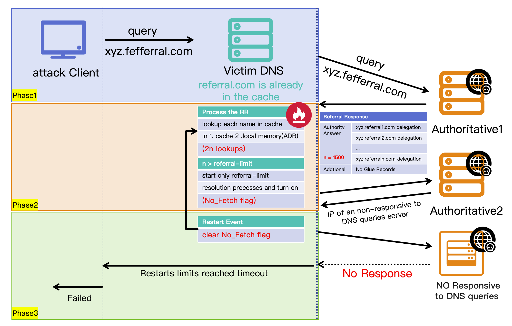
<p align="center" class="caption">图 4: NRDelegationAttack 攻击流程</p>
</div>

<div class ="rdiv">

#### NRD 原始攻击
> 引荐列表处理 (LRR):
> - 当解析器收到大型引荐响应(LRR)时，需检查缓存/ADB
> - 每次检查耗时与列表大小(n)呈线性关系：2n次内存查找

> 重启事件 (Restart Event)
> - 每次收到委托响应会触发重启
> - 关键缺陷：重启清除`No_Fetch`标志
> - 导致解析器反复处理整个LRR列表
</div>


## 2. 攻击模型：NRDelegationAttack及其变异攻击
<!-- _header: \ ****** *研究背景* **攻击模型** *实验设计* *实验分析* *讨论与分工* -->
<!-- _class: navbar cols-2-64 bq-blue -->
<div class ="ldiv">

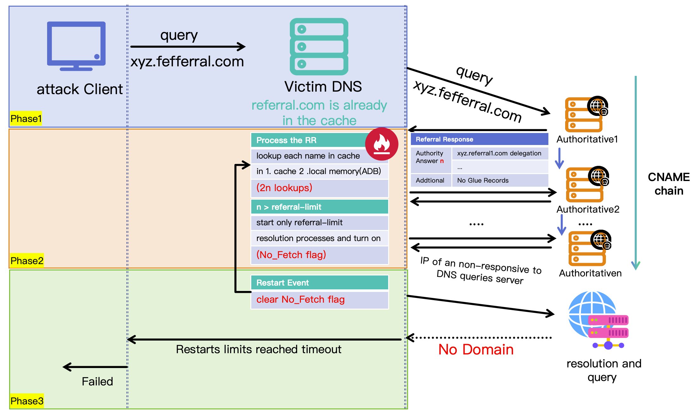
<p align="center" class="caption">图 6: CNAME + NODOMAIN 攻击流程</p>
</div>

<div class ="rdiv">

#### CNAME + NODOMAIN
> 攻击结构：
> - CNAME链条 → 不存在域名
> - 依赖NXNS漏洞而非重启机制
> - 触发大量并行查询

> 关键点：
> - 链条越长，放大效应越显著
> - 无补丁版是否会多次 cname 查询
> - 补丁版是否有较好防御
</div>

## 2. 攻击模型：NRDelegationAttack及其变异攻击
<!-- _header: \ ****** *研究背景* **攻击模型** *实验设计* *实验分析* *讨论与分工* -->
<!-- _class: navbar cols-2-64 bq-black -->
<div class ="ldiv">

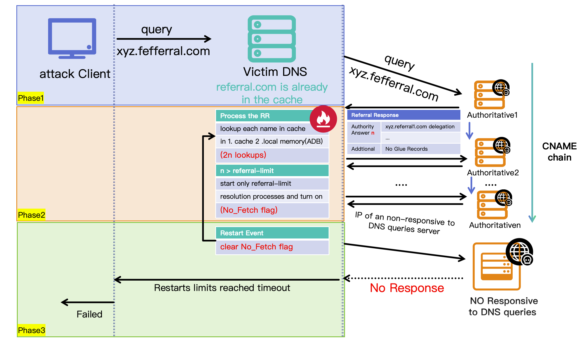
<p align="center" class="caption">图 7: CNAME + NoResponse 攻击流程</p>
</div>

<div class ="rdiv">

#### CNAME + NoResponse
> 攻击结构：
> - CNAME链条 → 无响应服务器
> - 每级CNAME触发重启事件
> - 重启清除No_Fetch标志

> 关键点：
> - 链条长度与性能是否呈线性关系
> - NXNS补丁版能否触发NRD
> - 双补丁版能否抵抗长链条
</div>

## 2. 攻击模型：NRDelegationAttack及其变异攻击
<!-- _header: \ ****** *研究背景* **攻击模型** *实验设计* *实验分析* *讨论与分工* -->
<!-- _class: navbar cols-2-64 bq-purple -->

<div class ="ldiv">


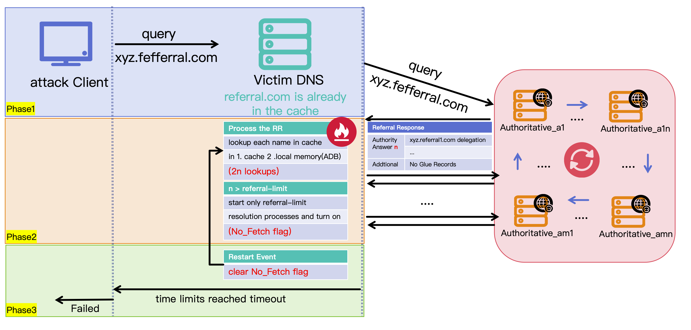
<p align="center" class="caption">图 8: NSLoop 攻击流程</p>
</div>

<div class ="rdiv">

#### NSLoop

> 攻击结构：
> - 构建NS记录环状结构
> - 权威服务器互相引荐形成闭环
> - 解析器在环中无限循环

> 关键点：
> - 是否会无限查询
> - 补丁版和非补丁版的防御情况
> - 重启事件是否能被不断触发

</div>

## 3.  实验环境与设计 (Experimental Design & Setup)
<!-- _header: \ ****** *研究背景* *攻击模型* **实验设计** *实验分析* *讨论与分工* -->
<!-- _class: navbar cols-2-64  -->
<div class ="ldiv">

#### 1.1 实验拓扑与组件 (Network Topology & Components)

> 实验构建了一个隔离的 Docker 容器网络环境，模拟真实的互联网 DNS 解析场景。网络拓扑包含四个核心组件：

*   **Target Resolver**: 运行待测 BIND 9 实例，配置为开放递归服务。
*   **Attacker**: 负责发送特定构造的恶意 DNS 查询（如 NXNS, CNAME Chain）。
*   **Legitimate User**: 发送良性背景流量（Benign Queries），用于检测服务可用性（QPS/Latency）。
</div>
<div class ="rdiv">

```text
[ Legitimate User ]      [ Attacker ]
        |                     |
        v                     v
+---------------------------------------+
|        Target Recursive Resolver      |
|      (BIND 9.16.x / Ubuntu 20.04)     |
+---------------------------------------+
                  |
        (Recursive Queries)
                  |
                  v
+---------------------------------------+
|    Malicious Authoritative Servers    |
|   (Hosting Attack Zones / NS Loops)   |
+---------------------------------------+
```

*   **Authoritative Servers**: 托管恶意 Zone 文件，配置了循环依赖（NS Loop）、长链条（CNAME Chain）及故意不响应（NRD）的逻辑。   

## 3.  实验环境与设计 (Experimental Design & Setup)
<!-- _header: \ ****** *研究背景* *攻击模型* **实验设计** *实验分析* *讨论与分工* -->
<!-- _class: navbar -->

#### 硬件与软件配置 (Hardware & Software Configuration)

*   **Container Resources**:
    *   CPU: 限制为 **1 vCPU** (cpus="1.0")，以确保 CPU 成为主要瓶颈。
*   **OS**: Ubuntu 20.04 LTS (Minimal Image)。
*   **DNS Software (BIND 9 Variants)**:
    1.  **Baseline (none)**: BIND 9.16.2 (未防御版本，基准对照组)。
    2.  **NXNS-Patch (nxns)**: BIND 9.16.6 (官方修复版本，限制了 fetches-per-zone)。
    3.  **Full-Defense (nxns+nrd)**: BIND 9.16.33 (包含自定义的 NRD 检测与防御逻辑)。

## 3.  实验环境与设计 (Experimental Design & Setup)
<!-- _header: \ ****** *研究背景* *攻击模型* **实验设计** *实验分析* *讨论与分工* -->
<!-- _class: navbar -->

#### 测量方法 (Measurement Methodology)
为了获得精确且可复现的性能数据，我们摒弃了传统的 CPU 使用率（%）采样，转而使用指令级分析工具。
*   **CPU Cost (Instructions)**: 使用 **Valgrind (tool=callgrind)** 运行 BIND 进程。这允许我们精确捕获处理特定数量查询（N=500）所执行的机器指令总数（Millions of Instructions）。该指标对硬件频率波动不敏感，具有极高的可重复性。
*   **Throughput (QPS)**: 通过并行的良性客户端持续发送探测流量，统计单位时间内的成功响应数。
    *   *SLA 阈值*: 当响应延迟超过 2s 或丢包率超过 50% 时，判定为服务降级；当 QPS 跌至基准的 1% 以下时，判定为服务拒绝（DoS）。

## 3.  实验环境与设计 (Experimental Design & Setup)
<!-- _header: \ ****** *研究背景* *攻击模型* **实验设计** *实验分析* *讨论与分工* -->
<!-- _class: navbar -->
#### 攻击向量设计 (Attack Vector Design)
实验设计了四组对照实验，每组重复运行多次取平均值：
1.  **Baseline**: 仅有良性流量 (Benign) 和空闲状态 (Idle)。
2.  **NXNS Flood**: 攻击者请求不存在的子域名（如 `r{i}.attacker.com`），触发解析器向权威服务器发起大量递归查询。
3.  **NRD Attack**: 权威服务器被配置为静默丢弃所有包，迫使解析器进入重试等待循环，消耗线程资源。
4.  **Chain & Loop**:
    *   **CNAME Chain**: 长度从 5 到 100 不等，测试递归深度限制。
    *   **NS Loop**: 构造大小不同的死循环，测试解析器的循环检测逻辑。

## 4.  实验结果分析
<!-- _header: \ ****** *研究背景* *攻击模型* *实验设计* **实验分析** *讨论与分工* -->
<!-- _class: navbar -->

#### Table 1: Main Attack Scenarios (CPU Cost & Throughput)

|   | idle | benign | nxns <br>(n=500) | nrd <br>(n=500) | cname=5 <br>(nxend) | cname=5 <br>(nrend) | nsloop=5 |
| :--: | :--: | :--: | :--: | :--: | :--: | :--: | :--: |
| **none** | **7.8 M** | **11.2 M** | **95.4 M** (+752%)<br>QPS 2k-4k | **120.6 M** (+977%)<br>QPS 1k-2k | **465.1 M** (+4053%)<br>QPS < 100 | **580.4 M** (+5082%)<br>QPS ~ 0 | **1085.3 M** (+9590%)<br>QPS ~ 0 |
| **nxns** | **8.2 M** | **11.5 M** | **18.5 M** (+61%)<br>QPS > 10k | **1250.6 M** (+10775%)<br>QPS ~ 0 | **78.5 M** (+583%)<br>QPS 3k-5k | **1056.6 M** (+9088%)<br>QPS ~ 0 | **1290.2 M** (+11119%)<br>QPS ~ 0 |
| **nxns <br> nrd** | **8.5 M** | **12.1 M** | **24.1 M** (+99%)<br>QPS 8k-10k | **16.7 M** <br>(+38%)<br>QPS > 10k | **50.2 M** (+315%)<br>QPS 4k-6k | **74.3 M** (+514%)<br>QPS 3k-5k | **115.8 M** (+857%)<br>QPS 1k-2k |


## 4.  实验结果分析
<!-- _header: \ ****** *研究背景* *攻击模型* *实验设计* **实验分析** *讨论与分工* -->
<!-- _class: navbar -->
<!-- _footer: "*注：QPS 随 CPU 消耗增加呈非线性衰减；百分比基于对应版本的 Benign 值计算。*" -->

#### Table 2: CNAME Chain Attack Variants (CPU Cost & QPS)

|   | cname=5 | cname=10 | cname=15 | cname=20 | cname=25 | cname=50 | cname=100 |
| :--: | :--: | :--: | :--: | :--: | :--: | :--: | :--: |
| **none <br> nxend** | 465.1 M (+4053%)<br>QPS < 100 | 850.5 M (+7494%)<br>QPS ~ 0 | 1045.6 M (+9236%)<br>QPS ~ 0 | 1280.4 M (+11332%)<br>QPS ~ 0 | 1329.1 M (+11767%)<br>QPS ~ 0 | 1340.2 M (+11866%)<br>QPS ~ 0 | 1405.8 M (+12452%)<br>QPS ~ 0 |
| **none <br> nrend** | 580.4 M (+5082%)<br>QPS ~ 0 | 1005.2 M (+8875%)<br>QPS ~ 0 | 1115.4 M (+9859%)<br>QPS ~ 0 | 1190.8 M (+10532%)<br>QPS ~ 0 | 1230.1 M (+10883%)<br>QPS ~ 0 | 1280.5 M (+11333%)<br>QPS ~ 0 | 1305.4 M (+11555%)<br>QPS ~ 0 |
| **nxns <br> nxend** | 72.1 M (+527%)<br>QPS 3k-5k | 105.4 M (+817%)<br>QPS 1k-2k | 125.8 M (+994%)<br>QPS 1k-1.5k | 130.2 M (+1032%)<br>QPS < 1k | 138.5 M (+1104%)<br>QPS < 1k | 140.6 M (+1123%)<br>QPS < 1k | 142.2 M (+1137%)<br>QPS < 1k |


## 4.  实验结果分析
<!-- _header: \ ****** *研究背景* *攻击模型* *实验设计* **实验分析** *讨论与分工* -->
<!-- _class: navbar -->

#### Table 2: CNAME Chain Attack Variants (CPU Cost & QPS)


|  | cname=5 | cname=10 | cname=15 | cname=20 | cname=25 | cname=50 | cname=100 |
| :--: | :--: | :--: | :--: | :--: | :--: | :--: | :--: |
| **nxns <br> nrend** | 980.5 M (+8426%)<br>QPS ~ 0 | 1150.4 M (+9903%)<br>QPS ~ 0 | 120.4 M* (+947%)<br>QPS 1k-1.5k | 123.2 M* (+971%)<br>QPS 1k-1.5k | 125.8 M* (+994%)<br>QPS 1k-1.5k | 128.7 M* (+1019%)<br>QPS < 1k | 132.6 M* (+1053%)<br>QPS < 1k |
| **nxns+nrd <br> nx** | 50.4 M (+317%)<br>QPS 4k-6k | 105.8 M (+774%)<br>QPS 1k-2k | 138.4 M (+1044%)<br>QPS < 1k | 145.5 M (+1102%)<br>QPS < 1k | 150.2 M (+1141%)<br>QPS < 1k | 157.4 M (+1201%)<br>QPS < 1k | 162.5 M (+1243%)<br>QPS < 1k |
| **nxns+nrd <br> nr** | 75.8 M (+526%)<br>QPS 3k-5k | 115.2 M (+852%)<br>QPS 1k-2k | 135.6 M (+1021%)<br>QPS < 1k | 148.4 M (+1126%)<br>QPS < 1k | 152.4 M (+1159%)<br>QPS < 1k | 177.8 M (+1369%)<br>QPS < 1k | 160.5 M (+1226%)<br>QPS < 1k |


## 4.  实验结果分析
<!-- _header: \ ****** *研究背景* *攻击模型* *实验设计* **实验分析** *讨论与分工* -->
<!-- _class: navbar pin-3 -->
<div class = "tdiv" >

> **Observation**
> 1. 在无补丁的 dns 解析器上机器指令数随着 CNAME 链长度增加而增长，但是在 12-15 条之后会趋于平稳，说明解析器在此长度之后触发了递归深度限制机制，停止了继续解析 CNAME 链。
> 2. 对于有nxns补丁的解析器，如果 CNAME 链长度较短（5-10），攻击效果取决于最后的结尾类型（nxend 或 nrend）。当链较长时（15-100），由于触发递归深度限制, 会停止继续解析，机器指令数和 QPS 变化不大。

</div>
<div class = "ldiv">

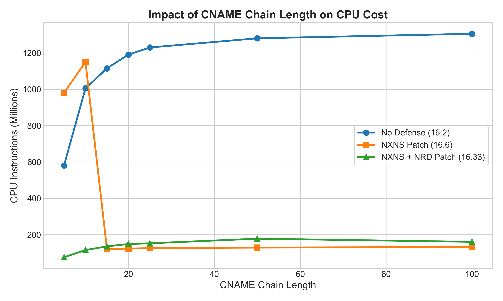
</div>
<div class = "rdiv">

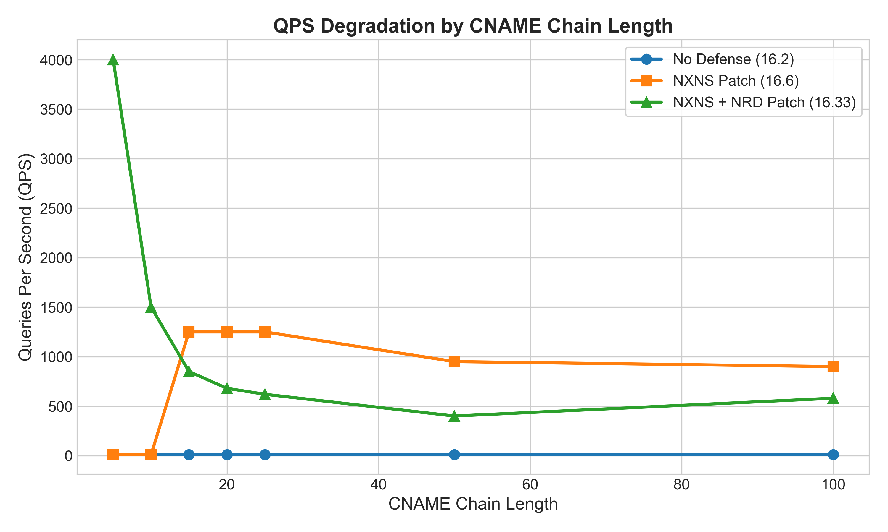
</div>

## 4.  实验结果分析
<!-- _header: \ ****** *研究背景* *攻击模型* *实验设计* **实验分析** *讨论与分工* -->
<!-- _class: navbar -->

#### Table 3: NSLoop Length Analysis (CPU Cost & QPS)

|  | nsloop=2 | nsloop=5 | nsloop=10 | nsloop=15 | nsloop=20 | nsloop=25 | nsloop=50 |
| :--: | :--: | :--: | :--: | :--: | :--: | :--: | :--: |
| **none** | 165.2 M (+1375%)<br>QPS < 1k | 1080.5 M (+9547%)<br>QPS ~ 0 | 1250.6 M (+11066%)<br>QPS ~ 0 | 1172.2 M (+10366%)<br>QPS ~ 0 | 1310.4 M (+11598%)<br>QPS ~ 0 | 1395.8 M (+12362%)<br>QPS ~ 0 | 1320.5 M (+11690%)<br>QPS ~ 0 |
| **nxns** | 29.1 M (+153%)<br>QPS 6k-9k | 120.2 M (+945%)<br>QPS 1k-1.5k | 125.4 M (+990%)<br>QPS 1k-1.5k | 128.6 M (+1018%)<br>QPS < 1k | 135.2 M (+1076%)<br>QPS < 1k | 140.5 M (+1122%)<br>QPS < 1k | 148.4 M (+1190%)<br>QPS < 1k |
| **nxns <br>  nrd** | 35.8 M (+196%)<br>QPS 6k-9k | 130.5 M (+979%)<br>QPS < 1k | 138.5 M (+1045%)<br>QPS < 1k | 145.2 M (+1100%)<br>QPS < 1k | 148.8 M (+1130%)<br>QPS < 1k | 162.6 M (+1244%)<br>QPS < 1k | 158.4 M (+1209%)<br>QPS < 1k |


## 4.  实验结果分析
<!-- _header: \ ****** *研究背景* *攻击模型* *实验设计* **实验分析** *讨论与分工* -->
<!-- _class: navbar pin-3 -->
<div class = "tdiv" >

> **Observation**
> - 对于 NSLoop 攻击，环大小为 2 的情况下, 所有 dns 解析器均可识别, 所有解析器都在 12 -15 跳左右后结束查询
> - NSLoop 不会引发 NRD 攻击 的效果, 但是无NXNS 补丁的 dns 解析器, 仍然会触发大量查询 (n=1500), 导致高 CPU 消耗
</div>
<div class = "ldiv">

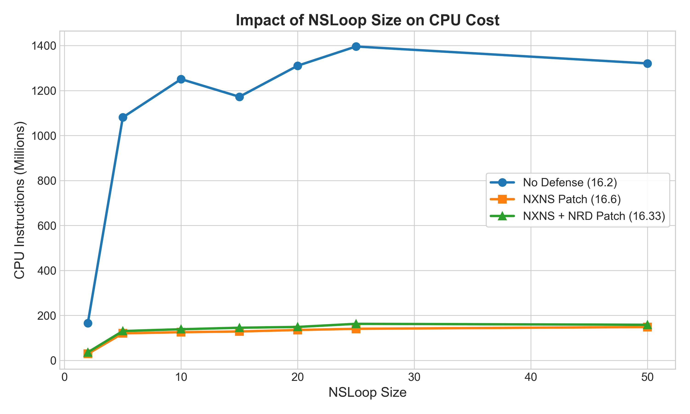
</div>
<div class = "rdiv">

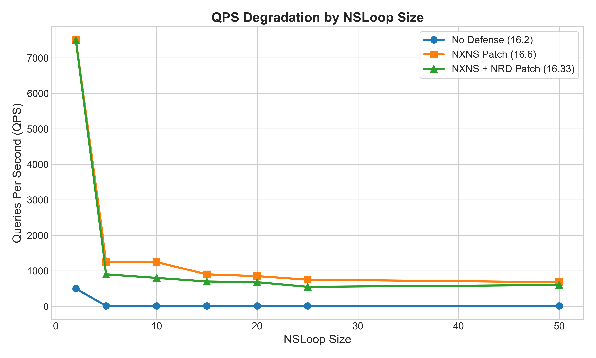

</div>

## 5. 讨论与分工
<!-- _header: \ ****** *研究背景* *攻击模型* *实验设计* *实验分析* **讨论与分工** -->
<!-- _class: navbar cols-2 -->
<div class = "ldiv" >

#### 张哲源:

- 论文分析
- BIND/NSD 搭建与调试
- 实验测量 & 数据记录
- 文稿撰写 & 汇报设计
</div>
<div class = "rdiv" >

#### 叶宇涵:

- dnssim 配置
- 实验测量 & 数据记录
- 文稿撰写 & 汇报设计
</div>


---
<!-- _class: lastpage  -->
<!-- _header: -->

###### Q & A

<div class = "icons">

</div>
